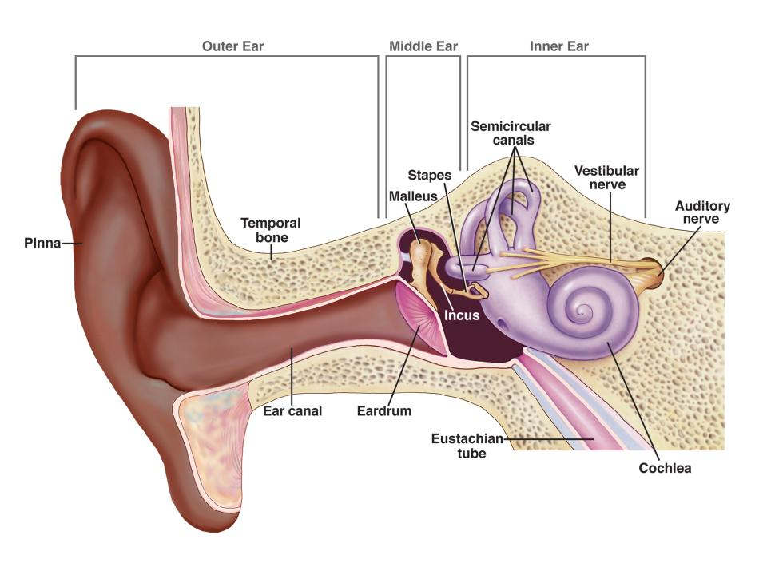
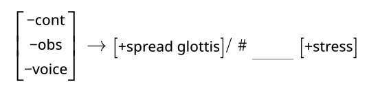
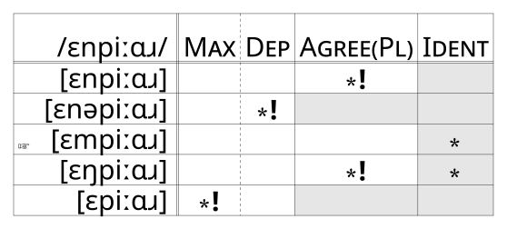
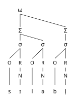
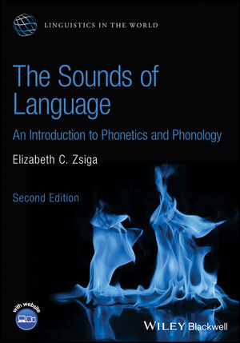

```{r}
#| echo: false
#| message: false
source(here::here("_defaults.R"))

library(tidyverse)
library(tuneR)
library(praatpicture)
```

## The plan for today

::: {}
- Names & Attendance

- Course "Flightplan"

- Syllabus
:::

## Speech Sounds

We make them with our bodies.

{fig-alt="Schematic of body planes" fig-align="center" width="100%"}

## Speech Sounds

We can cross-categorize them many ways

::: ipa
```{mermaid}
%%| fig-alt: |
%%|   A taxonomy of speech sounds by airstream mechanism
flowchart TD
  A[airstream] --> P[pulmonic]
  A --> G[glottalic]
  A --> V[velaric]
  P --> Pe[egressive]
  G --> Ge[egressive]
  G --> Gi[ingressive]
  V --> Vi[ingressive]
  Pe --> Pes["[p, t, k,...]"]
  Ge --> Ges["[pʼ, tʼ, kʼ, ...]"]
  Gi --> Gis["[ɓ, ɗ, ɠ, ...]"]
  Vi --> Vis["[ʘ, ǃ, ...]"]
```
:::

## Speech Sounds

We hear them

{fig-alt="Diagram of the ear" fig-align="center" width="100%"}

## Speech Sounds

We can record them

```{r}
#| echo: false
#| fig-alt: |
#|   A waveform
iy_wav <- readWave(
  here::here("assets/iy.wav")
)

tibble(
  samp = iy_wav@left
) |> 
  mutate(
    rown = row_number(),
    sign = sign(samp),
    cross = sign != lag(sign)
  ) |> 
  slice(10110:11096) |> 
  mutate(
    time = ((rown-min(rown))/iy_wav@samp.rate)*1000
  ) |> 
  ggplot(
    aes(
      time, 
      samp
    )
  ) +
  geom_hline(
    yintercept = 0,
    linewidth = 0.25,
    color = "grey"
  ) +
  geom_line() +
  labs(
    x = "time (ms)"
  ) +
  theme_no_y()
```

## Speech Sounds

They have acoustic properties

```{r}
#| echo: false
#| fig-alt: A spectrogram
praatpicture(
  here::here("assets/iy.wav"),
  frames = c('spectrogram'),
  proportion = c(30,70),
  wave_color = 'grey',
  spec_freqRange = c(0,5500)
)
```

## Speech Sounds

We cognitively organize and distribute them.

{fig-alt="A phonological rule" fig-align="center"}

## Speech Sounds

We cognitively organize and distribute them

{fig-alt="An optimality theory tableaux" fig-align="center"}

## Speech Sounds

We cognitively organize and distribute them

{fig-alt="Prosodic tree for the word \"syllable\"" fig-align="center"}

## Flight Plan

- Speech Anatomy & Articulatory Classifications

- Speech Perception & Acoustics

- Phonological Contrast & Alternation

- Phonological Features & Rules

- Phonological Constraints

- Prosodic Structure

## The Textbook

{fig-alt="The cover of Zsiga (2024)" fig-align="center"}

Zsiga, Elizabeth C (2024) *The Sounds of Language*, Wiley-Blackwell ISBN: 978-1-119-87850-6

## Course Evaluation

- Weekly comprehension quizzes

- Language Puzzles

- IPA transcription exercises

- In-class midterm (Oct 6)

- In-person final exam (Dec 17)

- Participation

## AI Policy

::: {style="font-size: 10em;"}

:::

## Lecture Slides

The lecture slides, in general, serve to *support* the in-class discussion, and to augment your own notes.
They won't be overly wordy, and may not make sense outside of the classroom context.
