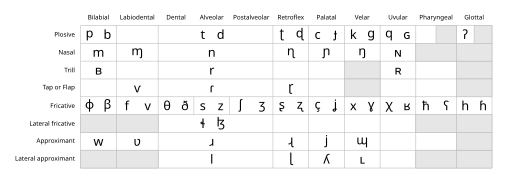
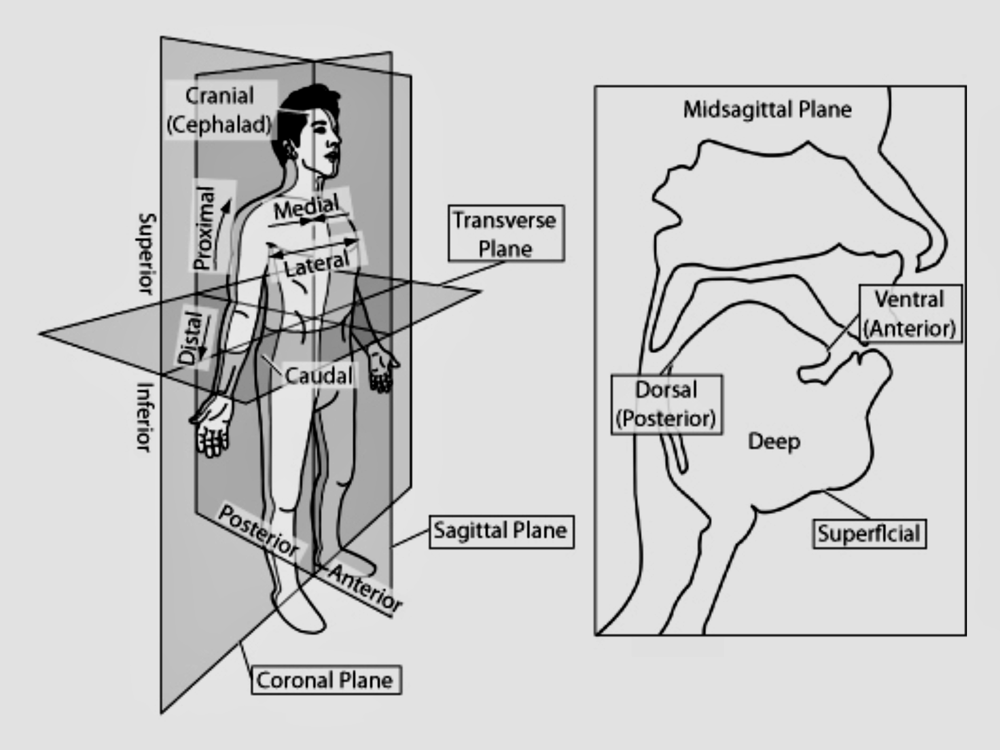
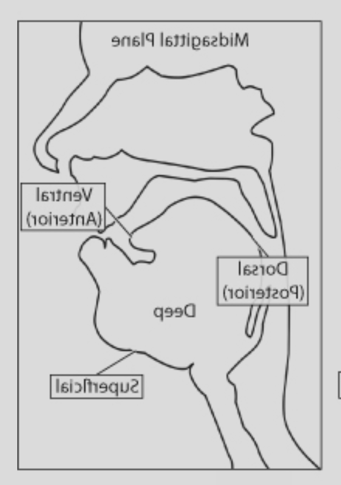
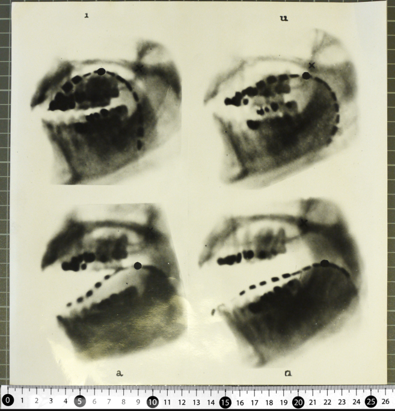
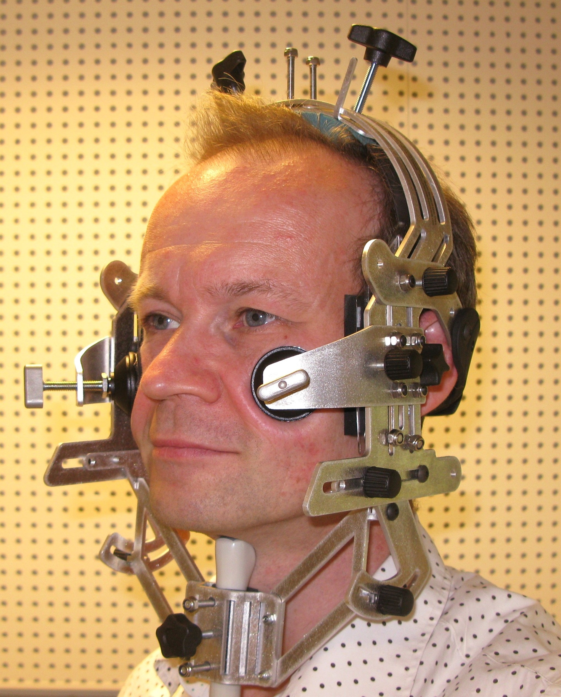
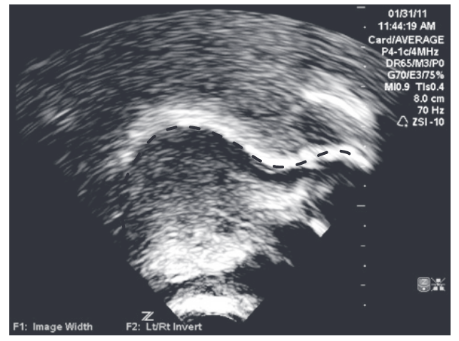
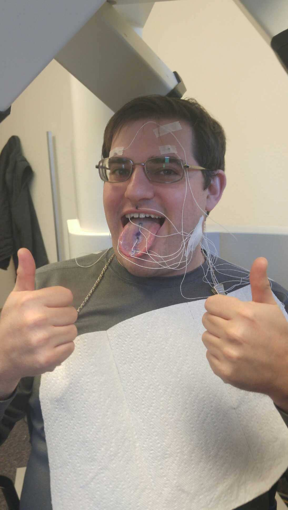
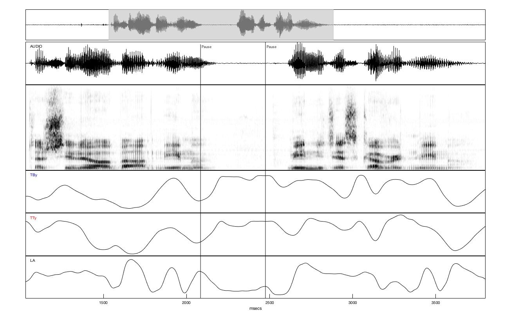
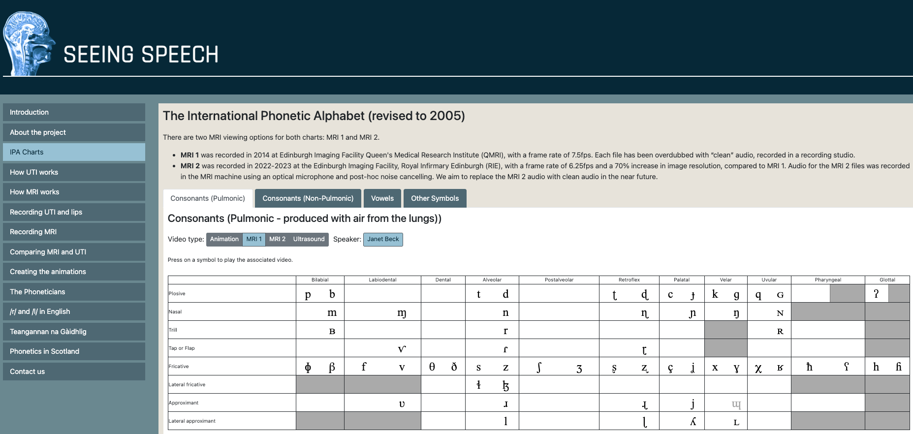

## Seeing Speech

Maybe you think speech looks like this:

{fig-align="center"}

## Seeing speech

Speech is a physical activity



## Today

- Tools we use for looking at speech.

- Starting some anatomy.

## Conceptualizing the head

{fig-align="center" width="100%"}

| Posterior | Anterior |
|-----------|---------:|
| "back"    |  "front" |

## Conceptualizing the head

::: {layout="[[20, 80]]"}
{fig-align="left"}

:::

## Tools of the trade

### X-Ray

:::: {layout-ncol="2" style="width: 100%;"}
anterior ⬅️

::: {style="text-align: right;"}
➡️ posterior
:::
::::

{fig-align="center" width="100%"}

## Tools of the trade

### X-Ray

::::::: {layout-ncol="2"}
:::: {}
**Pros?**

::: fragment
- Better than nothing
:::
::::

:::: {}
**Cons?**

::: fragment
- Can't image fleshy bits well

- Harmful to health

- Static/low framerate
:::
::::
:::::::

## **To**ols of the trade

### Ultrasound tongue imaging

{fig-align="center" width="50%"}

## Tools of the trade

### Ultrasound tongue imaging

:::: {layout-ncol="2" style="width: 100%;"}
posterior ⬅️

::: {style="text-align: right;"}
➡️ anterior
:::
::::

{fig-align="center" width="90%"}

@linGesturalReductionLexical2014

## Tools of the trade

### Ultrasound tongue imaging

::::::: {layout-ncol="2"}
:::: {}
**Pros?**

::: fragment
- Relatively non-invasive.
:::
::::

:::: {}
**Cons?**

::: fragment
- Can *only* image fleshy bits.

- Can't image across an air gap.

- Relatively low frame rate.
:::
::::
:::::::

## Tools of the trade

### Electromagnetic Articulography (EMA)

::: {layout="[[25, 75]]"}
{fig-align="center" width="100%"}

{fig-align="center" width="100%"}
:::

## Tools of the trade

### Electromagnetic Articulography (EMA)

::::::: {layout-ncol="2"}
:::: {}
**Pros?**

::: fragment
- Very high time resolution.

- Spatially precise.
:::
::::

:::: {}
**Cons?**

::: fragment
- Invasive.

- Harder to visualize.

- Expensive equipment.
:::
::::
:::::::

## Tools of the trade

### MRI

:::: {layout-ncol="2" style="width: 100%;"}
posterior ⬅️

::: {style="text-align: right;"}
➡️ anterior
:::
::::



## Tools of the trade

### MRI

::::::: {layout-ncol="2"}
:::: {}
**Pros?**

::: fragment
- Non invasive.

- High quality images.
:::
::::

:::: {}
**Cons?**

::: fragment
- Low frame rate (but improving).

- *Very* loud.

- Speakers must be lying down.

- Expensive equipment.
:::
::::
:::::::

## Seeing Speech

## References
