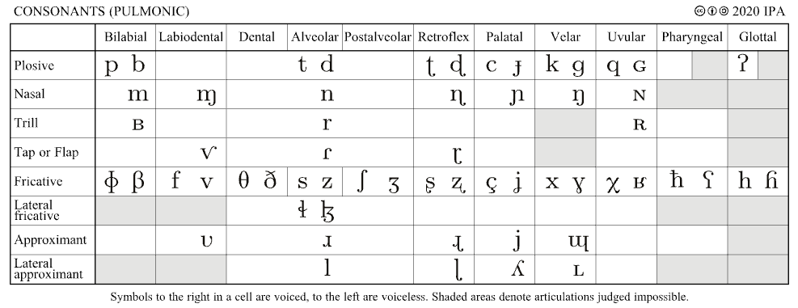

## Seeing Speech

Maybe you think speech looks like this:

:::: {.content-hidden when-format="typst"}
::: {.ipa .r-stack style="font-size: 10em; margin: auto;"}
ʒ
:::
::::

::: {.content-visible when-format="typst"}
ʒ
:::

:::: {.content-visible when-format="revealjs"}
::: footer
[Webpage](index.qmd)
:::
::::

## Seeing speech

Tools of the trade



## Conceptualizing the head

{width="100%"}

## Conceptualizing the head

::: {layout="[[20, 80]]"}
{fig-align="left"}

:::

## Tools of the trade

### X-Ray

{fig-align="center" width="96%"}

## Tools of the trade

### Ultrasound tongue imaging

{fig-align="center" width="50%"}

## Tools of the trade

### Ultrasound tongue imaging

:::: {layout-ncol="2" style="width: 100%;"}
posterior ⬅️

::: {style="text-align: right;"}
➡️ anterior
:::
::::

{fig-align="center" width="90%"}

@linGesturalReductionLexical2014

## Tools of the trade

### Electromagnetic Articulography (EMA)

::: {layout="[[25, 75]]"}
{fig-align="center" width="100%"}

{fig-align="center" width="100%"}
:::

## Tools of the trade

### MRI



## Moving air around

### Option 1: The lungs (pulmonic)

- On the out-breath: "egressive"

- On the in-breath: "ingressive"

## Moving air around

### Ingressive:

> ~~\[...\] no language uses the pulmonic *ingressive* airstream in any systematic way.~~

Many languages, including some Englishes, use ingressive speech for "backchannelling".

## Terminology

- "Sublaryngeal": below the larynx

- "Supralaryngeal": above the larynx

## Larynx and the voice

:::: {layout="[[10, 90]]"}
::: {}
⬆️

posterior

anterior️

⬇️
:::


::::

## References
