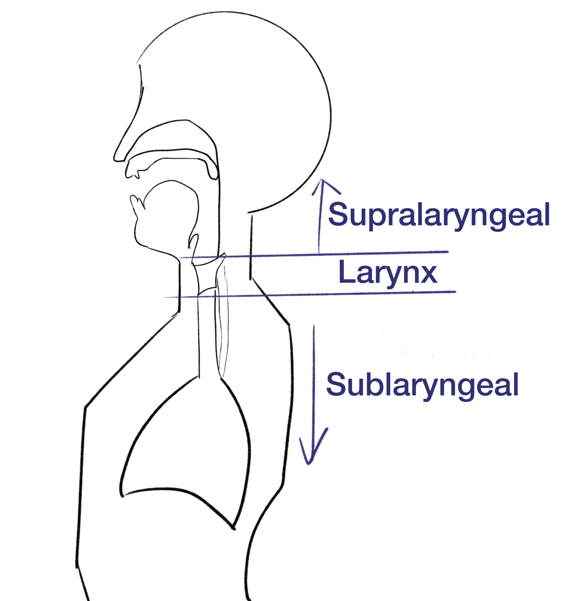
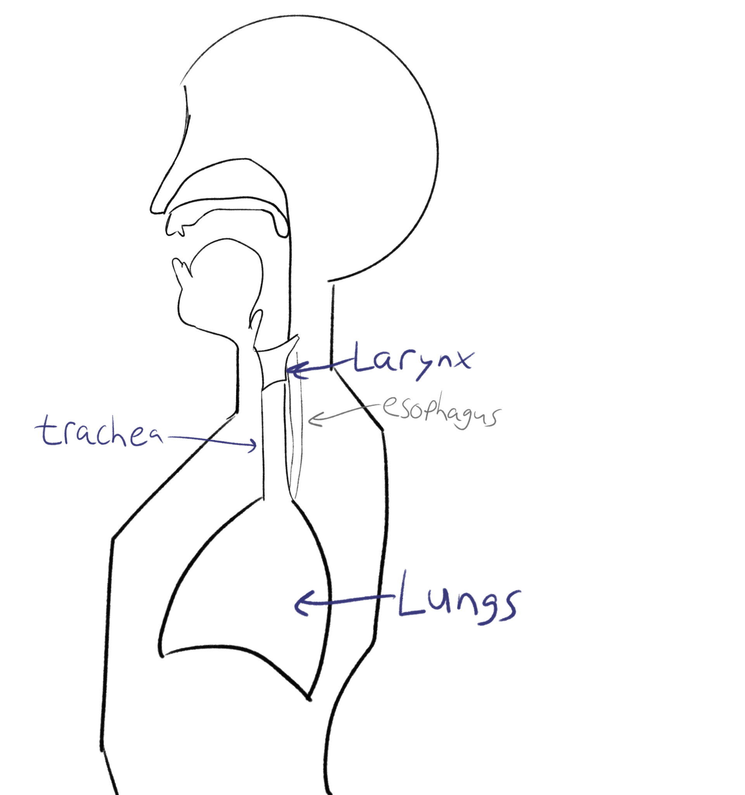
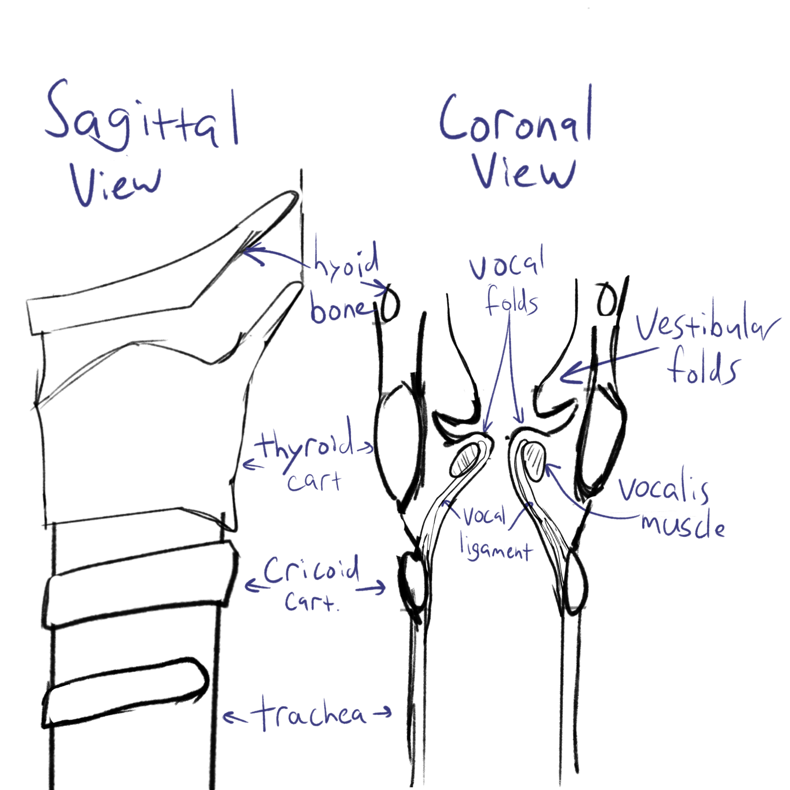

## Sub vs Supra Laryngeal

{fig-align="center" width="100%"}

## Sublaryngeal Vocal Tract

{fig-align="center" width="100%"}

## Moving air around

### Option 1: The lungs (pulmonic)

- On the out-breath: "egressive"

- On the in-breath: "ingressive"

## Moving air around

### Ingressive:

> ~~\[...\] no language uses the pulmonic *ingressive* airstream in any systematic way.~~

Many languages, including some Englishes, use ingressive speech for "backchannelling".

## Larynx

{fig-align="center" width="100%"}

## Larynx and the voice

:::: {layout="[[10, 90]]"}
::: {}
⬆️

posterior

anterior️

⬇️
:::


::::
