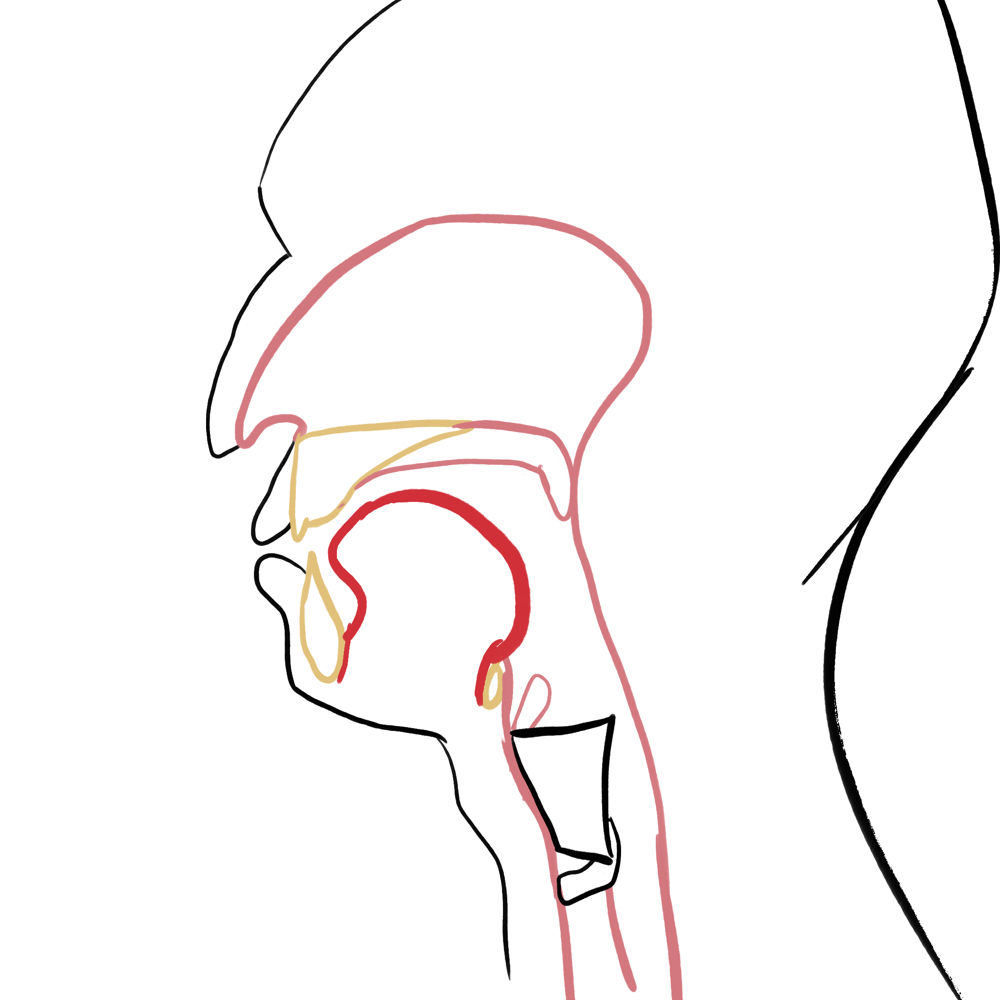
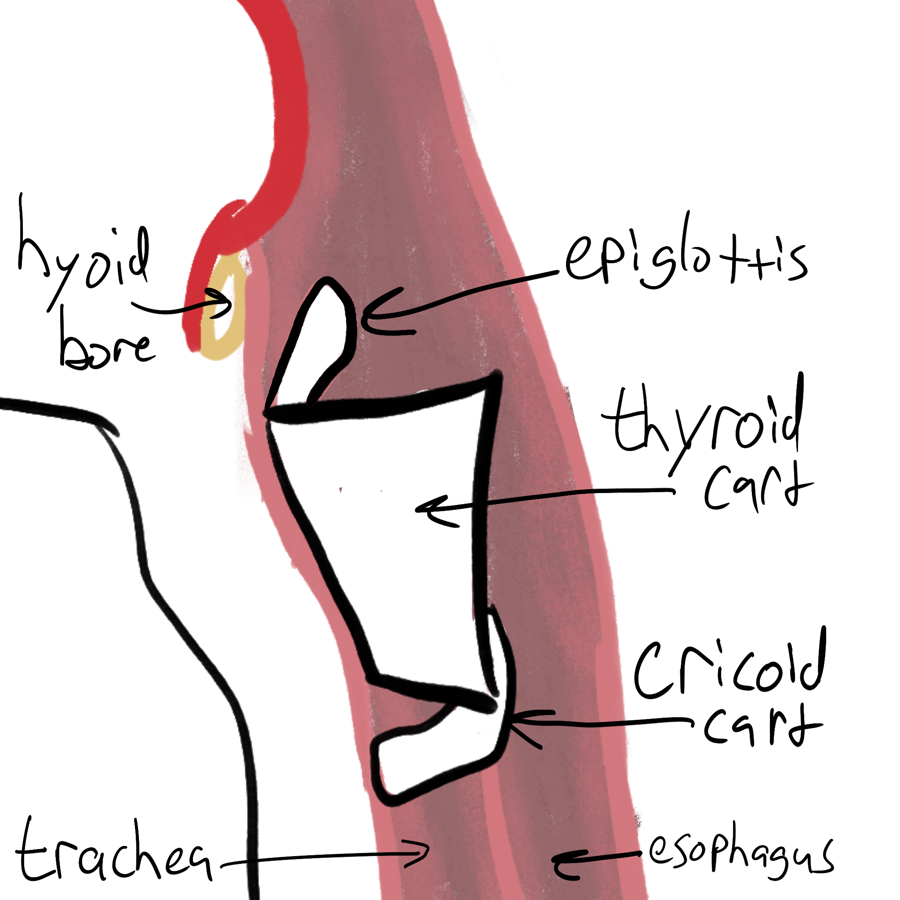
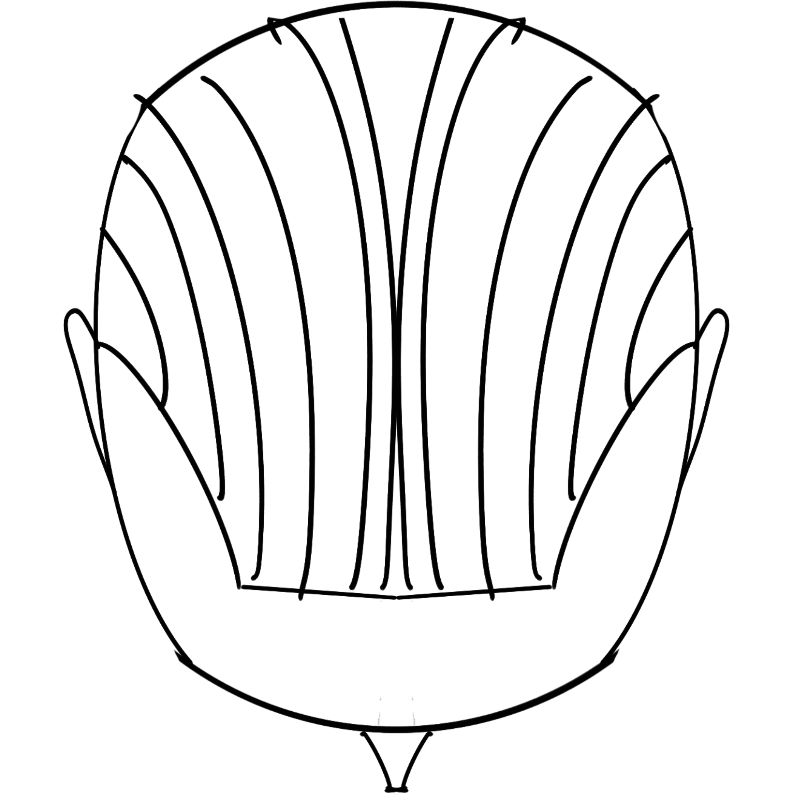
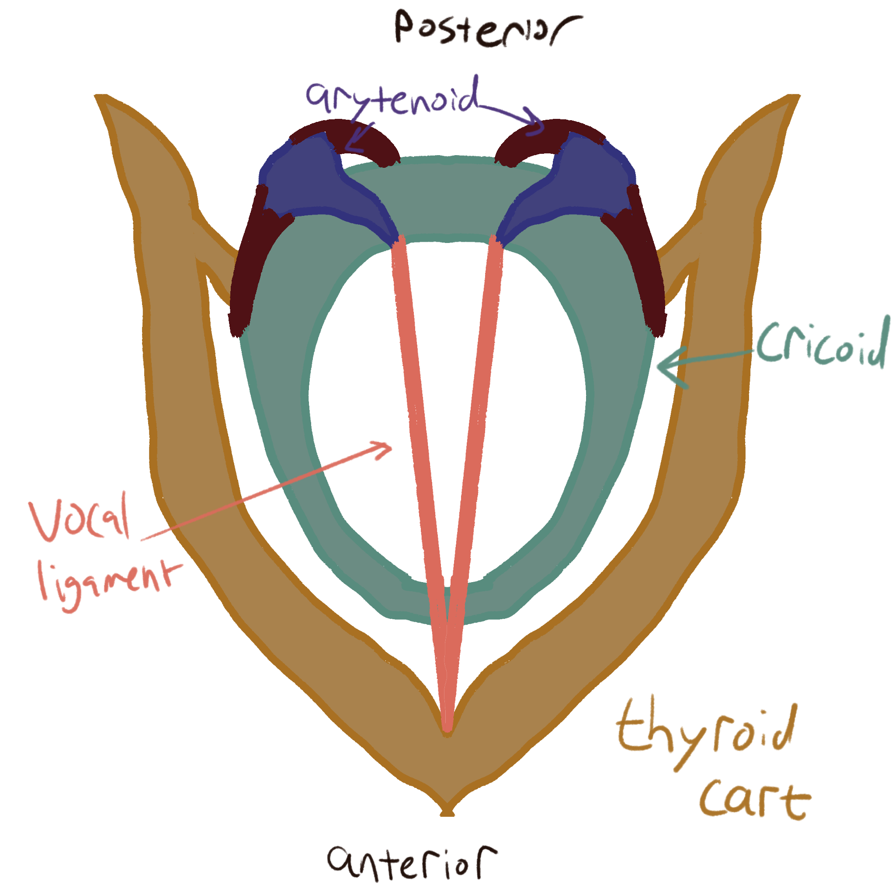
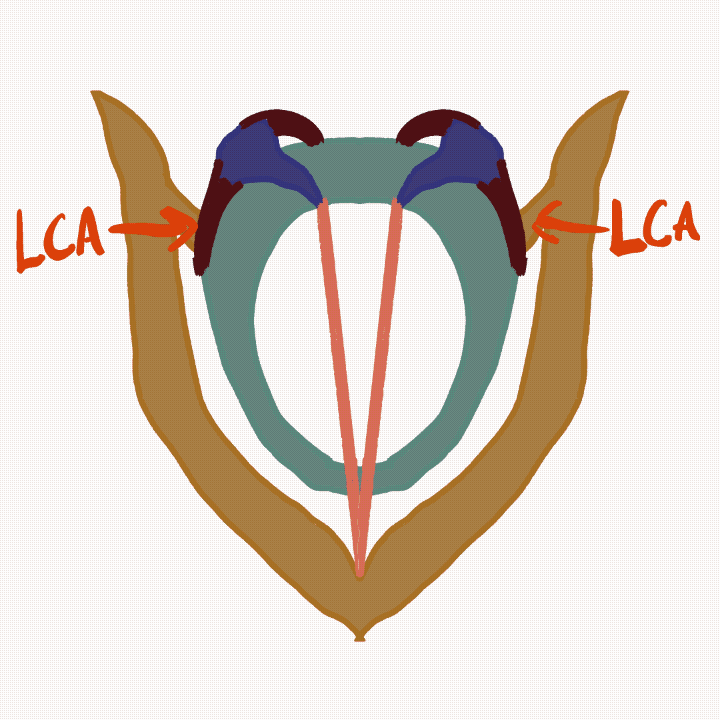
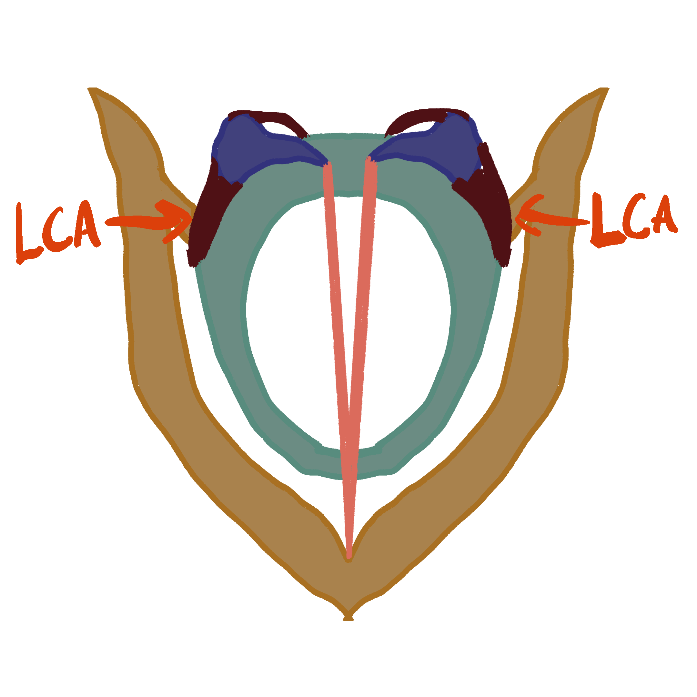
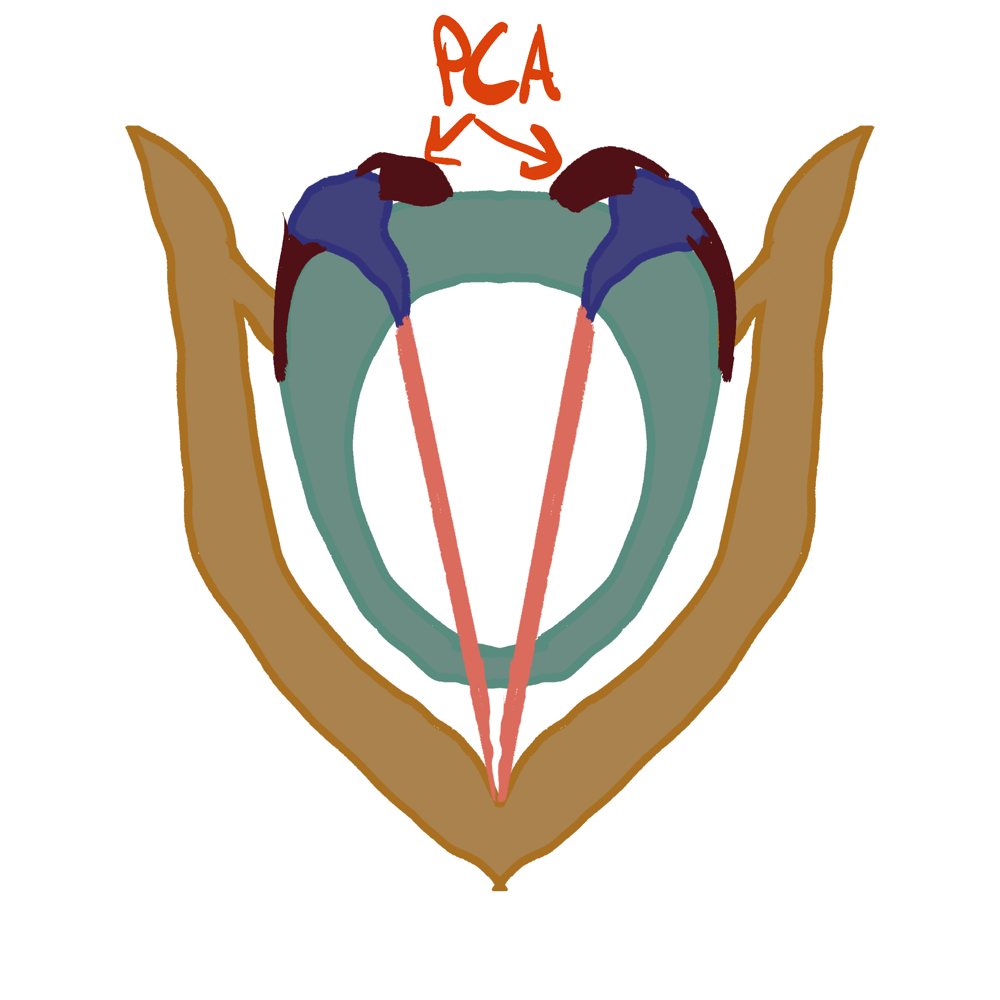
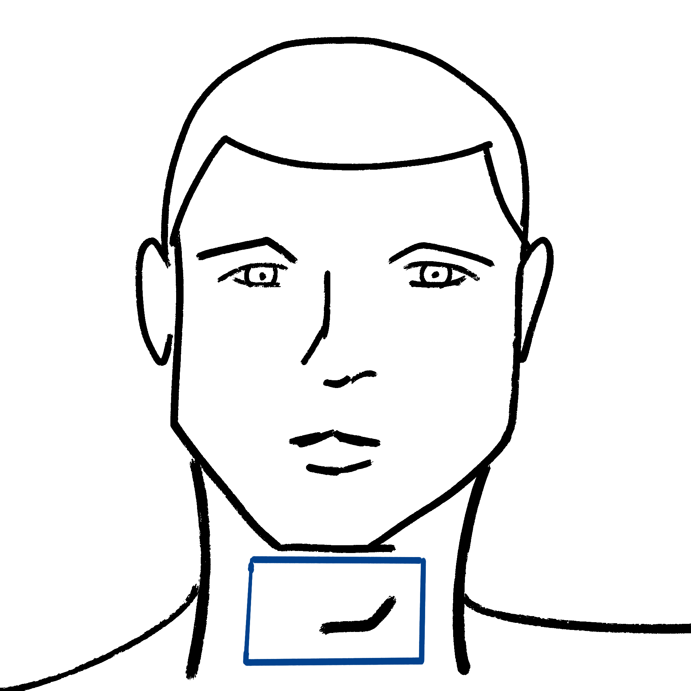
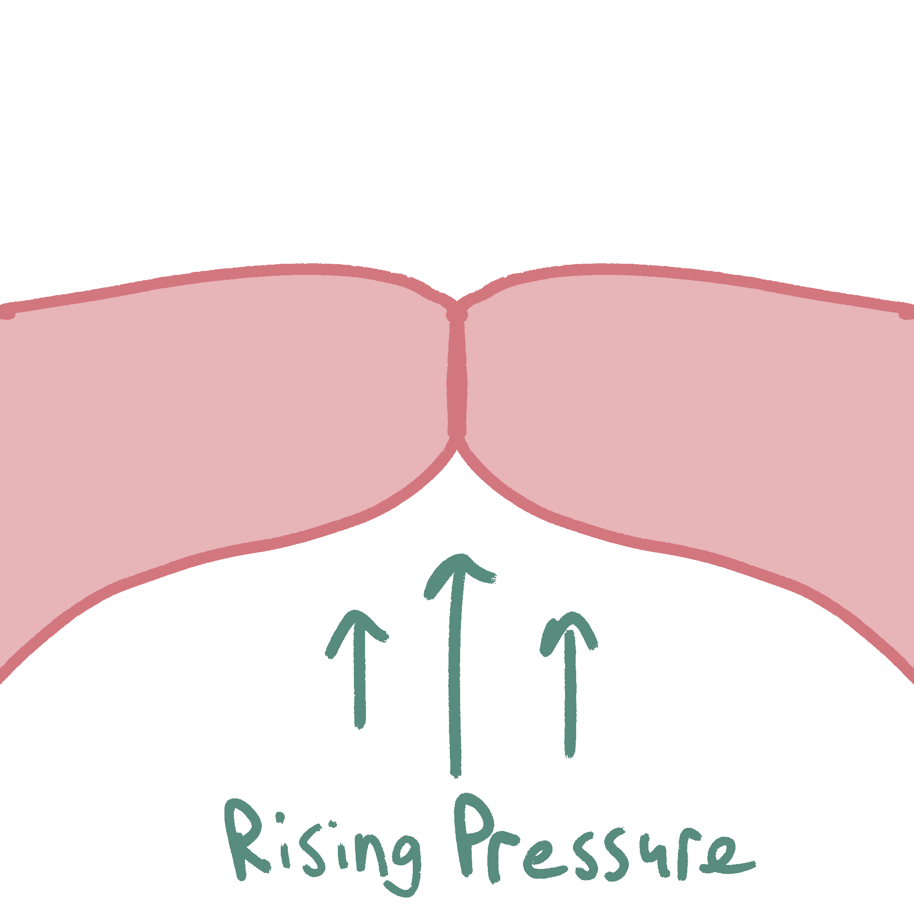
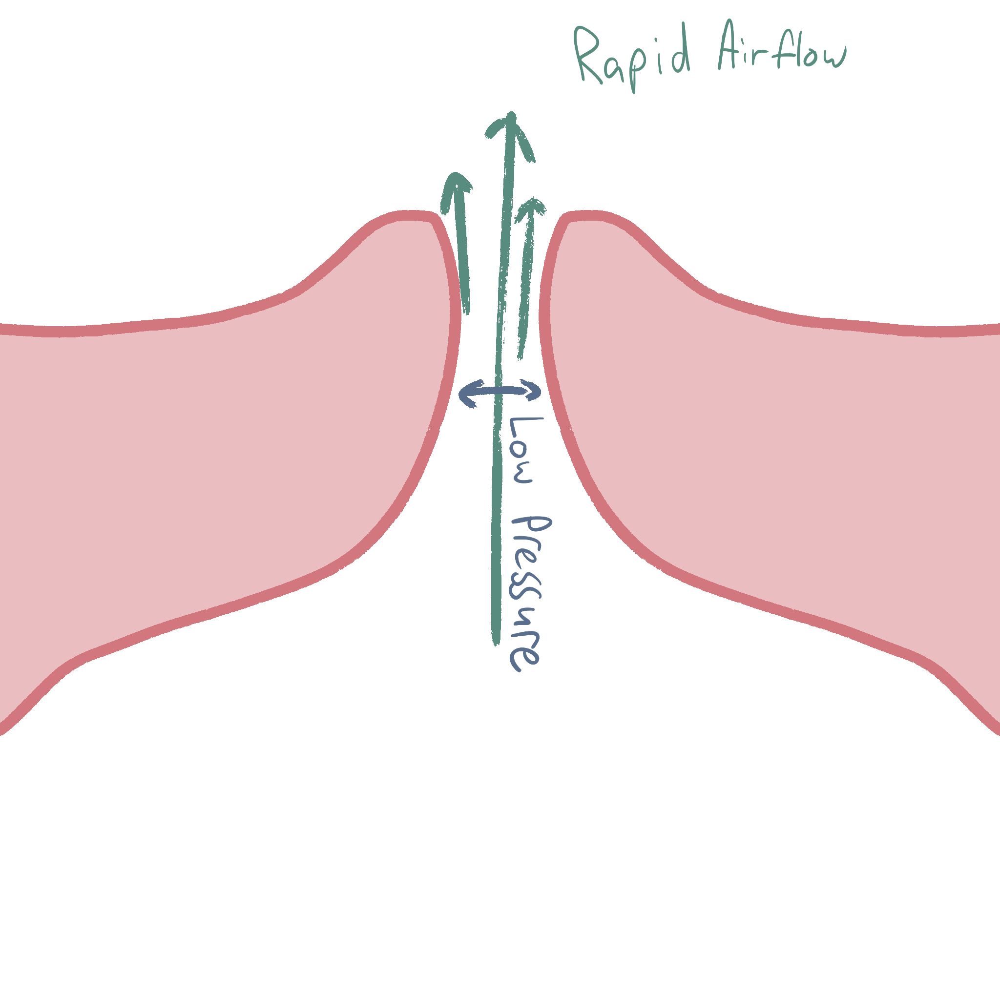

## The Larynx

:::::::: r-stack
:::: {layout-ncol="2"}
{fig-align="center"}

::: {.fragment fragment-index="2"}
{style="border-style=\"solid\"; border-color:blue;" fig-align="center"}
:::
::::

::::: {.content-visible when-format="revealjs"}
:::: {.fragment fragment-index="1"}
::: {.shape-square .absolute bottom="100" left="200" fill="none" stroke="blue" size="12rem"}
:::
::::
:::::
::::::::

## Voicing

:::: {layout="[[30,30,90]]"}
{fig-align="center" width="10%"}

::: {}
:::

{fig-align="center" width="60%"}
::::

## Voicing

::::: {.content-hidden when-format="typst"}
:::: {layout="[[30,30,90]]"}
{fig-align="center" width="10%"}

::: {}
:::

{fig-align="center" width="60%"}
::::
:::::

:::: {.content-visible when-format="typst"}
::: {layout-ncol="2"}
{width="50%"}

{width="50%"}
:::
::::

## Voicing

:::: {layout="[[30,30,90]]"}
{fig-align="center" width="20%"}

::: {}
:::

{fig-align="center" width="60%"}
::::

## Voicing

:::: {layout="[[30,30,90]]"}
{fig-align="center" width="20%"}

::: {}
:::

{fig-align="center" width="60%"}
::::

::::: {.content-hidden when-format="typst"}
## Voicing

:::: {layout="[[30,10,90]]"}
{fig-align="center" width="20%"}

::: {}
:::

{fig-align="center" width="60%"}
::::
:::::

## Voicing

### Pitch

::: {.content-hidden when-format="typst"}
```{=html}
<script src="https://unpkg.com/@strudel/embed@latest"></script>
<strudel-repl>
<!--  
  setcpm(60) 
  s("pink")
  .replicate(slider(4, 4, 200, 4)) 
  .clip(0.05)
  .lpf(1000)
  ._spectrum()
-->
</strudel-repl>
```
:::

## Voice Quality

### Modal Voice

```{r}
library(tidyverse)
library(ggdist)
set.seed(2026-09-01)
```

```{r}
#| fig-width: 10
#| fig-height: 2
make_glot <- function(
    peaks = seq(
      0,20, by = 4
    ),
    open_prop = 0.6,
    close_prop = 0.2
  ) {

  tibble(
    peaks = peaks
  ) |> 
    mutate(
      prev = lag(peaks),
      diff = peaks - lag(peaks),
      lead = lead(peaks) - peaks
    ) |> 
    filter(!is.na(prev)) |> 
    fill(
      lead
    )-> 
    peak_lag
  
  
  peak_lag |> 
    mutate(
      open_traj = map2(
        peaks, diff,
        \(p, d){
          tibble(
            time = seq(
              p - (d * open_prop), p,
              length = 10
            ),
            open = plogis(seq(
              -4, 4,
              length = 10
            )
          ))
        }
      ),
      close_traj = map2(
        peaks, lead,
        \(p, l){
          tibble(
            time = seq(
              p, p+(l*close_prop),
              length = 10
            ),
            open = plogis(seq(
              4, -4,
              length = 10
            )
            ))
        }
      ),
      all_traj = map2(
        open_traj, close_traj,
        ~bind_rows(.x, .y)
      )
    ) |> 
    unnest(all_traj) |> 
    # bind_rows(
    #   tibble(
    #     time = c(0,24),
    #     open = 0
    #   )
    # ) |> 
    identity()
}
  
```

```{r}
#| fig-width: 10
#| fig-height: 2
make_glot(
  peaks = seq(
    0, 20,
    by = 2
  ),
  open_prop = 0.4,
  close_prop = 0.15
) |> 
  ggplot(
    aes(time, open)
  ) + 
  geom_line() +
  labs(
    x = "time",
    y = "glottal airflow"
  ) +
  theme_ggdist() +
  theme_sub_axis(
    text = element_blank(),
    ticks = element_blank()
  )
```

## Voice Quality

### Modal Voice

- Very "periodic" - glottal pulses at a regular rhythm

- High frequency

## Voice Quality

### Creaky Voice

```{r}
#| fig-width: 10
#| fig-height: 2
make_glot(
  peaks = seq(
    0, 20,
    by = 3.5
  ) + runif(
    6, 
    min = -1, max = 1
  ),
  open_prop = 0.2,
  close_prop = 0.05
) |> 
  ggplot(
    aes(time, open)
  ) + 
  geom_line() +
  labs(
    x = "time",
    y = "glottal airflow"
  ) +
  ylim(0, 1.2) +
  theme_ggdist() +
  theme_sub_axis(
    text = element_blank(),
    ticks = element_blank()
  )
```

## Voice Quality

### Creaky Voice

- Low frequency

- Some irregular timing between opening phases

- Lower airflow

- Achieved by highly constricted glottis

@keating2015

## Voice Quality

### Vocal Fry

```{r}
#| fig-width: 10
#| fig-height: 2
make_glot(
  peaks = seq(
    0, 20,
    by = 3.5
  ) ,
  open_prop = 0.3,
  close_prop = 0.1
) |> 
  ggplot(
    aes(time, open)
  ) + 
  geom_line() +
  labs(
    x = "time",
    y = "glottal airflow"
  ) +
  theme_ggdist() +
  theme_sub_axis(
    text = element_blank(),
    ticks = element_blank()
  )
```

## Voice Quality

### Vocal Fry

- Periodic (regular intervals)

- Low frequency

- Achieved by ??

@keating2015

## Voice Quality

### Vocal Fry

Almost everything you've heard about "vocal fry" in popular culture is bunk.

- There's nothing harmful about it.

- People really only complain about women doing it, even though men also do it [@slobe2016]

- When people complain, they often also don't correctly identify what they're complaining about.

## Voice Quality

### Breathy voice

```{r}
#| fig-width: 10
#| fig-height: 2
make_glot(
  peaks = seq(
    0, 20,
    by = 3
  ) ,
  open_prop = 0.7,
  close_prop = 0.2
) |> 
  ggplot(
    aes(time, open)
  ) + 
  geom_line() +
  labs(
    x = "time",
    y = "glottal airflow"
  ) +
  theme_ggdist() +
  theme_sub_axis(
    text = element_blank(),
    ticks = element_blank()
  )
```

## Voice Quality

### Breathy Voice

- Periodic

- High glottal airflow

- Achieved by laxer vocal fold constriction

## References
