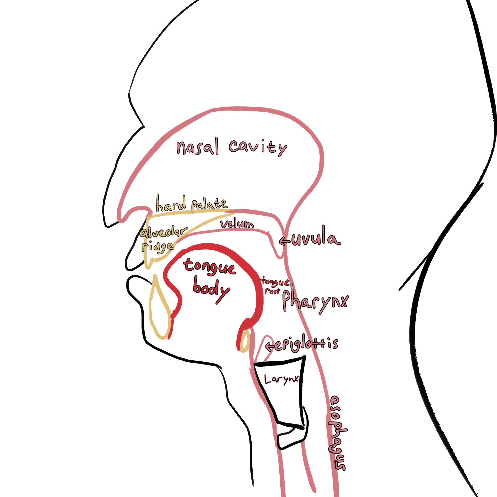
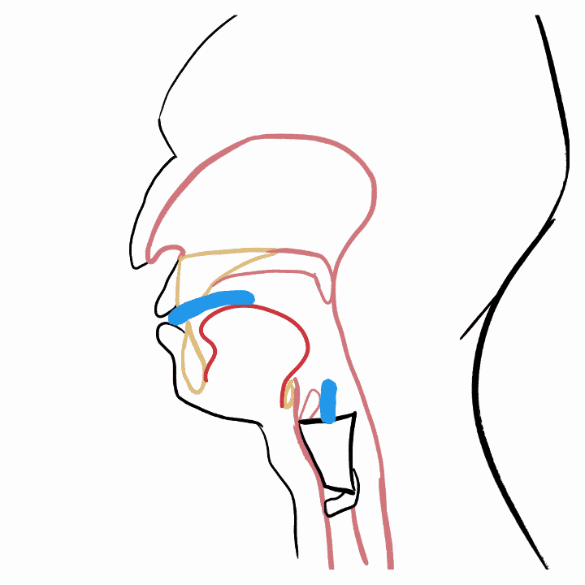
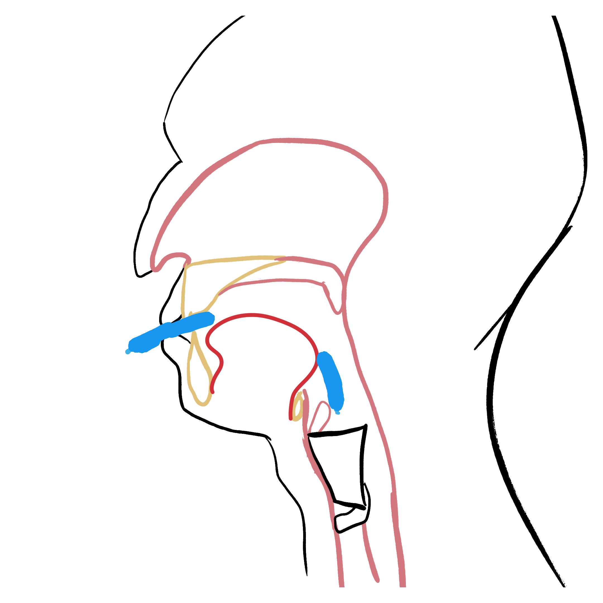
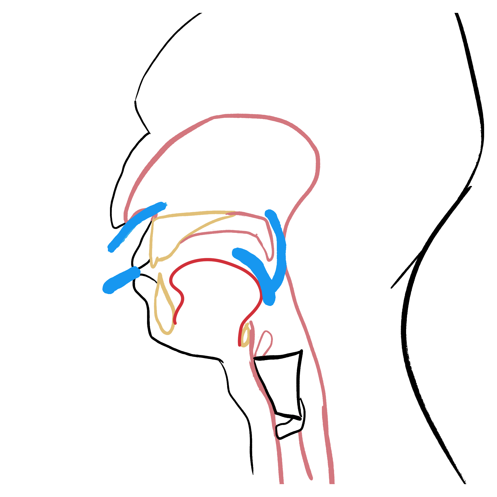
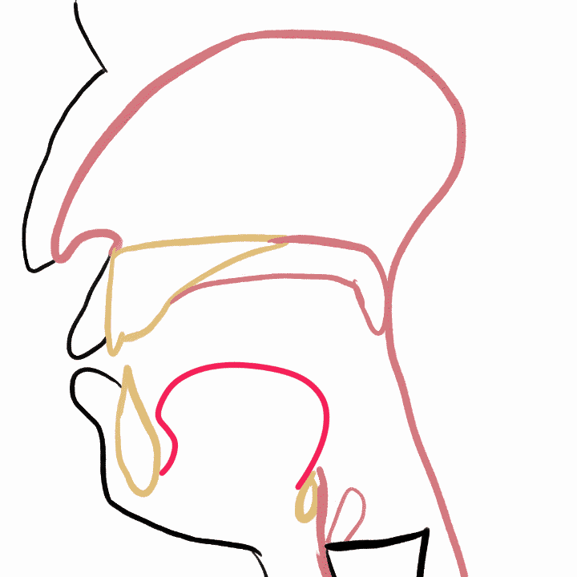
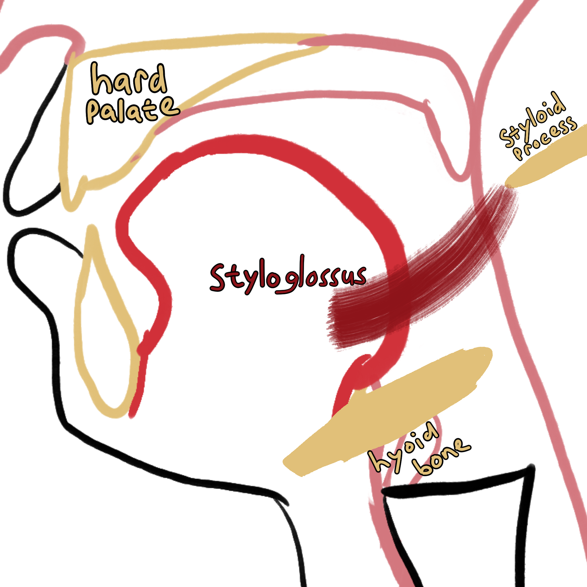
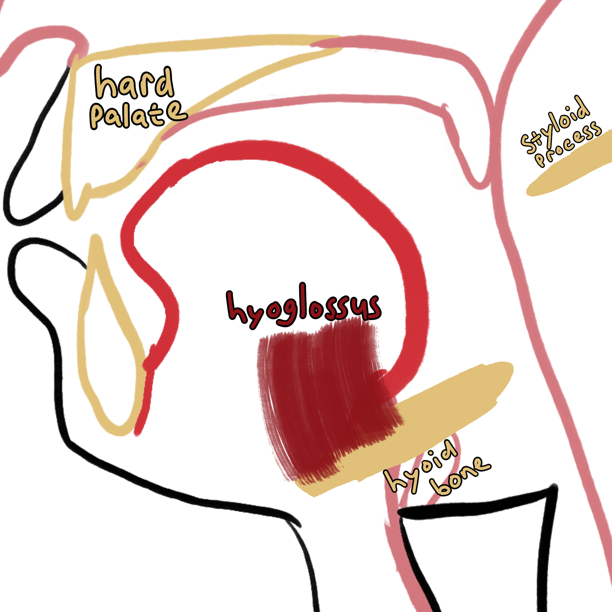
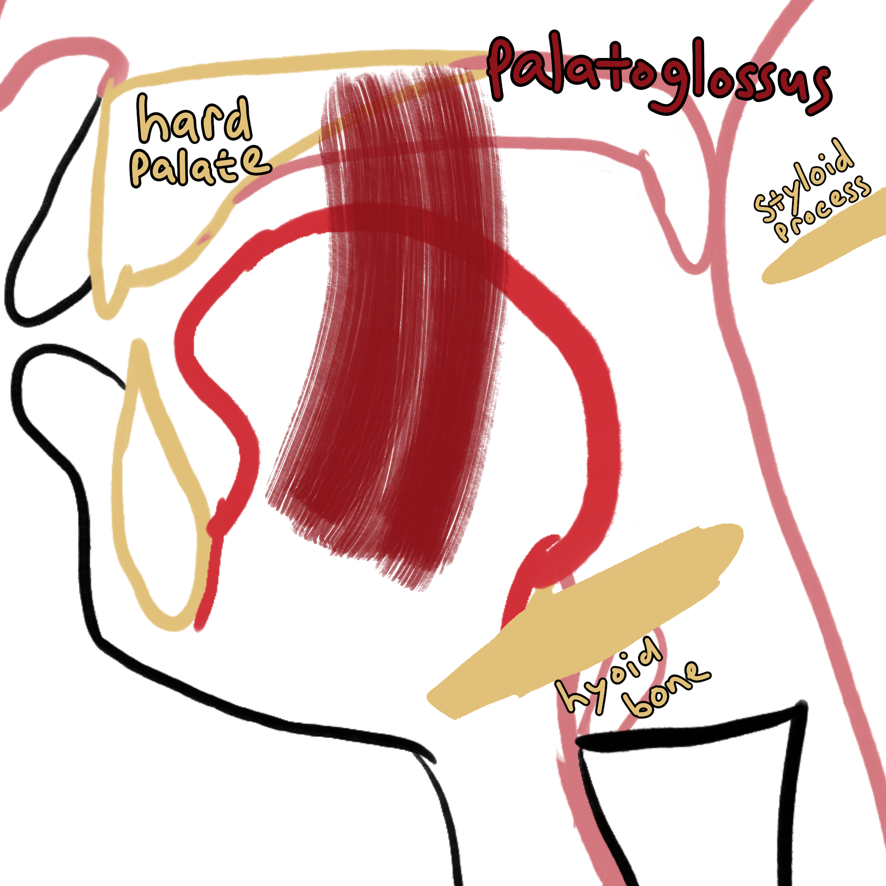
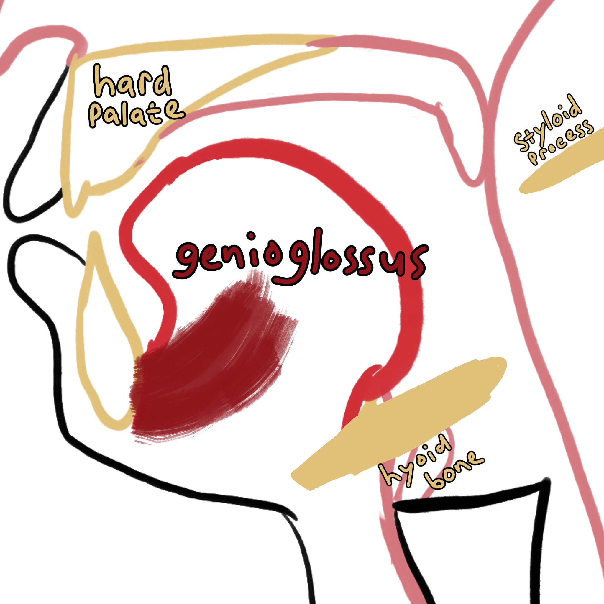
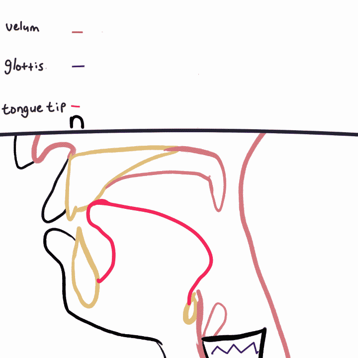

##  {background-image="images/supra1.png" background-size="contain"}

::: {.content-hidden when-format="revealjs"}
{fig-align="center"}
:::

## Nasopharynx

::: {.content-hidden when-format="typst"}
{fig-align="center"}
:::

:::: {.content-visible when-format="typst"}
::: {layout-ncol="2"}

:::
::::

## The Tongue

{fig-align="center"}

## The Tongue

- **extrinsic** muscles: muscles attached to the tongue

- **intrinsic** muscles: muscles within the tongue

## The Tongue

Muscles are usually named for the what they attach to.

- "-glossus": Attaching to the tongue

## The Tongue

### Extrinsic Muscles

{fig-align="center"}

Pulls tongue body back

## Styloid Process

[{.img-hor-vert fig-alt="Styloid process of temporal bone - lateral view04" fig-align="center" width="60%"}](https://commons.wikimedia.org/wiki/File:Styloid_process_of_temporal_bone_-_lateral_view04.png)

<!--  -->

## The Tongue

### Extrinsic Muscles

{fig-alt="Hyoglossus Muscle" fig-align="center"}

Pulls tongue body down

## The Tongue

### Extrinsic Muscles

{fig-align="center"}

Pulls tongue up

## The Tongue

### Extrinsic Muscles

{fig-align="center"}

Downward and forward

## Coordinating it all {.smaller}

Everything is connected to everything

- Hyoglossus pulls down on tongue ➔

- Tongue pulls on palatoglossus ➔

- Palatoglossus pulls on soft palate

Low vowels are more likely to be nasalized than high vowels.

## Coordinating it all

### Timing

{fig-align="center"}
