```{r}
#| echo: false
source(here::here("_extensions/mcanouil/typst-render/_resources/typst_define.R"))
```

# Reading

Zsiga Chapter 2

# Transcription

## Transcription

::: {.content-hidden when-format="typst"}
```{typst}
//| fig-alt: A musical staff with notes
#import "@preview/staves:0.1.0": stave

#stave(
  "treble", 
  "A", 
  notes: ("A4", "A4", "C5", "E5", "A5", "E5", "C5", "A4"),
  note-duration: "quarter"
)
```
:::

::: {.content-visible when-format="typst"}
```{typst}
//| output: asis
//| fig-alt: A musical staff with notes
#import "@preview/staves:0.1.0": stave

#stave("treble", "A", notes: ("A4", "A4", "C5", "E5", "A5", "E5", "C5", "A4"))
```
:::

```{r}
library(tidyverse)
source(here::here("_defaults.R"))
```

## Notation

But what *is* "A"?

```{r}
#| fig-alt: A sine wave at 440 Hz.
#| dev: svg
tibble(
  x = seq(0, 0.025, length = 1000),
  y = sin((x*440) * (2*pi))
) |> 
  ggplot(
    aes(x, y)
  )+
  geom_hline(
    yintercept = 0,
    color = "grey40"
  ) +
  geom_line(
    linewidth = 1
  ) +
  labs(
    x = "seconds",
    title = "440 Hertz"
  ) +
  theme_no_y()
```

## Transcription

There have been different conventions for what frequency "Concert A" should be!

:::: {.content-hidden when-format="typst"}
::: {layout-ncol="2"}
```{=html}
<script src="https://unpkg.com/@strudel/embed@latest"></script>
<strudel-repl>
<!--  
function semitone(x){
  return x.map(z => 2**(z/12))
}
let A4 = "<415  432  440  432>"

$: A4
  .segment(8)
  .mul(semitone([0, 4, 7, 12, 7, 4, 0]))
  .freq()
  ._pianoroll()
-->
</strudel-repl>
```

```{typst}
//| fig-alt: A musical staff
#import "@preview/staves:0.1.0": stave

#stave(
  "treble", 
  "A", 
  notes: ("A4", "A4", "C5", "E5", "A5", "E5", "C5", "A4"),
  note-duration: "quarter"
)
```
:::
::::

## 440Hz how?

::: {layout-ncol="2" style="font-size: 7em"}
🎷

🎸
:::

## [ɹ]{.ipa} how?

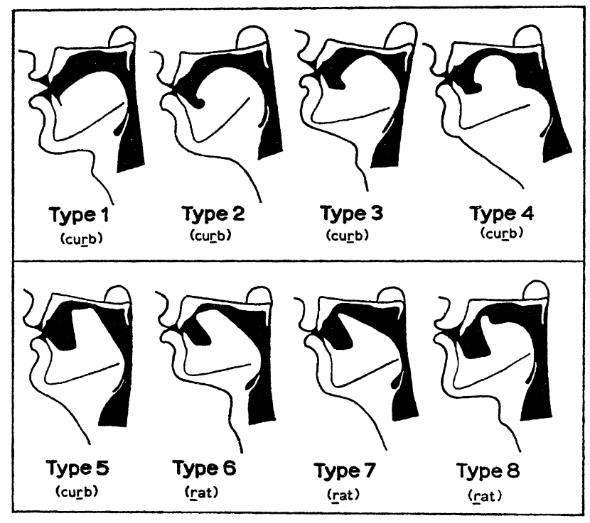{fig-alt="Schematic diagrams of different [r] articulations" fig-align="center" width="100%"}

source: @delattreDIALECTSTUDYAMERICAN1968

## The IPA!

::: {.content-hidden when-format="typst"}
```{typst}
//| fig-alt: The IPA consonants
#import "@preview/phonokit:0.5.14": *
#phonokit-init(font: "Noto Sans")
#consonants("all")
```
:::

::: {.content-visible when-format="typst"}
```{typst}
//| output: asis
#import "@preview/phonokit:0.5.14": *
#phonokit-init(font: "Noto Sans")
#consonants("all")
```
:::

## IPA Bits and Pieces

:::: {layout-ncol="2"}
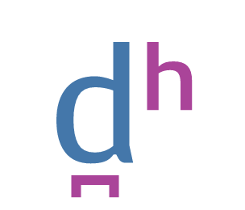{fig-alt="A \"d\" symbol with diacritics"}

::: {}
[**Symbol**]{style="color: #4477aa; font-size: 3em"}

[**Diacritics**]{style="color: #aa4499; font-size: 3em"}
:::
::::

## IPA Bits and Pieces

You *really* should not assume that the un-decorated symbol is more "basic" or "general" or "simpler" than the decorated symbol.

```{=typst}
#text(font: "Noto Sans")[
```
::::: {layout-ncol="2"}
::: {style="font-size:2em"}
*diss* (to insult)

[\[dɪs\]]{.ipa}
:::

::: {style="font-size:2em"}
*dis* (this)

[\[d̪ɪs\]]{.ipa}
:::
:::::

```{=typst}
]
```
## Place & Manner

### Place

- *Where* the point of greatest constriction is.

### Manner

- *What* happens at that place of constriction.

# Place

## Place

Most articulations have an *active* and a *passive* articulator

- Active: the articulator that moves

- Passive: the articulator that gets moved to

Most places of articulation and named for the location of the passive articulator.

## Place

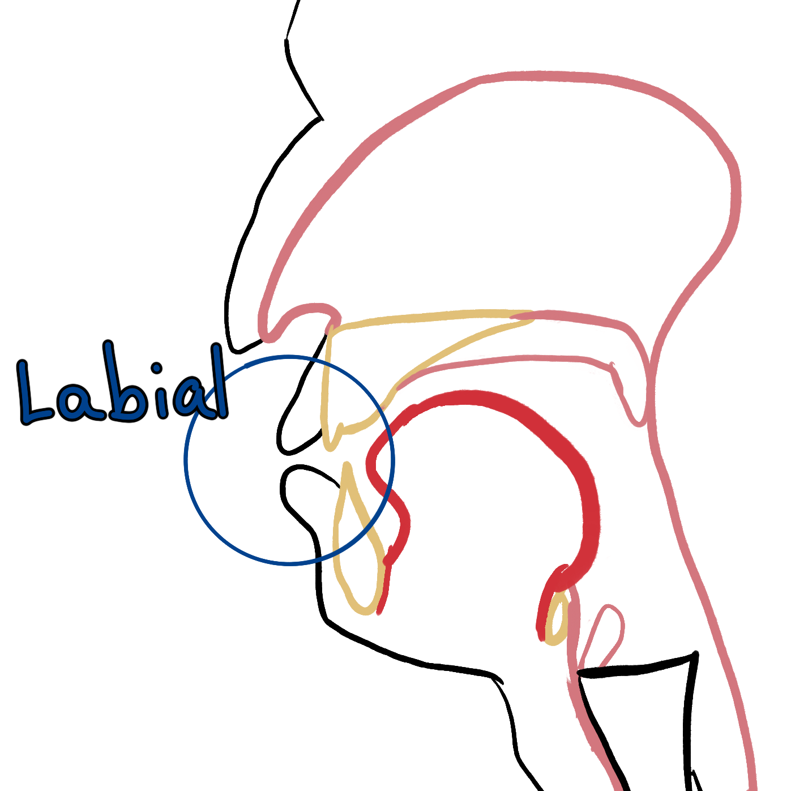{fig-alt="Labial" fig-align="center" width="100%"}

## Place

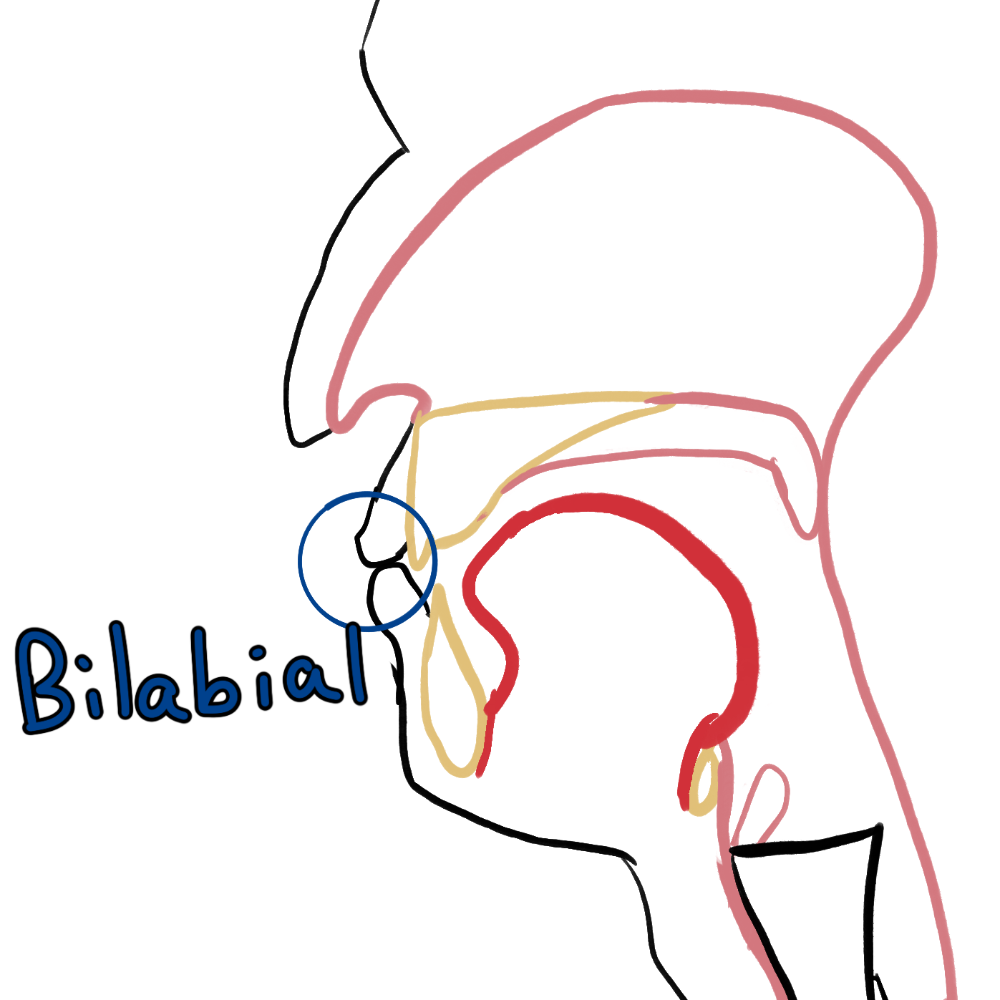{fig-alt="Bilabial" fig-align="center" width="100%"}

## Place

::: {.content-hidden when-format="typst"}
```{typst}
//| fig-alt: The IPA consonants
#import "@preview/phonokit:0.5.14": *
#phonokit-init(font: "Noto Sans")
#let phone_arr = (
  "p", "b",
  "m", "\\;B",
  "F", "B",
  "w"
)
#let phone_map = (phone_arr.map(p => (p, red.darken(19%)))).to-dict()

#consonants(
  "all",
  phoneme-colors: phone_map
)
```
:::

::: {.content-visible when-format="typst"}
```{typst}
//| output: asis
#import "@preview/phonokit:0.5.14": *
#phonokit-init(font: "Noto Sans")
#let phone_arr = (
  "p", "b",
  "m", "\\;B",
  "F", "B",
  "w"
)
#let phone_map = (phone_arr.map(p => (p, red.darken(19%)))).to-dict()

#consonants(
  "all",
  phoneme-colors: phone_map
)
```
:::

## Place

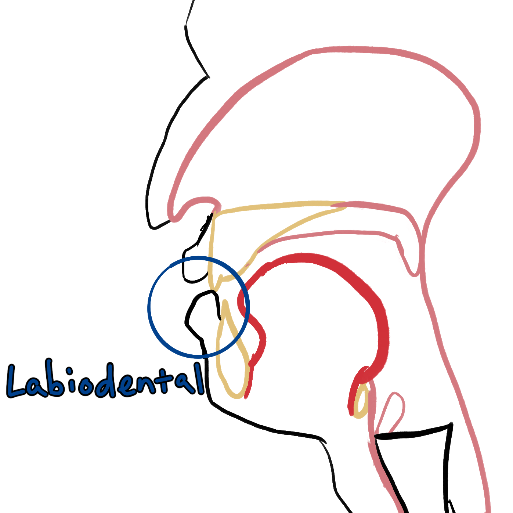{fig-alt="Labiodental" fig-align="center" width="100%"}

## Place

::: {.content-hidden when-format="typst"}
```{typst}
//| fig-alt: The IPA consonants
#import "@preview/phonokit:0.5.14": *
#phonokit-init(font: "Noto Sans")
#let phone_arr = (
  "M","V",
  "ⱱ", "f", "v"
)
#let phone_map = (phone_arr.map(p => (p, red.darken(19%)))).to-dict()

#consonants(
  "all",
  phoneme-colors: phone_map
)
```
:::

::: {.content-visible when-format="typst"}
```{typst}
//| output: asis
#import "@preview/phonokit:0.5.14": *
#phonokit-init(font: "Noto Sans")
#let phone_arr = (
  "M","V",
  "ⱱ", "f", "v"
)
#let phone_map = (phone_arr.map(p => (p, red.darken(19%)))).to-dict()

#consonants(
  "all",
  phoneme-colors: phone_map
)
```
:::

## Place

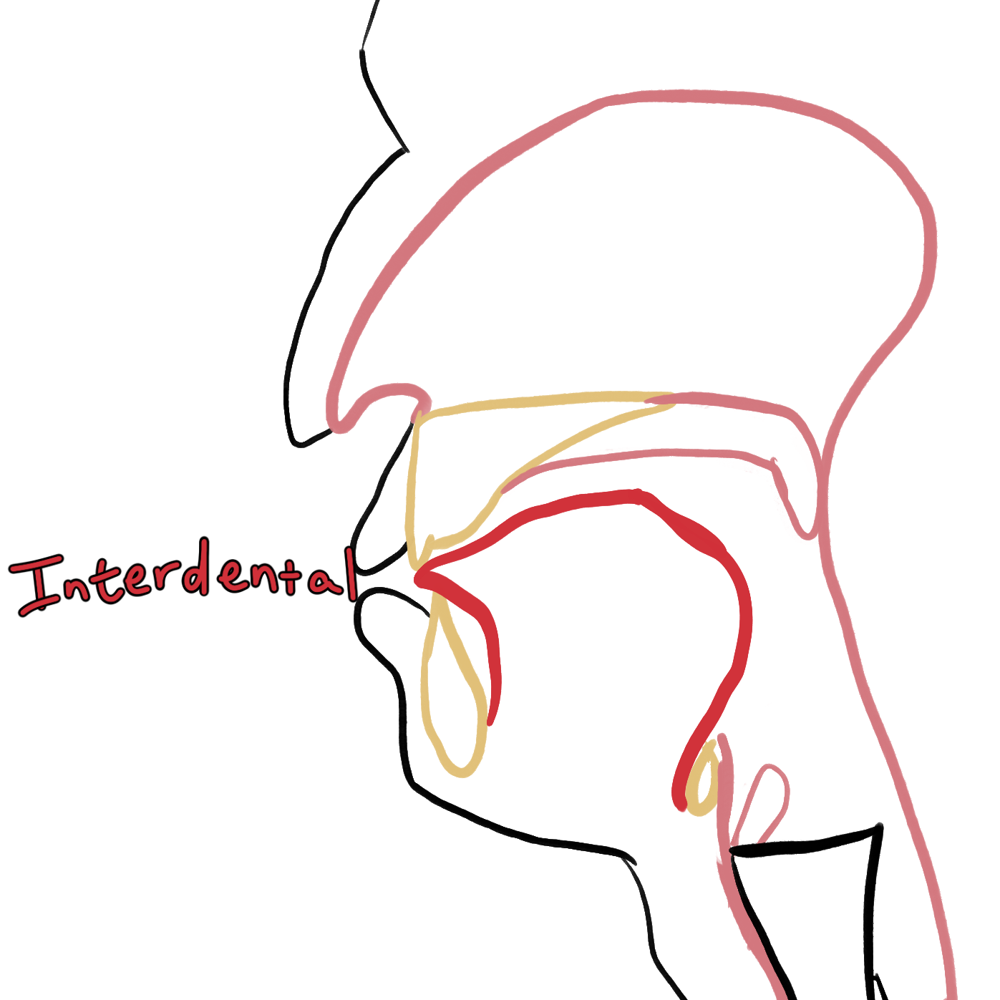{fig-alt="Interdental" fig-align="center" width="100%"}

## Place

::: {.content-hidden when-format="typst"}
```{typst}
//| fig-alt: The IPA consonants
#import "@preview/phonokit:0.5.14": *
#phonokit-init(font: "Noto Sans")
#let phone_arr = (
 "T", "D"
)
#let phone_map = (phone_arr.map(p => (p, red.darken(19%)))).to-dict()

#consonants(
  "all",
  phoneme-colors: phone_map
)
```
:::

::: {.content-visible when-format="typst"}
```{typst}
//| output: asis
#import "@preview/phonokit:0.5.14": *
#phonokit-init(font: "Noto Sans")
#let phone_arr = (
 "T", "D"
)
#let phone_map = (phone_arr.map(p => (p, red.darken(19%)))).to-dict()

#consonants(
  "all",
  phoneme-colors: phone_map
)
```
:::

## Place

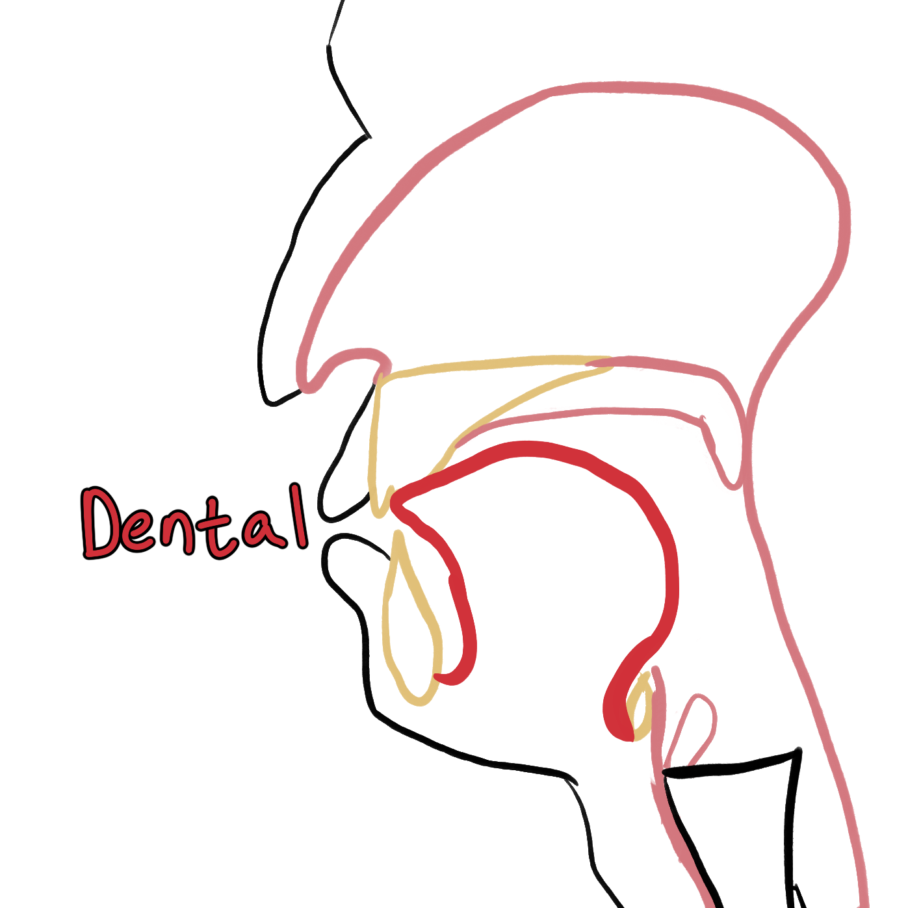{fig-alt="Dental" fig-align="center" width="100%"}

## Place

### Dental

::: {.content-hidden when-format="typst"}
```{typst}
//| fig-alt: The IPA consonants
#import "@preview/phonokit:0.5.14": *
#phonokit-init(font: "Noto Sans")
#table(
  columns: (10em),
  inset: 0.5em,
  stroke: none,
  align: horizon+center,
  [#ipa("\\dental t") #ipa("\\dental d")],
  [#ipa("\\dental n")],
  [#ipa("\\dental s") #ipa("\\dental z")]
)

```
:::

::: {.content-visible when-format="typst"}
```{typst}
//| output: asis
#import "@preview/phonokit:0.5.14": *
#phonokit-init(font: "Noto Sans")
#table(
  columns: (10em),
  inset: 0.5em,
  stroke: none,
  align: horizon+center,
  [#ipa("\\dental t") #ipa("\\dental d")],
  [#ipa("\\dental n")],
  [#ipa("\\dental s") #ipa("\\dental z")]
)
```
:::

## Place

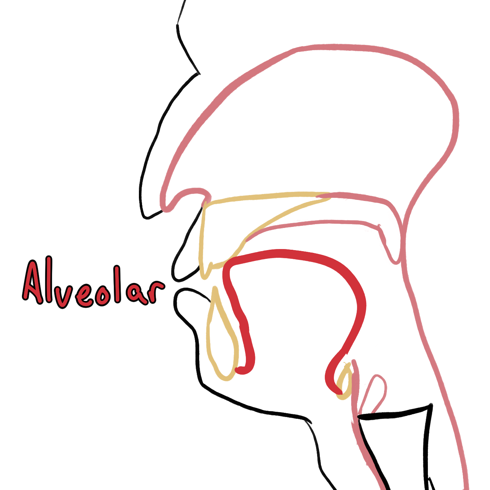{fig-alt="Alveolar" fig-align="center" width="100%"}

## Place

::: {.content-hidden when-format="typst"}
```{typst}
//| fig-alt: The IPA consonants
#import "@preview/phonokit:0.5.14": *
#phonokit-init(font: "Noto Sans")
#let phone_arr = (
 "t", "d",
 "n",
 "r",
 "R",
 "s", "z",
 "\\textbeltl","\\l3",
 "\\*r", 
 "l"
)

#let phone_map = (phone_arr.map(p => (p, red.darken(19%)))).to-dict()

#consonants(
  "all",
  phoneme-colors: phone_map
)
```
:::

::: {.content-visible when-format="typst"}
```{typst}
//| output: asis
#import "@preview/phonokit:0.5.14": *
#phonokit-init(font: "Noto Sans")
#let phone_arr = (
 "t", "d",
 "n",
 "r",
 "R",
 "s", "z",
 "\\textbeltl","\\l3",
 "\\*r", 
 "l"
)
#let phone_map = (phone_arr.map(p => (p, red.darken(19%)))).to-dict()

#consonants(
  "all",
  phoneme-colors: phone_map
)
```
:::

## Place

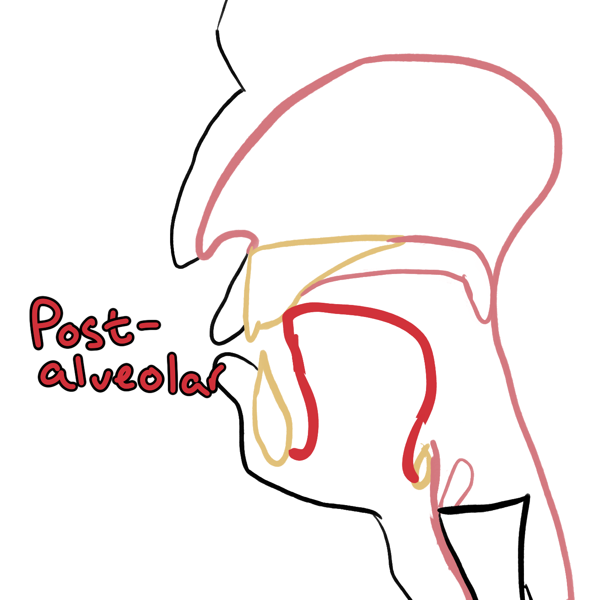{fig-alt="Postalveolar" fig-align="center" width="100%"}

## Place

::: {.content-hidden when-format="typst"}
```{typst}
//| fig-alt: The IPA consonants
#import "@preview/phonokit:0.5.14": *
#phonokit-init(font: "Noto Sans")
#let phone_arr = (
  "S", "Z"
)
#let phone_map = (phone_arr.map(p => (p, red.darken(19%)))).to-dict()

#consonants(
  "all",
  phoneme-colors: phone_map
)
```
:::

::: {.content-visible when-format="typst"}
```{typst}
//| output: asis
#import "@preview/phonokit:0.5.14": *
#phonokit-init(font: "Noto Sans")
#let phone_arr = (
  "S", "Z"
)
#let phone_map = (phone_arr.map(p => (p, red.darken(19%)))).to-dict()

#consonants(
  "all",
  phoneme-colors: phone_map
)
```
:::

## Place

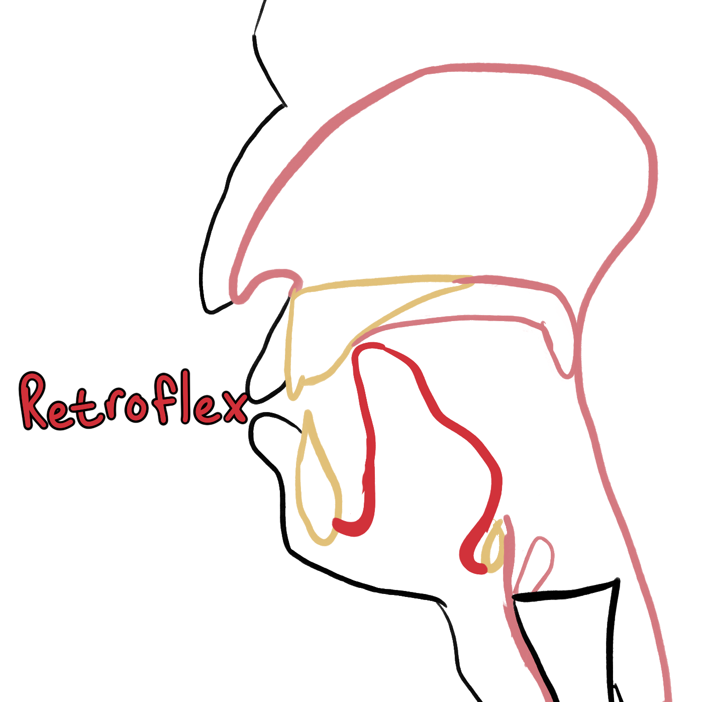{fig-alt="retroflex" fig-align="center" width="100%"}

## Place

::: {.content-hidden when-format="typst"}
```{typst}
//| fig-alt: The IPA consonants
#import "@preview/phonokit:0.5.14": *
#phonokit-init(font: "Noto Sans")
#let phone_arr = (
  "\\:t", "\\:d",
  "\\:n",
  "\\:r", 
  "\\:s",  "\\:z",
  "\\:R",
  "\\:l"
)
#let phone_map = (phone_arr.map(p => (p, red.darken(19%)))).to-dict()

#consonants(
  "all",
  phoneme-colors: phone_map
)
```
:::

::: {.content-visible when-format="typst"}
```{typst}
//| output: asis
#import "@preview/phonokit:0.5.14": *
#phonokit-init(font: "Noto Sans")
#let phone_arr = (
  "\\:t", "\\:d",
  "\\:n",
  "\\:r", 
  "\\:s",  "\\:z",
  "\\:R",
  "\\:l"
)
#let phone_map = (phone_arr.map(p => (p, red.darken(19%)))).to-dict()

#consonants(
  "all",
  phoneme-colors: phone_map
)
```
:::

## Place

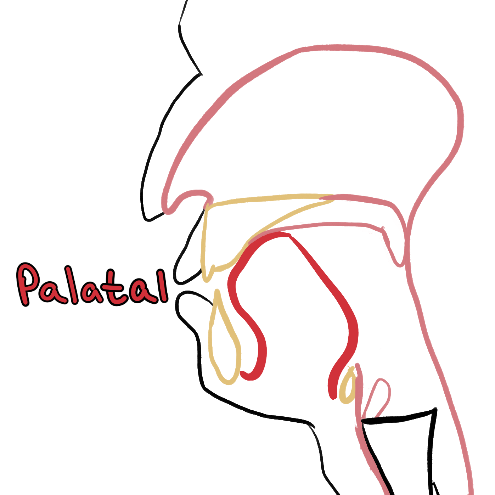{fig-alt="Palatal" fig-align="center" width="100%"}

## Place

::: {.content-hidden when-format="typst"}
```{typst}
//| fig-alt: The IPA consonants
#import "@preview/phonokit:0.5.14": *
#phonokit-init(font: "Noto Sans")
#let phone_arr = (
  "c","\\barredj",
  "\\textltailn",
  "C", "J",
  "j",
  "L"
)
#let phone_map = (phone_arr.map(p => (p, red.darken(19%)))).to-dict()

#consonants(
  "all",
  phoneme-colors: phone_map
)
```
:::

::: {.content-visible when-format="typst"}
```{typst}
//| output: asis
#import "@preview/phonokit:0.5.14": *
#phonokit-init(font: "Noto Sans")
#let phone_arr = (
  "c","\\barredj",
  "\\textltailn",
  "C", "J",
  "j",
  "L"
)
#let phone_map = (phone_arr.map(p => (p, red.darken(19%)))).to-dict()

#consonants(
  "all",
  phoneme-colors: phone_map
)
```
:::

## Place

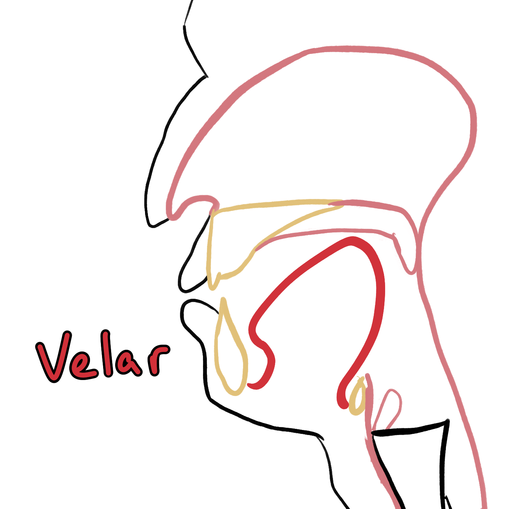{fig-alt="Velar" fig-align="center" width="100%"}

## Place

::: {.content-hidden when-format="typst"}
```{typst}
//| fig-alt: The IPA consonants
#import "@preview/phonokit:0.5.14": *
#phonokit-init(font: "Noto Sans")
#let phone_arr = (
  "k", "g",
  "N",
  "x", "G",
  "\\mw", 
  "\\;L"
)
#let phone_map = (phone_arr.map(p => (p, red.darken(19%)))).to-dict()

#consonants(
  "all",
  phoneme-colors: phone_map
)
```
:::

::: {.content-visible when-format="typst"}
```{typst}
//| output: asis
#import "@preview/phonokit:0.5.14": *
#phonokit-init(font: "Noto Sans")
#let phone_arr = (
  "k", "g",
  "N",
  "x", "G",
  "\\mw", 
  "\\;L"
)
#let phone_map = (phone_arr.map(p => (p, red.darken(19%)))).to-dict()

#consonants(
  "all",
  phoneme-colors: phone_map
)
```
:::

## Place

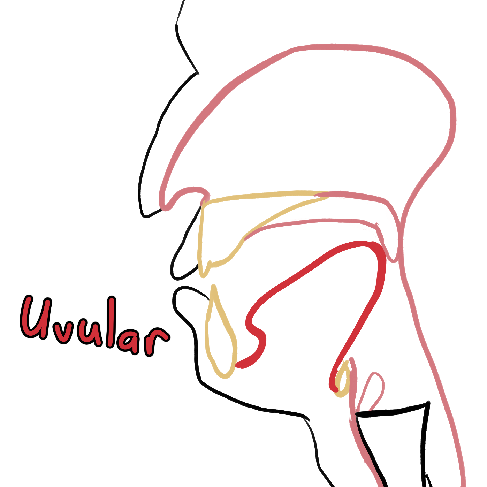{fig-alt="uvular" fig-align="center" width="100%"}

## Place

::: {.content-hidden when-format="typst"}
```{typst}
//| fig-alt: The IPA consonants
#import "@preview/phonokit:0.5.14": *
#phonokit-init(font: "Noto Sans")
#let phone_arr = (
  "q", "\\;G",
  "\\;N", 
  "\\;R",
  "X", "K"
)
#let phone_map = (phone_arr.map(p => (p, red.darken(19%)))).to-dict()

#consonants(
  "all",
  phoneme-colors: phone_map
)
```
:::

::: {.content-visible when-format="typst"}
```{typst}
//| output: asis
#import "@preview/phonokit:0.5.14": *
#phonokit-init(font: "Noto Sans")
#let phone_arr = (
  "q", "\\;G",
  "\\;N", 
  "\\;R",
  "X", "K"
)
#let phone_map = (phone_arr.map(p => (p, red.darken(19%)))).to-dict()

#consonants(
  "all",
  phoneme-colors: phone_map
)
```
:::

## Place

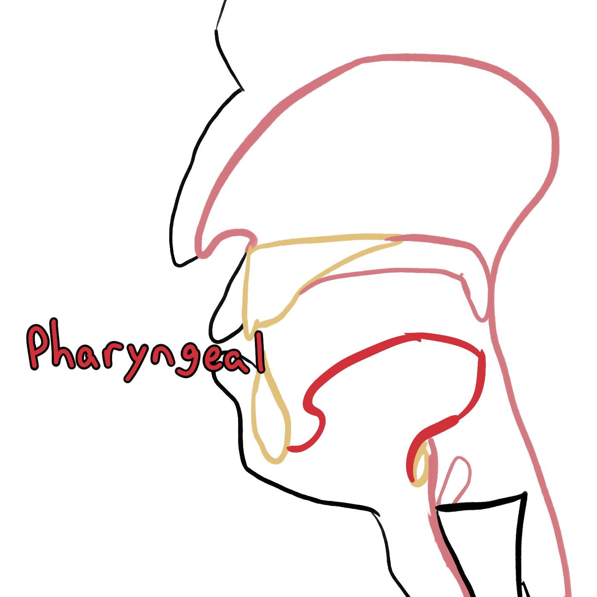{fig-alt="Pharyngeal" fig-align="center"}

## Place

::: {.content-hidden when-format="typst"}
```{typst}
//| fig-alt: The IPA consonants
#import "@preview/phonokit:0.5.14": *
#phonokit-init(font: "Noto Sans")
#let phone_arr = (
  "\\barredh","Q"
)
#let phone_map = (phone_arr.map(p => (p, red.darken(19%)))).to-dict()

#consonants(
  "all",
  phoneme-colors: phone_map
)
```
:::

::: {.content-visible when-format="typst"}
```{typst}
//| output: asis
#import "@preview/phonokit:0.5.14": *
#phonokit-init(font: "Noto Sans")
#let phone_arr = (
  "\\barredh","Q"
)
#let phone_map = (phone_arr.map(p => (p, red.darken(19%)))).to-dict()

#consonants(
  "all",
  phoneme-colors: phone_map
)
```
:::

## Place

There are also terms based on the active articulator involved.

- Front of tongue: Coronal

  - Tip of tongue: Apical

  - Blade of tongue: Laminal

- Back of tongue: Dorsal

## Place

| Apical       | Laminal      |
|--------------|--------------|
| [ʂ, ʐ]{.ipa} | [ç, ʝ]{.ipa} |
| (retroflex)  | (palatal)    |

# Manner

## Manner

*What* happens at each place of articulatio.

## Manner

### Oral Stops/Plosives

- Full constriction between articulators

- No oral airflow

- No nasal airflow

## Manner

### Oral Stops/Plosives

::: {.content-hidden when-format="typst"}
```{typst}
//| fig-alt: The IPA consonants
#import "@preview/phonokit:0.5.14": *
#phonokit-init(font: "Noto Sans")
#let phone_arr = (
  "p", "b",
  "t", "d",
  "\\:t", "\\:d",
  "c", "\barredj",
  "k", "g",
  "q", "\\;G",
  "P"
)
#let phone_map = (phone_arr.map(p => (p, red.darken(19%)))).to-dict()

#consonants(
  "all",
  phoneme-colors: phone_map
)
```
:::

::: {.content-visible when-format="typst"}
```{typst}
//| output: asis
#import "@preview/phonokit:0.5.14": *
#phonokit-init(font: "Noto Sans")
#let phone_arr = (
  "p", "b",
  "t", "d",
  "\\:t", "\\:d",
  "c", "\barredj",
  "k", "g",
  "q", "\\;G",
  "P"
)
#let phone_map = (phone_arr.map(p => (p, red.darken(19%)))).to-dict()

#consonants(
  "all",
  phoneme-colors: phone_map
)
```
:::

## Manner

### Nasal Stops

- Full constriction between articulators

- No oral airflow

- Nasal airflow

## Manner

### Nasal Stops

::: {.content-hidden when-format="typst"}
```{typst}
//| fig-alt: The IPA consonants
#import "@preview/phonokit:0.5.14": *
#phonokit-init(font: "Noto Sans")
#let phone_arr = (
  "m", "M",
  "n", "\\:n",
  "\\nh",
  "N",
  "\\;N"
)
#let phone_map = (phone_arr.map(p => (p, red.darken(19%)))).to-dict()

#consonants(
  "all",
  phoneme-colors: phone_map
)
```
:::

::: {.content-visible when-format="typst"}
```{typst}
//| output: asis
#import "@preview/phonokit:0.5.14": *
#phonokit-init(font: "Noto Sans")
#let phone_arr = (
  "m", "M",
  "n", "\\:n",
  "\\nh",
  "N",
  "\\;N"
)
#let phone_map = (phone_arr.map(p => (p, red.darken(19%)))).to-dict()

#consonants(
  "all",
  phoneme-colors: phone_map
)
```
:::

## Manner

### Trills & Taps

- Trills

  - Articulators held loosely together, allowing for airflow to generate the Bernoulli effect

- Taps

  - A very fast, glancing articulation.

## Manner

### Trills & Taps

::: {.content-hidden when-format="typst"}
```{typst}
//| fig-alt: The IPA consonants
#import "@preview/phonokit:0.5.14": *
#phonokit-init(font: "Noto Sans")
#let phone_arr = (
  "\\;B", "r",
  "\\;R", "ⱱ",
  "R", "\\:r"
)
#let phone_map = (phone_arr.map(p => (p, red.darken(19%)))).to-dict()

#consonants(
  "all",
  phoneme-colors: phone_map
)
```
:::

::: {.content-visible when-format="typst"}
```{typst}
//| output: asis
#import "@preview/phonokit:0.5.14": *
#phonokit-init(font: "Noto Sans")
#let phone_arr = (
  "\\;B", "r",
  "\\;R", "ⱱ",
  "R", "\\:r"
)
#let phone_map = (phone_arr.map(p => (p, red.darken(19%)))).to-dict()

#consonants(
  "all",
  phoneme-colors: phone_map
)
```
:::

## Manner

Nasals and trills are assumed to be voiced, but if they're voiceless we use an under-dot to indicate that.

::: {.content-hidden when-format="typst"}
```{typst}
//| fig-alt: The IPA consonants
#import "@preview/phonokit:0.5.14": *
#phonokit-init(font: "Noto Sans")
#table(
  columns: (10em),
  align: horizon + center,
  stroke: none,
  [
    #ipa("\\r m")
    #ipa(
      "\\r n"
    )
  ],
  [
    #ipa("\\r r")
  ]
)
```
:::

::: {.content-visible when-format="typst"}
```{typst}
//| output: asis
#import "@preview/phonokit:0.5.14": *
#phonokit-init(font: "Noto Sans")
#table(
  columns: (10em),
  align: horizon + center,
  stroke: none,
  [
    #ipa("\\r m")
    #ipa(
      "\\r n"
    )
  ],
  [
    #ipa("\\r r")
  ]
)
```
:::

## Manner

### Fricatives

- Close, but not complete constriction of articulators

- Turbulent airflow

## Manner

### Fricatives

::: {.content-hidden when-format="typst"}
```{typst}
//| fig-alt: The IPA consonants
#import "@preview/phonokit:0.5.14": *
#phonokit-init(font: "Noto Sans")
#let phone_arr = (
  "F","B",
  "f", "v", 
  "T", "D",
  "s", "z", 
  "S", "Z",
  "\\:s", "\\:z",
  "C", "J",
  "x", "G",
  "X", "K",
  "\\barredh", "Q",
  "h", "H"
)
#let phone_map = (phone_arr.map(p => (p, red.darken(19%)))).to-dict()

#consonants(
  "all",
  phoneme-colors: phone_map
)
```
:::

::: {.content-visible when-format="typst"}
```{typst}
//| output: asis
#import "@preview/phonokit:0.5.14": *
#phonokit-init(font: "Noto Sans")
#let phone_arr = (
  "F","B",
  "f", "v", 
  "T", "D",
  "s", "z", 
  "S", "Z",
  "\\:s", "\\:z",
  "C", "J",
  "x", "G",
  "X", "K",
  "\\barredh", "Q",
  "h", "H"
)
#let phone_map = (phone_arr.map(p => (p, red.darken(19%)))).to-dict()

#consonants(
  "all",
  phoneme-colors: phone_map
)
```
:::

# Complex Consonants

## Complex Consonants

- Doubly Articulated
- "Contour" segments

## Complex Consonants

### Doubly Articulated

::::::: {layout-ncol="2"}
{fig-alt="A doubly articulated kp" fig-align="center" width="100%"}

:::::: {}
:::: {.content-hidden when-format="typst"}
::: {.ipa .bigger}
k͡p
:::
::::

::: {.content-visible when-format="typst"}
```{typst}
//| output: asis
#import "@preview/phonokit:0.5.14": *
#phonokit-init(font: "Noto Sans")
#text(size:10em)[#ipa("\\t kp")]
```
:::
::::::
:::::::

## Complex Consonants

### Doubly Articulated

::::: {layout-ncol="2"}
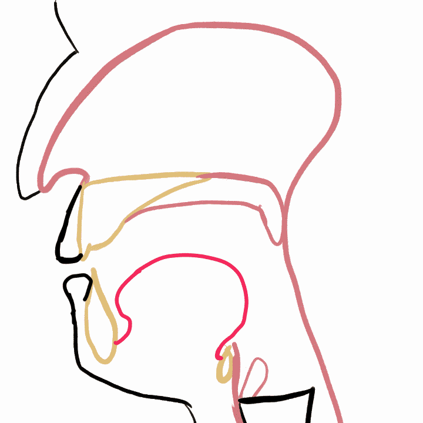{fig-alt="A w" fig-align="center" width="100%"}

:::: {}
::: {.ipa .bigger}
w
:::
::::
:::::

## Complex Consonants

### Contour Consonants

:::: {layout-ncol="2"}
{fig-alt="An affricate" fig-align="center"}

::: {.ipa .bigger}
d͡ʒ
:::
::::

## Complex Consonants

### Contour Consonants

:::: {layout-ncol="2"}
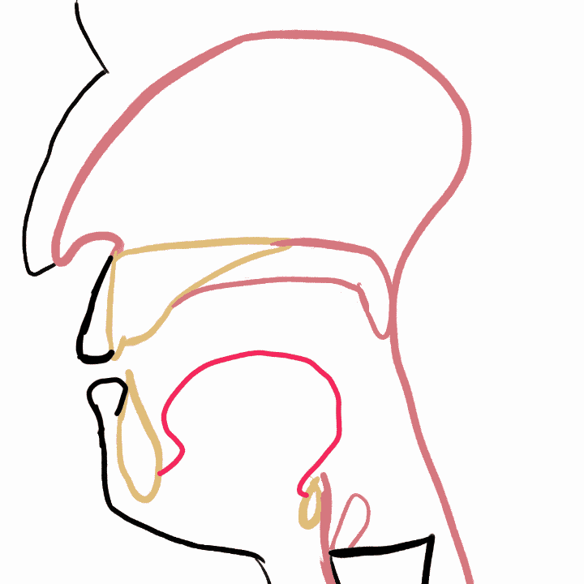{fig-alt="Light l" fig-align="center"}

::: {.ipa .bigger}
l
:::
::::

@Sproat1993

## Complex consonants

### Contour Consonants

:::: {layout-ncol="2"}
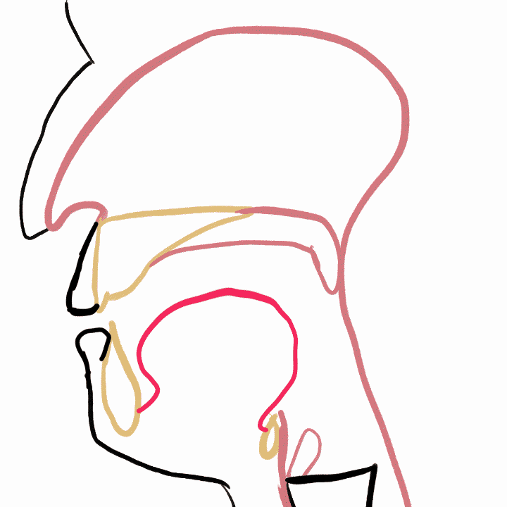{fig-alt="dark-l" fig-align="center"}

::: {.ipa .bigger}
ɫ
:::
::::

@Sproat1993

# Other Classifications

## Laterals

:::::: {layout="[ 10, 30, 30, 30]"}
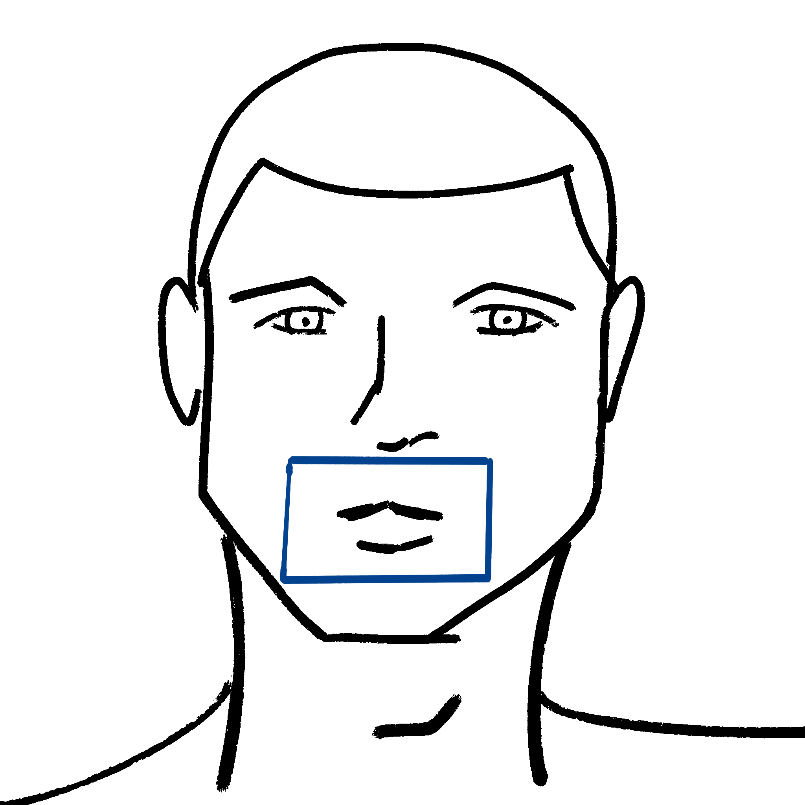{fig-alt="Coronal Plane" fig-align="center"}

::: {}
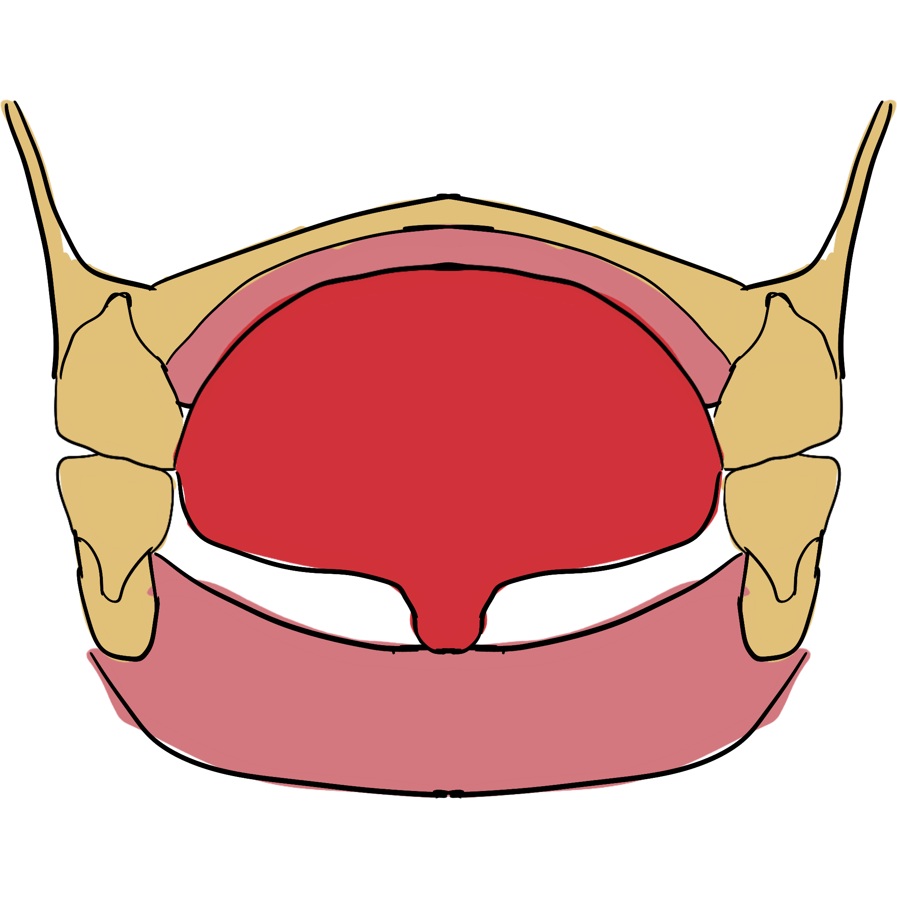{fig-alt="Stop closure" fig-align="center"}

Stop closure
:::

::: {}
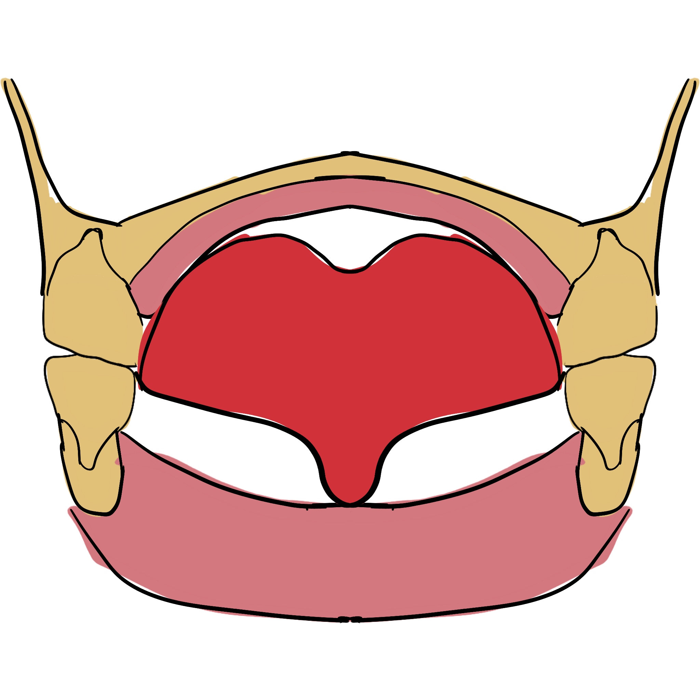{fig-alt="Fricative constriction" fig-align="center"}

Fricative constriction
:::

::: {}
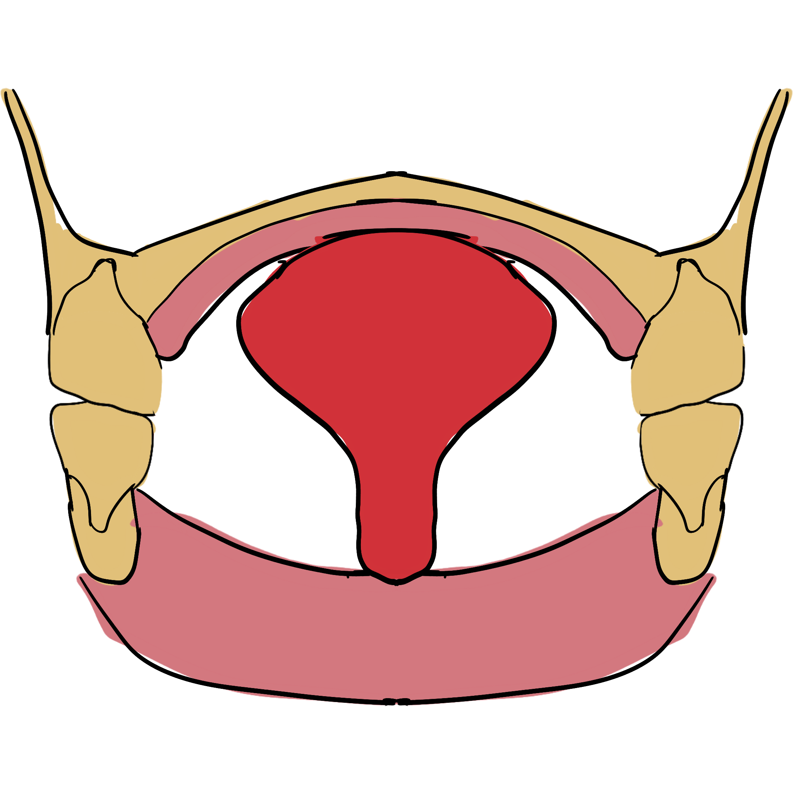{fig-alt="Lateral constriction" fig-align="center"}

Lateral constriction
:::
::::::

## "Rhotics"

Rhotics aren't a phonetically coherent set of sounds. Sounds classified as rhotics include

- alveolar trills

- uvular trills

- uvular fricatives

- velar fricatives

- alveolar taps

- retroflex approximants

- alveolar approximants

- whatever bunched [ɹ] is

## "Rhotics"

As the name would suggest, these are sounds spelled with characters derived from Greek "$\rho$".

## References
