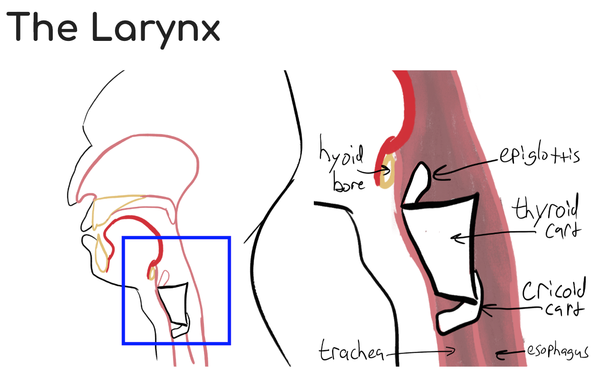
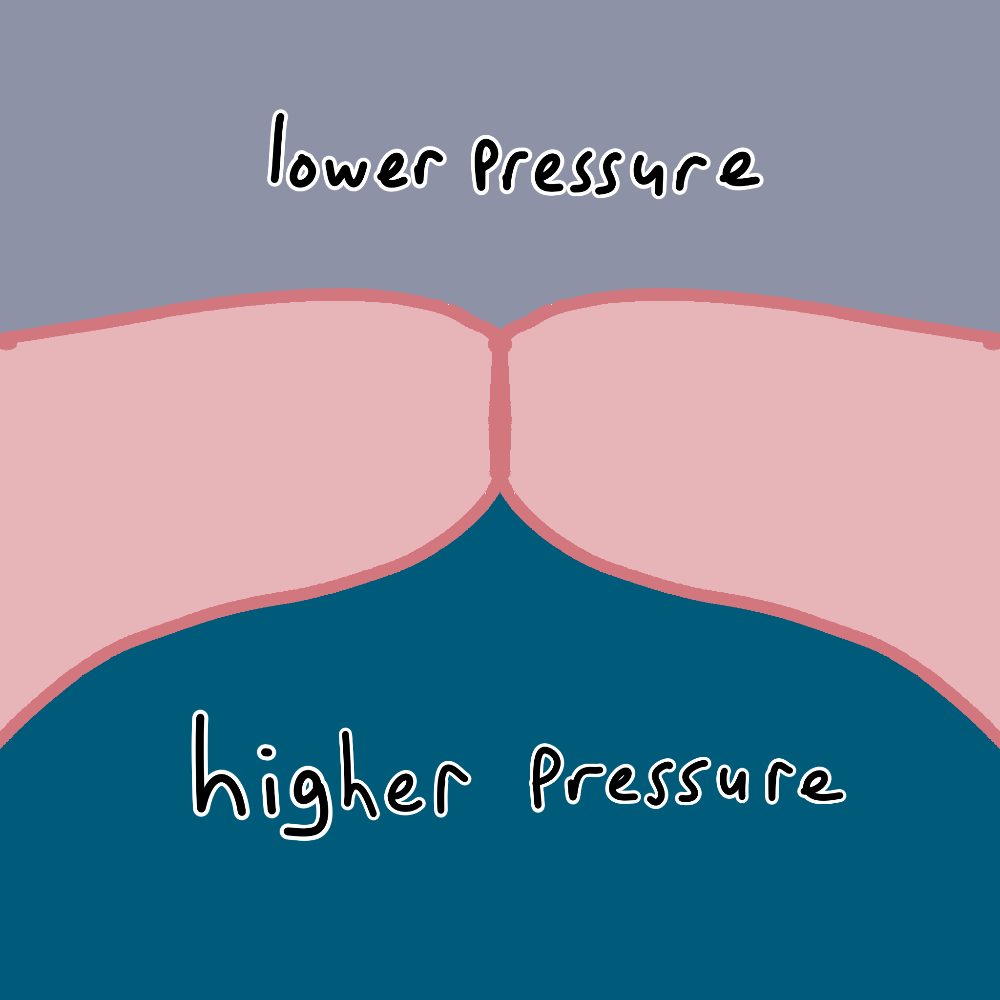
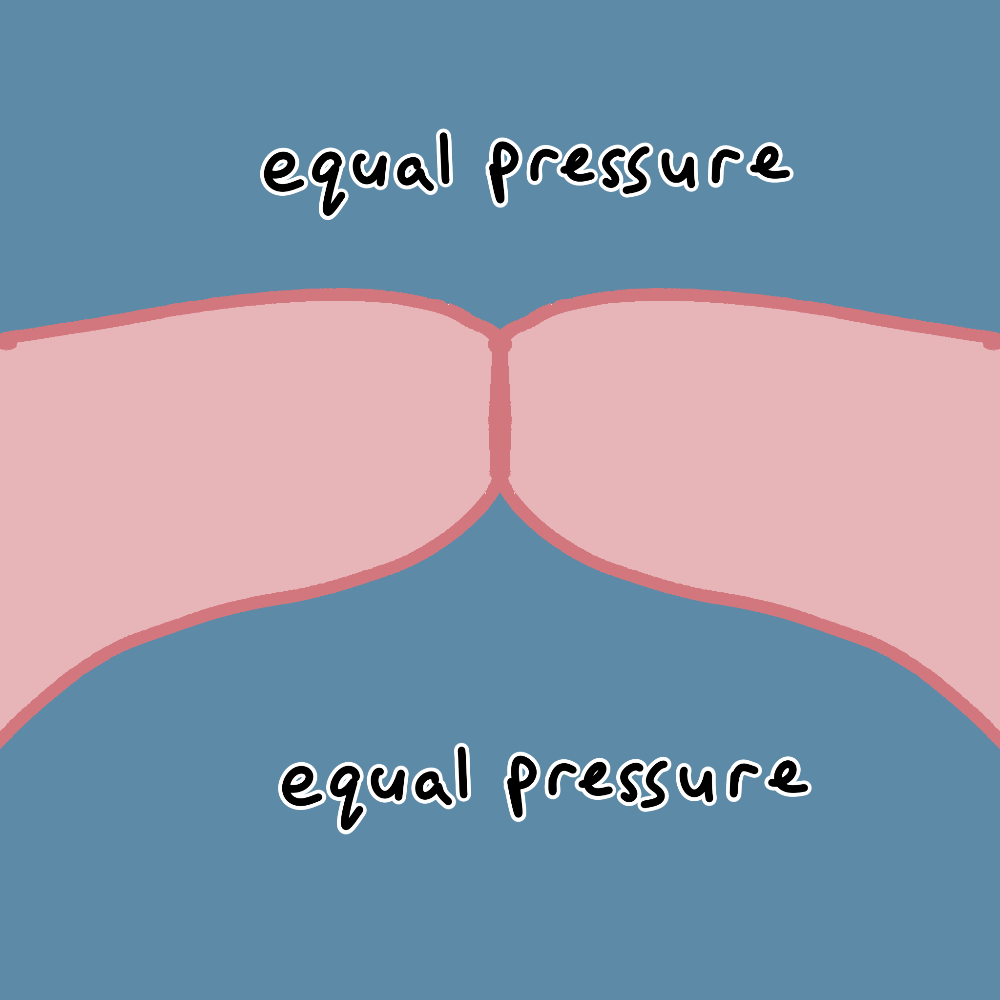
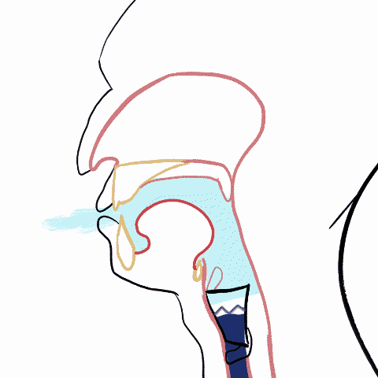
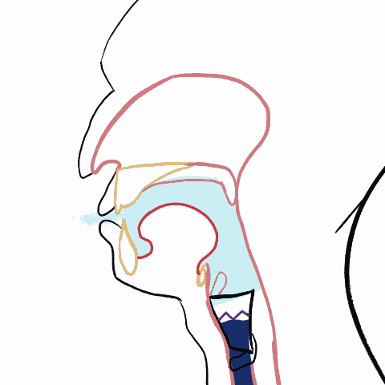
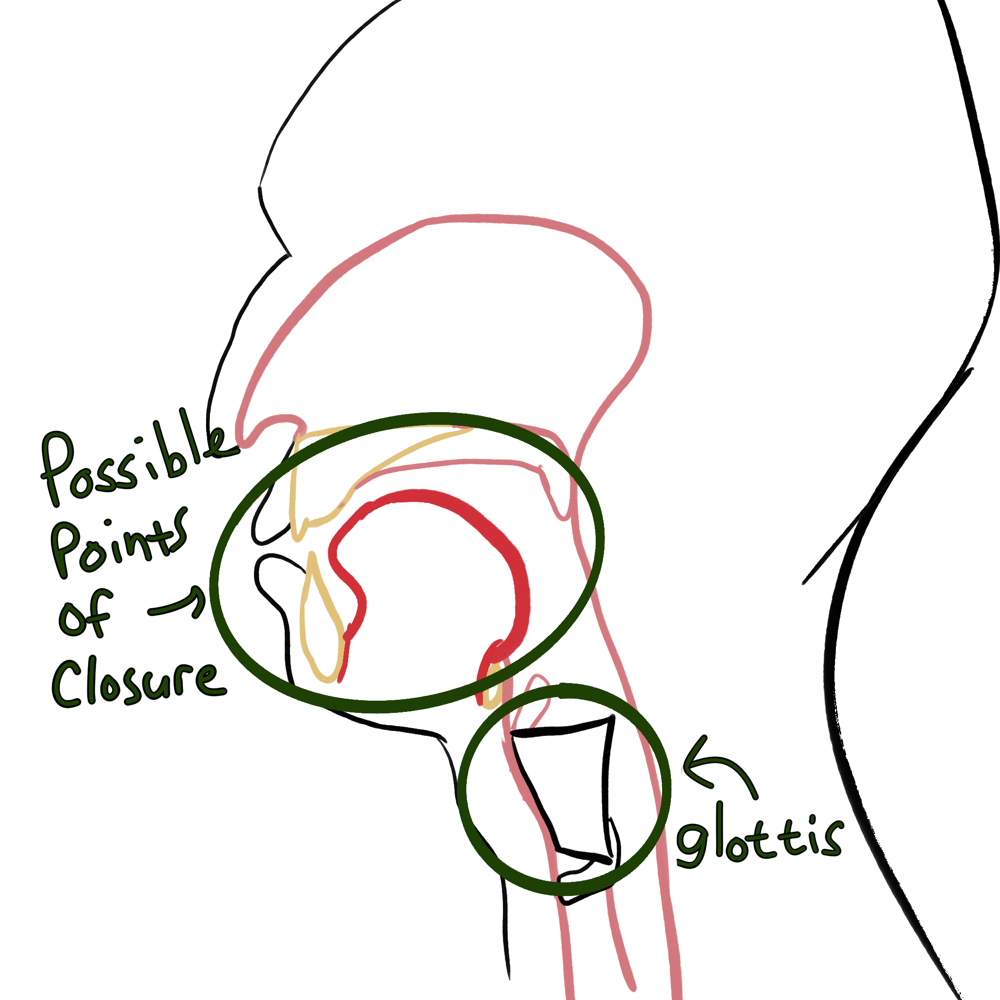
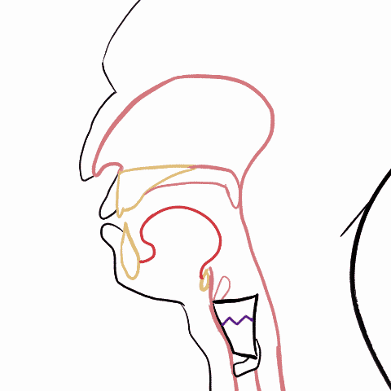
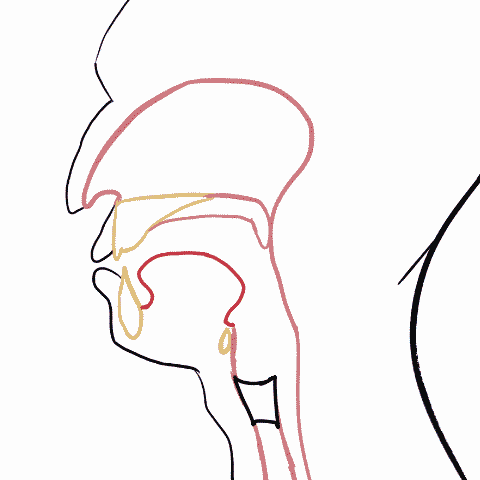
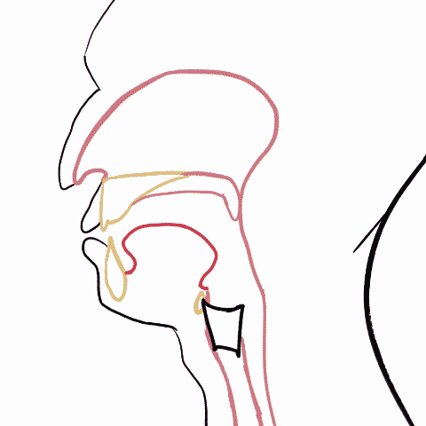
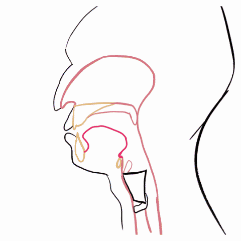

```{r}
#| echo: false
#| message: false
source(here::here("_extensions/mcanouil/typst-render/_resources/typst_define.R"))
source(here::here("_defaults.R"))
library(tidyverse)
library(osfr)
library(ggdist)
```

```{r}
#| echo: false
#| message: false
#| include: false
osf_retrieve_node("https://osf.io/ry3en/") |> 
  osf_ls_files() |> 
  filter(
    name == "ChodroffGoldenWilson2019_vot.csv"
  ) |> 
  osf_download(
    path = here::here("data"), 
    conflicts = "overwrite"
  )
```

```{r}
#| echo: false
#| message: false
vot <- read_csv(here::here("data/ChodroffGoldenWilson2019_vot.csv"))
```

# Voicing

## Voicing

Previously:

[{fig-alt="Screenshot of course slides" fig-align="center" width="75%"}](https://lin300-2026.github.io/course-materials/lecture-notes/03_anatomy/anatomy3.html#/the-larynx)

## Voicing

Voicing requires a pressure differential.

::::: {layout="[20, 45, 45]"}


::: {}
voicing possible 
:::

::: {}
voicing not possible 
:::
:::::

## Voicing

No problem for sounds with incomplete closure.

{fig-alt="voiced fricative" fig-align="center"}

## Voicing

With complete closure, air pressure equalizes.

{fig-alt="A voiced stop" fig-align="center"}

# Voice Onset Time

## Pulmonic Stops

|                           |                   |                |
|---------------------------|-------------------|----------------|
| Pulmonic                  | Egressive         | Stop           |
| "Air pressure from lungs" | "outward airflow" | "full closure" |

## Pulmonic Stops

{fig-alt="Diagram of possible pulmonic stop points of constriction." fig-align="center" width="100%"}

## Pulmonic Stops

The articulators involved with making stops don't *spatially* interfere with the glottis.

How might constrictions and the glottis interact *temporally*?

## Fully Voiced Stops

{fig-alt="A fully voiced stop" fig-align="center"}

## Fully Voiced Stops

Also known as "negative voice onset time"

::: {.content-hidden when-format="typst"}
```{typst}
#import "@preview/phonokit:0.5.14": *
#phonokit-init(font: "Noto Sans")

#vot(
  -50,
  voicing-stroke: 1pt+purple
)
```
:::

::: {.content-visible when-format="typst"}
```{typst}
//| output: asis
#import "@preview/phonokit:0.5.14": *
#phonokit-init(font: "Noto Sans")

#vot(
  -50,
  voicing-stroke: 1pt+purple
)
```
:::

## Short Lag Voice Onset Time

{fig-alt="A short-lag vot stop" fig-align="center"}

## Short Lag Voice Onset Time

There is a brief lag between releasing the closure and the onset of voicing.

::: {.content-hidden when-format="typst"}
```{typst}
#import "@preview/phonokit:0.5.14": *
#phonokit-init(font: "Noto Sans")

#vot(
  10,
  voicing-stroke: 1pt+purple
)
```
:::

::: {.content-visible when-format="typst"}
```{typst}
//| output: asis
#import "@preview/phonokit:0.5.14": *
#phonokit-init(font: "Noto Sans")

#vot(
  10,
  voicing-stroke: 1pt+purple
)
```
:::

## Long Lag Voice Onset Time

{fig-alt="Long lag vot" fig-align="center"}

## Short Lag Voice Onset Time

There is a long lag between releasing the closure and the onset of voicing.

::: {.content-hidden when-format="typst"}
```{typst}
#import "@preview/phonokit:0.5.14": *
#phonokit-init(font: "Noto Sans")

#vot(
  50,
  voicing-stroke: 1pt+purple
)
```
:::

::: {.content-visible when-format="typst"}
```{typst}
//| output: asis
#import "@preview/phonokit:0.5.14": *
#phonokit-init(font: "Noto Sans")

#vot(
  50,
  voicing-stroke: 1pt+purple
)
```
:::

## Voice Onset Time

::: {.content-hidden when-format="typst"}
```{typst}
//| fig-align: center
#import "@preview/phonokit:0.5.14": *
#phonokit-init(font: "Noto Sans")
#set text(font: "Noto Sans")

#table(
  columns: (20em, 20em),
  align: (horizon+left, left),
  //stroke: none,
  "Fully voiced stops", vot(
  -50,
  voicing-stroke: 1pt+purple
),
  "Short lag (a.k.a. Unaspirated Stops)", vot(
    10,
    voicing-stroke: 1pt+purple
  ),
  "Long lag (a.k.a. Aspirated Stops)", vot(
    50,
    voicing-stroke: 1pt+purple
  )
)
```
:::

::: {.content-visible when-format="typst"}
```{typst}
//| output: asis
#import "@preview/phonokit:0.5.14": *
#phonokit-init(font: "Noto Sans")
#set text(font: "Noto Sans")

#table(
  columns: (1fr, 1fr),
  align: (horizon+left, left),
  //stroke: none,
  "Fully voiced stops", vot(
  -50,
  voicing-stroke: 1pt+purple
),
  "Short lag (a.k.a. Unaspirated Stops)", vot(
    10,
    voicing-stroke: 1pt+purple
  ),
  "Long lag (a.k.a. Aspirated Stops)", vot(
    50,
    voicing-stroke: 1pt+purple
  )
)
```
:::

## Voice Onset Time

```{r}
#| fig-width: 4
#| fig-asp: 0.618
#| fig-align: center
#| fig-format: svg
vot |> 
  filter(
    #poa.broad == "coronal"
  ) |> 
  mutate(
    vot.category = fct_reorder(vot.category, desc(vot))
  ) |> 
  ggplot(
    aes(vot, vot.category)
  ) + 
  geom_vline(
    xintercept = 0,
    linewidth = 0.4,
    color = "grey"
  ) +
  stat_dots(
    color = "black",
    fill = "black"
  ) + 
  labs(
    y = NULL,
    x = "VOT (ms)"
  ) +
  theme_sub_panel(
    grid.major.y = element_line(
      linewidth = 0.4,
      color = "grey"
    )
  ) 
```

@chodroffCovariationStopVoice2019

## Transcribing different VOTs

|     VOT      |                     IPA                     |
|:------------:|:-------------------------------------------:|
| fully voiced | [\[b\]]{.ipa .fragment fragment-index="1"}  |
|  short lag   |      [?]{.fragment fragment-index="3"}      |
|   long lag   | [\[pʰ\]]{.ipa .fragment fragment-index="2"} |

## Transcribing VOTs {.smaller}

|   | fully voiced | short lag | long lag |
|------------------|:----------------:|:----------------:|:----------------:|
| [English, German]{.fragment fragment-index="1"} |  | [\[b d g\]]{.ipa .fragment fragment-index="1"} | [\[pʰ tʰ kʰ\]]{.ipa .fragment fragment-index="1"} |
| [Cantonese]{.fragment fragment-index="2"} |  | [\[p t k\]]{.ipa .fragment fragment-index="2"} | [\[pʰ tʰ kʰ\]]{.ipa .fragment fragment-index="2"} |
| [Spanish, Dutch, Hungarian]{.fragment fragment-index="3"} | [\[b d g\]]{.ipa .fragment fragment-index="3"} | [\[p t k\]]{.ipa .fragment fragment-index="3"} |  |
| [Eastern Armenian, Thai]{.fragment fragment-index="4"} | [\[b d g\]]{.ipa .fragment fragment-index="4"} | [\[p t k\]]{.ipa .fragment fragment-index="4"} | [\[pʰ tʰ kʰ\]]{.ipa .fragment fragment-index="4"} |

@liskerCrossLanguageStudyVoicing1964

## Transcribing VOT

Lesson: A lot of transcription is analysis in disguise!

# Non-Pulmonic Stops

## Non-Pulmonic Stops {.smaller}

|   | egressive (+ air pressure) | ingressive (- air pressure) |
|----|----|----|
| glottalic (closure at the glottis) | "ejectives" | "implosives" |
| velaric (closure at the velum) |  | "clicks" |

## Ejectives

1.  An oral closure is made.
2.  The glottis is tightly closed.
3.  The larynx is raised.
4.  Pressure builds behind the oral closure.
5.  The oral closure is released.
6.  The built up pressure rushes out.

## Ejectives

{fig-alt="Ejective" fig-align="center"}

## Ejectives {.smaller}

You can have an ejective at any point of closure, and it's transcribed with [\['\]]{.ipa} (a regular apostrophe)

| bilabial | alveolar | retroflex | palatal | velar | uvular |
|:----------:|:----------:|:----------:|:----------:|:----------:|:----------:|
| [\[p'\]]{.ipa} | [\[t'\]]{.ipa} | [\[ʈ'\]]{.ipa} | [\[c'\]]{.ipa} | [\[k'\]]{.ipa} | [\[q'\]]{.ipa} |

Ejective fricatives and affricates are also possible.

## Practicing Ejectives

Try holding your breath (thus closing your glottis) and articulating "t t t t" repeatedly.

## Implosives

1.  An oral closure is made.
2.  The glottis is tightly closed.
3.  The larynx lowers.
4.  Pressure drops behind the oral closure.
5.  The oral closure is released.
6.  Air rushes in, normalizing the low pressure.

## Implosives

{fig-alt="Implosive" fig-align="center"}

## Implosives

Implosives can be made at any point of closure, and their IPA symbols tend to have a little hooktop.

| bilabial | alveolar | velar | uvular |
|:----------------:|:----------------:|:----------------:|:----------------:|
| [\[]{.ipa}ɓ[\]]{.ipa} | [\[]{.ipa}ɗ[\]]{.ipa} | [\[]{.ipa}ɠ[\]]{.ipa} | [\[]{.ipa}ʛ[\]]{.ipa} |

## Clicks

1.  A closure is made somewhere in front of the velum.
2.  While that closure is maintained, the tongue body moves back.
3.  A vacuum is created between the point of closure and the velum.
4.  The closure is released.
5.  Air rushes in normalizing air pressure.

## Clicks

{fig-alt="Click" fig-align="center"}

## Clicks

You can only have clicks with active articulators that don't interfere with the tongue body.

|   bilabial    |    dental     |    palatal    | lateral       | post-alveolar |
|:-------------:|:-------------:|:-------------:|---------------|:-------------:|
| [\[ʘ\]]{.ipa} | [\[ǀ\]]{.ipa} | [\[ǂ\]]{.ipa} | [\[ǁ\]]{.ipa} | [\[ǃ\]]{.ipa} |

## Clicks In Xhosa [\[ǁoːsa\]]{.ipa}



## 

::: {#refs}
:::
