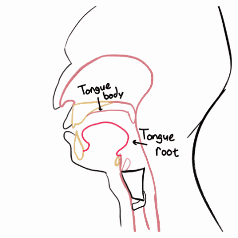
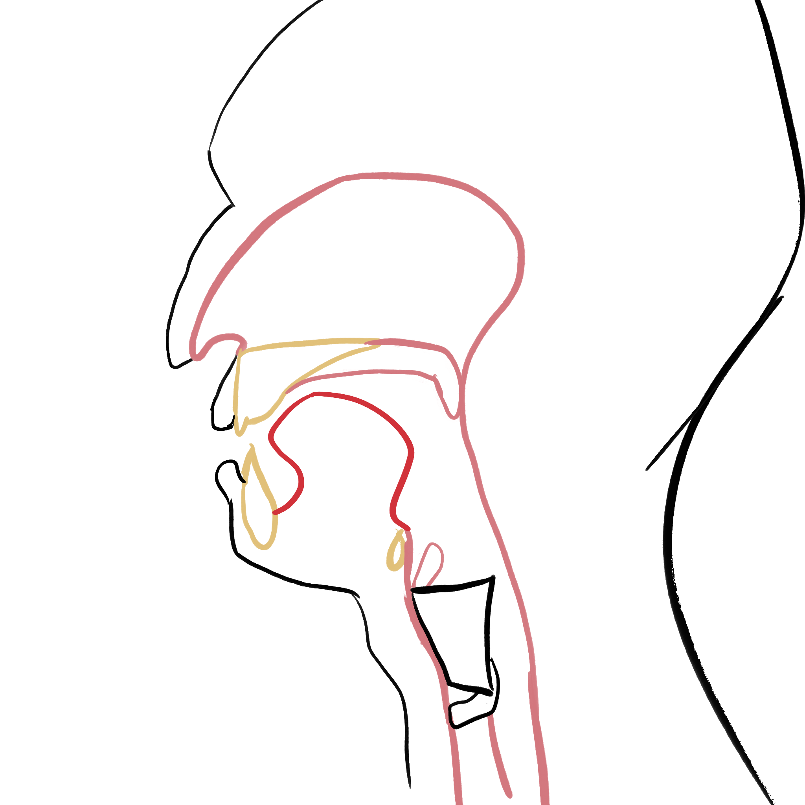
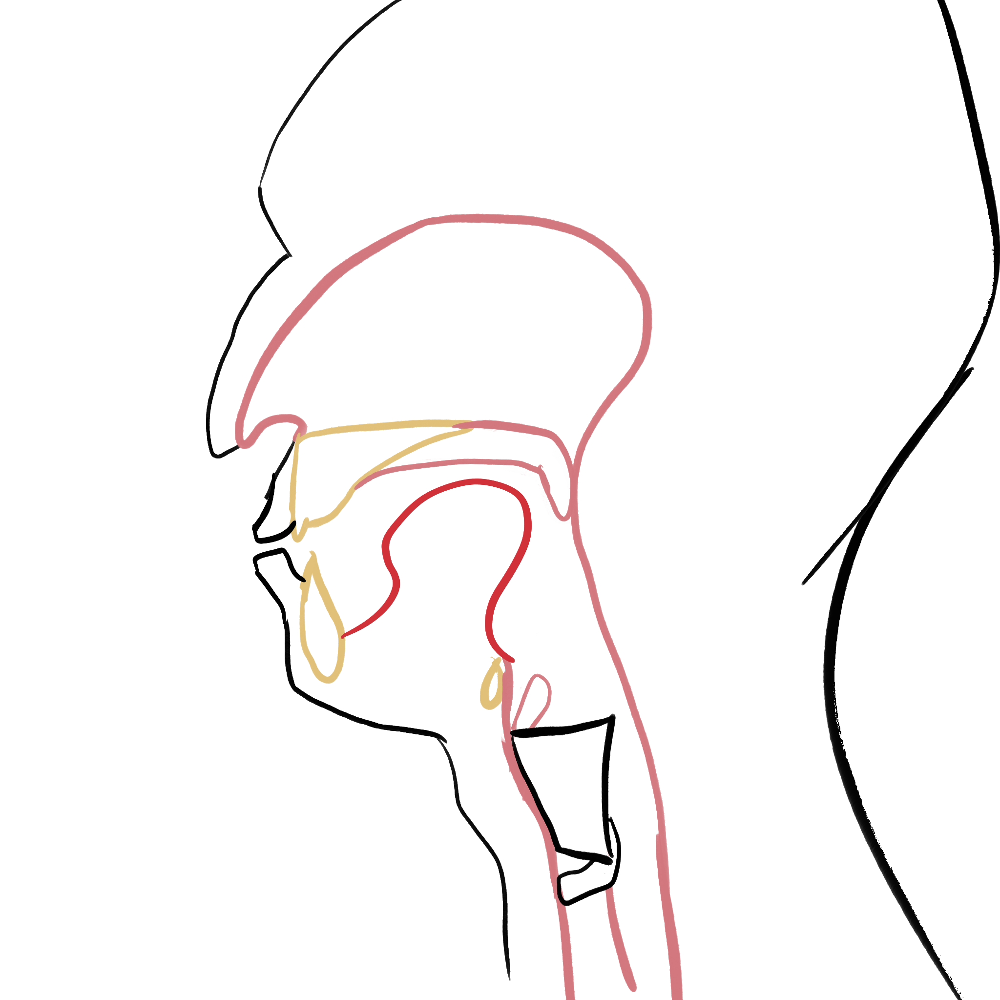
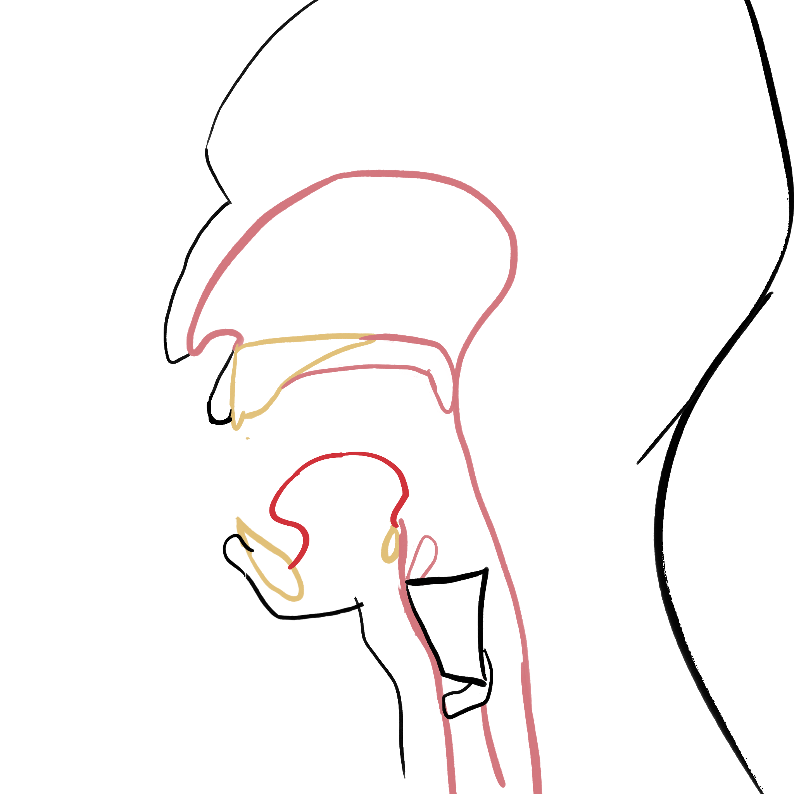
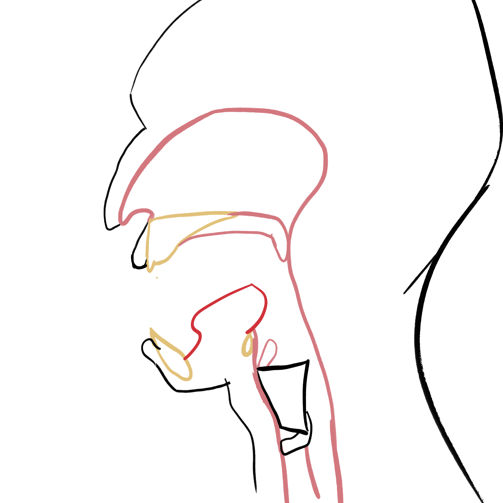
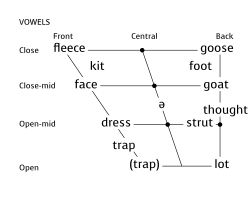

```{r}
source(here::here("_extensions/mcanouil/typst-render/_resources/typst_define.R"))
source(here::here("_defaults.R"))

library(tidyverse)
library(ggplot2)
library(colorspace)
library(tidynorm)
library(ggdensity)
library(scales)
library(geomtextpath)
library(ggdist)
```

```{r}
reul_tri <- function(theta, n=3){
  tau <- 2 * pi
  f = floor(
    ((n * (theta-pi))/tau) + 0.5
  )
  a = cos(theta - (tau/n)*f)
  
  a + sqrt(1 + (2*cos(pi/n)) + (a^2))
}
```

## Vowels

What is a vowel?

::: incremental
- Not a consonant.
:::

## Vowels

Clues in the name

|   | English | Dutch |
|------------------------|-----------------------:|-----------------------:|
| V | [(sonant?)]{.fragment fragment-index="4"} | [klinker]{.fragment fragment-index="2"} |
| C | [consonant]{.fragment fragment-index="1"} | [medeklinker]{.fragment fragment-index="3"} |

## Vowels

In general, a more open, unconstricted, artiulation compared to consonants.

## Vowels - Articulatory Dimensions {.smaller}

Tongue body and Tongue Root

{fig-alt="Tongue body and tongue root" fig-align="center"}

##  {.smaller fullscreen="true"}

::: topalign
|   | Front | Back |
|-----------------------:|------------------------|------------------------|
| **High** | {width="60%"} | {width="60%"} |
| **Low** | {width="60%"} | {width="60%"} |
:::

## Vowels - Dimensions

::: {.content-hidden when-format="typst"}
```{typst}
//| fig-align: center
#import "@preview/phonokit:0.5.14": *
#set text(font: "Noto Sans")
#phonokit-init(font: "Noto Sans")

#vowels(
  "i \\ae a u A"
)

```
:::

::: {.content-visible when-format="typst"}
```{typst}
//| results: asis
#import "@preview/phonokit:0.5.14": *
#set text(font: "Noto Sans")
#phonokit-init(font: "Noto Sans")

#vowels(
  "i \\ae a u A"
)
```
:::

## Vowels - Transcription

Vowels *fundamentally* exist in a continuous phonetic space, making the transcription problem especially tricky.

- It can be tricky putting a categorical label on a continuous space.

- Many "conventional" transcriptions use symbols that aren't technically accurate.

## Vowels - Transcription

::: {.ipa style="text-align: center; font-size:3em;"}
"goose"

guːs
:::

?

## Vowels - Transcription

```{r}
anae <- read_rds("~/OneDrive - University of Kentucky/Corpora/ANAE/rds_data/anaeUNNORM.rds")
```

```{r}
anae |> 
  norm_nearey(
    .by = TS,
    F1:F2
  ) -> 
  anae_norm

anae_norm |> 
  ggplot(
    aes(F2_lm, F1_lm)
  ) +
  stat_hdr(
    probs = 0.95,
    color = "black",
    fill = "grey90",
    show.legend = F
  ) +
  scale_x_reverse() +
  scale_y_reverse() +
  theme_no_x() +
  theme_no_y() + 
  coord_fixed() ->
  anae_base

make_means <- function(df){
  df |> 
    summarise(
      .by = matches("[^xy]"),
      across(c(x,y), mean)
    )
}
```

```{r}
anae_norm |> 
 summarise(
    .by = c(TS, VClass),
    across(F1_lm:F2_lm, mean)
  ) ->
  speaker_means

speaker_means |> 
  filter(VClass %in% c("iy", "uw", "ae", "o")) |> 
  mutate(
    vowel = recode_values(
      VClass,
      "iy" ~ "iː",
      "ae" ~ "æ",
      "uw" ~ "uː",
      "o" ~ "ɑ"
    )
  ) |> 
  mutate(
    vowel = fct_reorder(vowel, F1_lm)
  ) ->
  vpoints
```

:::: {layout-ncol="2"}
```{r}
#| fig-format: svg
#| fig-width: 4
#| fig-asp: 1
#| out-width: 100%
anae_base +
  geom_point(
    data = vpoints,
    aes(color = vowel),
    show.legend = F
  ) + 
  geom_label(
    data = vpoints,
    aes(color = vowel, label = vowel),
    family = "Noto Sans",
    stat = "manual",
    fun = make_means,
    show.legend = F
  )
```

::: {}
Data from the Atlas of North American English

1 point = 1 speaker
:::
::::

## Vowels - Transcription

### High Vowels

::: {.content-hidden when-format="typst"}
```{typst}
//| fig-align: center
#import "@preview/phonokit:0.5.14": *
#set text(font: "Noto Sans")
#phonokit-init(font: "Noto Sans")


#let focus = (
  "i",
  "y",
  "1",
  "0",
  "W",
  "u",
)

#let redden(a) = {
  a.map(x => (x, red)).to-dict()
}

#vowels(
  "i \\ae a u A
  y 1 0 W
  ",
  phoneme-colors: redden(focus)
)

```
:::

::: {.content-visible when-format="typst"}
```{typst}
//| results: asis
#import "@preview/phonokit:0.5.14": *
#set text(font: "Noto Sans")
#phonokit-init(font: "Noto Sans")

#let focus = (
  "i",
  "y",
  "1",
  "0",
  "W",
  "u",
)

#let redden(a) = {
  a.map(x => (x, red)).to-dict()
}

#vowels(
  "i \\ae a u A
  y 1 0 W
  ",
  phoneme-colors: redden(focus)
)
```
:::

## Vowel - Transcription

```{r}
#| fig-align: center
#| fig-width: 4
#| fig-asp: 1
#| fig-format: svg
anae_base +
  geom_label(
    data = vpoints,
    aes(color = vowel, label = vowel),
    family = "Noto Sans",
    stat = "manual",
    fun = make_means,
    show.legend = F
  ) +  
  geom_point(
    data = vpoints |> filter(VClass == "uw"),
    aes(color = vowel),
    show.legend = F
  ) +
  geom_label(
    data = vpoints |>  filter(VClass == "uw"),
    aes(color = vowel, label = vowel),
    family = "Noto Sans",
    stat = "manual",
    fun = make_means,
    show.legend = F
  )    

```

## Vowels - Transcription

::: {.ipa style="text-align: center;font-size:2em"}
gɨs?

gʉs?
:::

## Vowels - Transcription

::: {.ipa style="text-align: center; font-size:2em;"}
"thought"

θɔt
:::

?

## Vowels - Transcription

::::: {layout-ncol="2"}
::: {}
```{r}
#| fig-align: center
#| fig-width: 4
#| fig-asp: 1
#| fig-format: svg
#| out-width: 100%
anae_norm |> 
  filter(VClass %in% c("oh")) |> 
  summarise(
    .by = c(TS, VClass),
    across(F1_lm:F2_lm, mean)
  ) |> 
  mutate(
    vowel = case_match(
      VClass,
      "oh" ~ "ɔ"
    )
  ) |> 
  mutate(
    vowel = fct_reorder(vowel, F1_lm)
  ) ->
  oh

anae_base +
  geom_point(
    data = oh,
    aes(color = vowel),
    show.legend = F
  ) + 
  geom_label(
    data = oh,
    aes(color = vowel, label = vowel),
    family = "Noto Sans",
    stat = "manual",
    fun = make_means,
    show.legend = F
  ) +
  geom_label(
    data = vpoints,
    aes(label = vowel),
    family = "Noto Sans",
    stat = "manual",
    fun = make_means,
    show.legend = F,
    size = 4
  ) +  
  theme(
    text = element_text(family = "Voces")
  )
```
:::

::: {}
Data from the Atlas of North American English

1 point = 1 speaker
:::
:::::

## Vowels - Transcription

### Back Vowels

::: {.content-hidden when-format="typst"}
```{typst}
//| fig-align: center
#import "@preview/phonokit:0.5.14": *
#set text(font: "Noto Sans")
#phonokit-init(font: "Noto Sans")


#let focus = (
 "U", "7", 
 "o", "2",  
 "O", "6",
 "W", "u",
 "A"
)

#let redden(a) = {
  a.map(x => (x, red)).to-dict()
}

#vowels(
  "i \\ae a u A
  y 1 0 W
  U 7 o 2 O 6
  ",
  phoneme-colors: redden(focus)
)

```
:::

::: {.content-visible when-format="typst"}
```{typst}
//| results: asis
#import "@preview/phonokit:0.5.14": *
#set text(font: "Noto Sans")
#phonokit-init(font: "Noto Sans")

#let focus = (
 "U", "7", 
 "o", "2",  
 "O", "6",
 "W", "u"
 "A"
)

#let redden(a) = {
  a.map(x => (x, red)).to-dict()
}

#vowels(
  "i \\ae a u A
  y 1 0 W
  U 7 o 2 O 6
  ",
  phoneme-colors: redden(focus)
)
```
:::

## Vowels - Transcription

::: {.ipa style="text-align:center;font-size:2em;"}
θot?

θɔt?

θɒt?
:::

## Vowels?

```{r}
#| echo: false
#| fig-width: 4
#| fig-asp: 1
#| fig-format: svg
#| fig-align: center
#| out-width: 100%
expand_grid(
  x = seq(-1, 1, length = 20),
  y = seq(-1, 1, length = 20)
) |> 
  mutate(
    row = as.numeric(as.factor(y))
  ) |> 
  mutate(
    .by = row,
    mindiff = min(diff(x))/2
  ) |> 
  mutate(
     x = x + ((row %% 2) * mindiff),
    angle = atan2(y,x),
     angle = case_when(
      angle < 0 ~ angle + (2*pi),
      .default = angle
    ),
    deg = angle / (pi/180),
    dist = sqrt((x^2) + (y^2)),
    L =  ((dist + 0.5)/1.8) * 100,
    extreme = plogis((dist - 0.55) * 6),
    C = max_chroma(deg, L),
    hex = polarLUV(L, C * extreme, deg-60) |> hex(fixup = T)
  ) |>
  filter(
    dist <= reul_tri(angle + (pi/2), n = 3)
  ) -> dat

dat |> 
  mutate(
    row = as.numeric(as.factor(y)),
    col = as.numeric(as.factor(x)),
    id = str_glue("[{row},{col}]")
  ) |> 
  ggplot(
    aes(x, y)
  ) +
  geom_hex(
    stat = "identity",
    fill = dat$hex,
    color = "black",
    linewidth = 0.1
  ) +
  geom_text(
    aes(label = id),
    size = 2
  ) + 
  coord_fixed()+
  theme_void()
```

## Vowels - Transcription

If *all* we have is paper and ink to describe phonetic detail, we should try to use the closest IPA character.

Otherwise, we'll use symbols that best characterize lexical sets.

::: {.ipa style="text-align:center;"}
\[uː\] $\in$ {goose, coop, food}
:::

## Vowels

::: {.content-hidden when-format="typst"}
```{typst}
//| fig-align: center
#import "@preview/phonokit:0.5.14": *
#set text(font: "Noto Sans")
#phonokit-init(font: "Noto Sans")
#import "@preview/phonokit:0.5.14": *
#set text(font: "Noto Sans")
#phonokit-init(font: "Noto Sans")
#let vs = (
  "i", "y",
  "I", "Y",
  "e", " \\o ",
  "E", " \\oe ",
  " \\ae ", 
  "a", " \\OE ",

  "1", "0",
  "W", "u",
  "U", "7", "o",
  "2", "O",
  "A", " 6",
  "@"
)

#let to_shift = (
  "8", "9",
  "3", " \\closeepsilon ",
  "5"
)


#vowels(
  vs.join(),
  shift: to_shift.map(x => (x, 0, 0)),
  shift-color: luma(100),
  shift-size: 1.5em
)

```
:::

::: {.content-visible when-format="typst"}
```{typst}
//| results: asis
#import "@preview/phonokit:0.5.14": *
#set text(font: "Noto Sans")
#phonokit-init(font: "Noto Sans")

#let vs = (
  "i", "y",
  "I", "Y",
  "e", " \\o ",
  "E", " \\oe ",
  " \\ae ", 
  "a", " \\OE ",

  "1", "0",
  "W", "u",
  "U", "7", "o",
  "2", "O",
  "A", " 6",
  "@"
)

#let to_shift = (
  "8", "9",
  "3", " \\closeepsilon ",
  "5"
)


#vowels(
  vs.join(),
  shift: to_shift.map(x => (x, 0, 0)),
  shift-color: luma(100),
  shift-size: 1.5em
)
```
:::

## Vowels - English Keywords

{fig-align="center" width="100%"}

## Vowels - Length

In English

::: {.content-hidden when-format="typst"}
```{typst}
//| fig-align: center
#import "@preview/phonokit:0.5.14": *
#set text(font: "Noto Sans")
#phonokit-init(font: "Noto Sans")

#text(fill: red)[*long*] vs #text(fill: blue)[*short*]

#let redden(a) = {
  a.map(x => (x, red)).to-dict()
}

#let bluen(a) = {
  a.map(x => (x, blue)).to-dict()
}


#let long = (
  "i", "e", 
  "u", "o"
)

#let short = (
  "I", "E", "\\ae", 
  "a", "A", "2","U"
)

#vowels(
  "english",
  phoneme-colors: redden(long) + bluen(short)
)


```
:::

::: {.content-visible when-format="typst"}
```{typst}
//| results: asis
#import "@preview/phonokit:0.5.14": *
#set text(font: "Noto Sans")
#phonokit-init(font: "Noto Sans")

#text(fill: red)[*long*] vs #text(fill: blue)[*short*]

#let redden(a) = {
  a.map(x => (x, red)).to-dict()
}

#let bluen(a) = {
  a.map(x => (x, blue)).to-dict()
}


#let long = (
  "i", "e", 
  "u", "o"
)

#let short = (
  "I", "E", "\\ae", 
  "a", "A", "2","U"
)

#vowels(
  "english",
  phoneme-colors: redden(long) + bluen(short)
)

```
:::

## Vowels - Length

Length is transcribed with a [ː]{.ipa} symbol (which is different from :)!

::: {.ipa style="text-align:center;font-size:2em;"}
iː

uː
:::

## Vowels - Length

In English, the mid long vowels tend to be diphthongized.

## Vowel - Length

The mid long vowels in English tend to be diphthongized

```{r}
jean_lp <- read_csv("~/OneDrive - University of Kentucky/Corpora/PNC/derived_data/fave_results/PH06-2-1-AB-Jean_logparam.csv")
```

```{r}
jean_lp |> 
  filter(param == 0) |> 
  mutate(across(F1:F2, \(x)x*sqrt(2))) |> 
  ggplot(
    aes(F2, F1)
  )+
  stat_hdr(
    color = "black",
    fill = "grey80",
    probs = 0.95,
    show.legend = F
  ) +
  scale_x_reverse() +
  scale_y_reverse() + 
  coord_fixed() +
  theme_no_x() + 
  theme_no_y() -> 
  jean_base
```

:::: {layout-ncol="2"}
```{r}
#| fig-width: 4
#| fig-asp: 0.8
#| fig-format: svg
#| out-width: 100%
#| fig-align: center
jean_lp |> 
  filter(
    label %in% c("ey", "ow"),
    fol_seg != "l"
  ) |> 
  summarise(
    .by = c(param, label),
    across(F1:F2, mean)
  ) |> 
  reframe_with_idct(
    .param_col = param,
    .token_id_col = label,
    F1:F2
  ) |> 
  mutate(
    label = case_match(
      label, 
      "ey" ~ "eɪ",
      "ow" ~ "oʊ"
    )
  ) ->
  jean_ey_ow


jean_base +
  geom_textpath(
    data = jean_ey_ow,
    aes(
      color = label,
      label = label
    ),
    linewidth = 1,
    arrow = arrow(
      type = "closed",
      length = unit(0.25, "cm"),
      angle = 20
    ),
    family = "Noto Sans",
    show.legend = F
  )
```

::: {}
Average \[[eɪ]{.ipa}\] and \[[oʊ]{.ipa}\] from one speaker from Philadelphia.
:::
::::

## Vowels - Diphthongs

```{r}
jean_lp |> 
  filter(
    label %in% c("ay", "aw", "oy") 
  ) |> 
  summarise(
    .by = c(param, label),
    across(F1:F2, mean)
  ) |> 
  reframe_with_idct(
    .param_col = param,
    .token_id_col = label,
    F1:F2
  ) |> 
  mutate(
    label = case_match(
      label, 
      "ay" ~ "aɪ",
      "aw" ~ "aʊ",
      "oy" ~ "ɔɪ"
    )
  )->
  jean_diph
```

::::: {layout-ncol="2"}
::: {}
```{r}
#| fig-width: 4
#| fig-asp: 0.8
#| out-width: 100%
#| fig-format: svg
jean_base+
  geom_textpath(
    data = jean_diph,
    aes(
      color = label,
      label = label
    ),
    linewidth = 1,
    arrow = arrow(
      type = "closed",
      length = unit(0.25, "cm"),
      angle = 20
    ),
    family = "Noto Sans",
    show.legend = F
  )
```
:::

::: {}
Three diphthongs from a speaker from Philadelphia
:::
:::::

# Across the world

## Vowel Inventories

```{r}
#| echo: false
url_ <- "https://github.com/phoible/dev/blob/master/data/phoible.csv?raw=true"
col_types <- cols(InventoryID='i', Marginal='l', .default='c')
phoible <- read_csv(url(url_), col_types=col_types)
```

```{r}
#| echo: false
#| fig-width: 8
#| fig-asp: 0.618
#| fig-format: svg
phoible |> 
  filter(
    SegmentClass == "vowel"
  ) |> 
  summarise(
    .by = c(Glottocode, SpecificDialect),
    vowels = n()
  ) |> 
  slice(
    .by = Glottocode,
    1
  ) |>
  identity() |> 
  count(vowels) |> 
  mutate(
    inventory = case_when(
      vowels > 20 ~ ">20",
      .default = as.character(vowels)
    ) |> 
      fct_reorder(vowels)
  ) |> 
  summarise(
    .by = inventory,
    n = sum(n)
  ) |> 
  ggplot(
    aes(
      inventory, n
    )
  ) + 
  geom_col() + 
  scale_y_continuous(
    expand = expansion(0)
  ) +
  labs(
    x = "number of vowels",
    y = "number of languages"
  )
```

## Inventories

```{r}
phoible |> 
  filter(
    SegmentClass == "vowel"
  ) |> 
  mutate(
    .by = c(Glottocode, SpecificDialect),
    vowels = n()
  ) |> 
  count(
    vowels, Phoneme
  ) |> 
  arrange(
    desc(n)
  ) |> 
  slice(
    .by = vowels,
    1:first(vowels)
  ) |> 
  arrange(vowels) ->
  vowel_counts
```

```{r}
tribble(
  ~Phoneme, ~y, ~x,
  "ɑ", 0, 1,
  "a", 0, 0,
  "aː", 0, 0.6,
  "ã", 0, -0.5,
  "æ", 0, -0.7,
  "e", 2, -1.2,
  "eː", 2, -1.8,
  "ẽ", 2, -0.8,
  "ø", 2, -0.8,
  "i", 3, -2,
  "iː", 3, -2.4,
  "y", 3, -1.6,
  "ĩ", 3, -1.6,
  "o", 2, 1.2,
  "oː", 2, 1.7,
  "õ",2, 0.8,
  "ɤ", 2, 0.8,
  "u", 3, 2,
  "uː", 3, 2.6,
  "ũ", 3, 1.6,
  "ɯ", 3, 1.6,
  "ɔ", 1, 0.8,
  "ə", 1.5, 0,
  "ɛ", 1, -0.8,
  "œ", 1, -0.4,
  "ɪ", 2.5, -1.8,
  "ʏ", 2.5, -1.4,
  "ʊ", 2.5, 1.8,
  "ʊː", 2.5, 2.5,
  "e̞", 1.5, -1.2,
  "o̞", 1.5, 1.2,
  "ɨ", 3, 0,
  
  # "ɯ", "ɪ", "ʊ", 
) ->
  vowel_coords
```

```{r}
#| echo: false
#| fig-width: 4
#| fig-asp: 1.6
#| layout-ncol: 2
phoible |> 
  filter(
    SegmentClass == "vowel"
  ) |> 
  mutate(
    .by = c(Glottocode, SpecificDialect, InventoryID),
    vowels = n()
  )  |> 
  arrange(
    Phoneme
  ) |> 
  summarise(
    .by = c(Glottocode, SpecificDialect, , InventoryID, vowels),
    Phoneme = str_c(Phoneme, collapse = "_")
  ) |> 
  count(
    vowels, Phoneme
  ) |> 
  arrange(desc(n)) |> 
  slice(
    .by = vowels,
    1:2
  ) |> 
  arrange(vowels) |> 
  mutate(
    .by = vowels,
    rank = row_number()
  ) |> 
  filter(
    vowels <= 11
  ) |> 
  mutate(
    nlab = str_glue("n={n}")
  ) ->
  inventory_counts

inventory_counts |> 
  separate_longer_delim(
    Phoneme, delim = "_"
  ) |> 
  left_join(
    vowel_coords
  ) ->
  inventory_coord

inventory_coord |> 
  filter(vowels <= 6) |> 
  ggplot(
    aes(x, y)
  ) + 
  geom_text(
    aes(label = Phoneme),
    family = "Voces",
     size = 4.5
  ) +
  geom_text(
    data = inventory_counts |> filter(vowels <= 6),
  
    aes(
      x = -2.5, y = 0,
      label = nlab
    ),
    size = 3,
    hjust = 0
  ) +
  facet_grid(vowels ~ rank, labeller = "label_both") +
  scale_x_continuous(
    expand = expansion(0.1),
    limits = c(-2.6, 2.6)
  ) +
  scale_y_continuous(
    expand = expansion(0.2)
  ) +  
  theme_no_x() + 
  theme_no_y() +
  theme_sub_panel(
    border = element_rect()
  )

inventory_coord |> 
  filter(vowels > 6) |> 
  ggplot(
    aes(x, y)
  ) + 
  geom_text(
    aes(label = Phoneme),
    family = "Voces",
    size = 4.5
  ) +
  geom_text(
    data = inventory_counts |> filter(vowels > 6),
    aes(
      x = -2.5, y = 0,
      label = nlab
    ),
    size = 3,
    hjust = 0
  ) +  
  facet_grid(vowels ~ rank, labeller = "label_both") +
  scale_x_continuous(
    expand = expansion(0.1),
    limits = c(-2.6, 2.6)    
  ) +
  scale_y_continuous(
    expand = expansion(0.2)
  ) +  
  theme_no_x() + 
  theme_no_y() +
  theme_sub_panel(
    border = element_rect()
  )
```

## Inventories

```{r}
#| echo: false
phoible |> 
  filter(SegmentClass == "vowel") |> 
  mutate(
    .by = InventoryID,
    n = n(),
    diacrit = any(str_detect(GlyphID, "\\+"))
  ) |> 
  arrange(desc(n)) |> 
  filter(
    !diacrit
  ) |> 
  filter(
    n == 14
  ) -> fourteen
```

```{r}
#| echo: false
#| fig-width: 6
#| fig-asp: 0.5
fourteen |> 
  left_join(vowel_coords) |> 
  ggplot(
    aes(x, y)
  ) + 
  geom_text(
    aes(label = Phoneme),
    family = "Voces"
  ) + 
  facet_wrap(~LanguageName) +
  theme_no_x() + 
  theme_no_y() +
  theme_sub_panel(
    border = element_rect()
  )  
```
