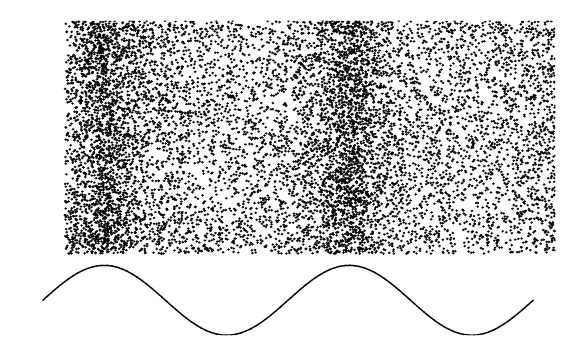
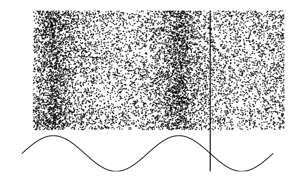
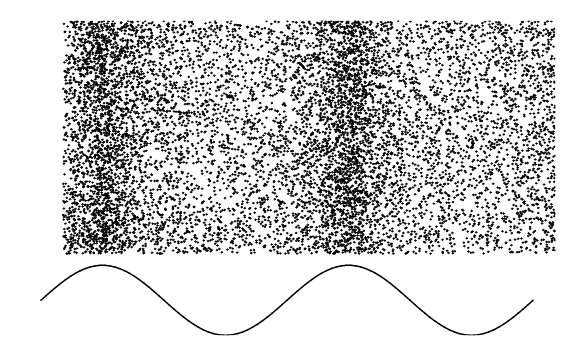
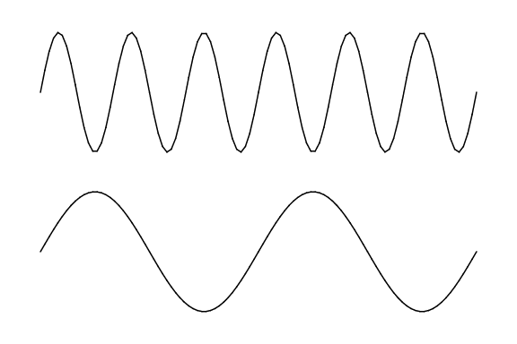
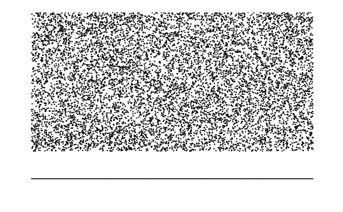
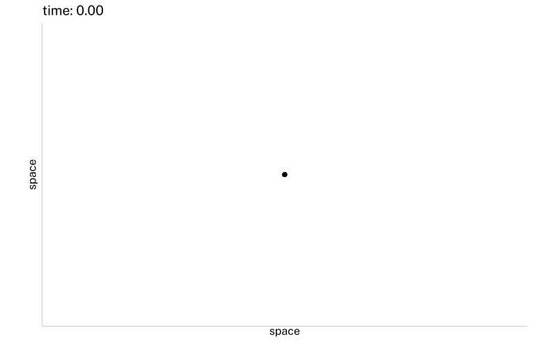
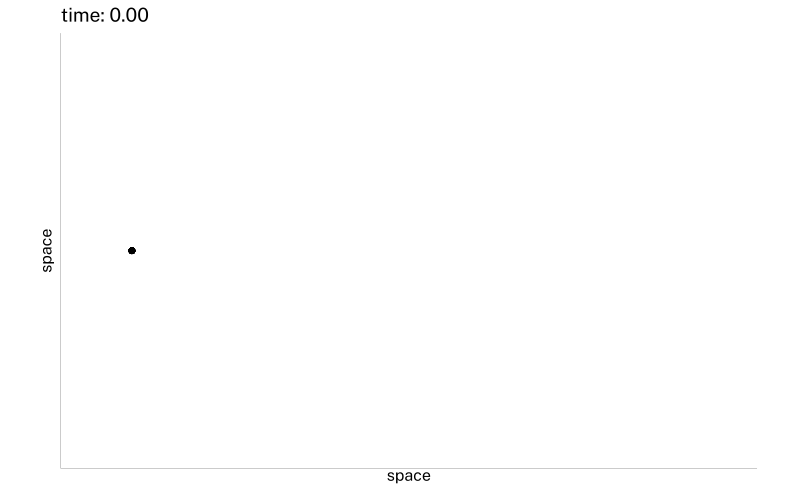

## What *is* sound?

Key takeaway:

- Sound takes up space

```{r}
source(here::here("_extensions/mcanouil/typst-render/_resources/typst_define.R"))
source(here::here("_defaults.R"))
library(tidyverse)
library(geomtextpath)
box::use(
  v = vellumplot
)
```

```{r}
make_sine <- function(x, freq = 1){
  # if there's no `freq` column
  # set `freq` to 1.
  y = sin(
        (freq * x * 2 * pi)
      )
}
```

```{r}
make_moving_sine <- function(x, freq, t){
  sin(
    (freq * (x - t) * 2 * pi)
  )
}
```

```{r}
tibble(
  x = runif(10000, max = 2),
  y = runif(10000),
  z = runif(10000, min = 0.01)
) |> 
  mutate(
    id = row_number()
  )->
  air
```

```{r}
make_moving_disp <- function(x, freq=1, t=0){
  cos(
    (freq * (x - t)* 2 * pi)
  )
}

make_disp_df <- function(df, freq=1, t=0, rel = 0.09){
  df |> 
    mutate(
      x = x + (make_moving_disp(
        x, freq, t
      ) * (rel/freq)),
      disp = make_moving_disp(
        x, freq, t
      ),
      t = t
    )
}
```

## Not Sound

```{r}
#| fig-format: png
v$vplot(
  data = air,
  width = 6,
  height = 6 * 0.618
) |> 
  v$mark_point(
    x = x,
    y = y,
    size = 0.2
  ) |> 
  v$scale_x_continuous(
    expand = 0
  ) |> 
  v$scale_y_continuous(
    expand = 0
  ) |> 
  v$scale_size(
    range = c(0,0.4)
  ) |> 
  v$guides(
      alpha = v$guide_none(),
      size = v$guide_none()
  ) |> 
  v$theme_void() |> 
  v$labs(
    title = "air"
  ) |> 
  identity()

```

## Sound - Aperiodic

```{r}
map(
 seq(0, 2.5*pi, length = 101),
  ~air |> mutate(
    t = .x,
    noise = runif(n(), -0.009, 0.009)
  )
) |> 
  list_rbind() ->
  noise_df

```

```{r}
#| echo: false
noise_df |>
  mutate(
    .by = id,
    x = x + cumsum(noise)
  ) |> 
  v$vplot() |> 
  v$mark_point(
  x = x,
  y = y,
  size = 0.2,
  #color = mark
) |> 
  # v$scale_color_manual(
  #   values = c("black", "red")
  # ) |> 
  v$guides(
    color = v$guide_none()
  ) |> 
  v$scale_x_continuous(
    expand = 0
  ) |> 
  v$scale_y_continuous(
    expand = 0
  ) |>   
  v$transition_time(
    t
  ) |> 
  v$ease_aes("cubic-in-out") |> 
  v$theme_void() |> 
  v$animate(nframes = 200, fps = 12) |> 
  v$anim_save(
    filename = "images/noise.gif"
  )
```

{fig-align="center"}

## Sound - Periodic

```{r}
air |> 
  filter(
    between(x, 0.99, 1.1)
  ) |> 
  pull(id) |> 
  sample(20) ->
  chosen

air |> 
  mutate(
    mark = id %in% chosen
  ) -> 
  air

map(
  seq(0, 2.5*pi, length = 50),
  ~make_disp_df(
    df = air, 
    freq = 1,
    t = .x
  )
) |> 
  list_rbind() ->
  big_df
```

```{r}
big_df |> 
  distinct(t) |> 
  mutate(
    cycle = floor(t),
    x = 0,
    y = 1.1
  ) -> 
  t_df
```

```{r}
#| eval: false
big_df |> 
  v$vplot(
    width = 6,
    height = 6 * 0.618
  ) |> 
  v$mark_point(
    x = x,
    y = y,
    size = 0.2
    # alpha = z
    #color = mark
  ) |> 
  # v$scale_color_manual(
  #   values = c("black", "red")
  # ) |> 
  v$scale_x_continuous(
    expand = 0
  ) |> 
  v$scale_y_continuous(
    expand = 0
  ) |> 
  v$scale_size(range = c(0,0.4)) |> 
  v$guides(
    color = v$guide_none(),
    size = v$guide_none(),
    alpha = v$guide_none()
  ) |>   
  v$transition_time(
    t
  ) |> 
  v$ease_aes("cubic-in-out") |> 
  v$theme_void() |> 
  v$animate(nframes = 200, fps = 12) |> 
  v$anim_save(
    filename = "images/air1.gif"
  )
```

{fig-align="center"}

## Sound

```{r}
#| eval: false
big_df |> 
  mutate(
    size = case_when(
      mark ~ 1,
      .default = 0.2
    )
  ) |> 
  v$vplot(
    width = 6,
    height = 6 * 0.618
  ) |> 
  v$mark_point(
    x = x,
    y = y,
    color = mark,
    size = size
  ) |> 
  v$scale_color_manual(
    values = c("black", "red")
  ) |>
  v$scale_size_identity() |> 
  v$guides(
    color = v$guide_none(),
    size = v$guide_none()
  ) |> 
  v$scale_x_continuous(
    expand = 0
  ) |> 
  v$scale_y_continuous(
    expand = 0
  ) |>   
  v$transition_time(
    t
  ) |> 
  v$ease_aes("cubic-in-out") |> 
  v$theme_void() |> 
  v$animate(nframes = 200, fps = 12) |> 
  v$anim_save(
    filename = "images/air2.gif"
  )
```

{fig-align="center"}

Sound is not the air molecules from my lungs hitting your ears.

## Sound

```{r}
tibble(
  x = seq(0, 2, length = 199),
  y = make_moving_sine(
    x, freq = 1, t = 0
  )
) -> sine_df
```

```{r}
big_df |> 
  filter(t == 0) |> 
  v$vplot(
    width = 6,
    height = 6 * 0.618
  ) |> 
  v$mark_point(
    x = x,
    y = y,
    size = 0.2
  ) |> 
  v$mark_line(
    data = sine_df,
    x = x, 
    y = (y * 0.15) - 0.2
  ) |> 
  v$scale_x_continuous(
    expand = 0
  ) |> 
  v$scale_y_continuous(
    expand = 0
  ) |>   
  v$theme_void() |> 
  identity()
```

Where air is tightly packed, there's high pressure.
Where it's more spread out, low pressure.

## Sound

```{r}
expand_grid(
  x = seq(0, 2, length = 101),
  t = seq(0, 2.5*pi, length = 101)
) |> 
  mutate(
    y = make_moving_sine(
      x = x,
      freq = 1,
      t = t
    )
  ) |> 
  mutate(
    y = (y * 0.15) - 0.2
  ) -> 
  sine_anim
```

```{r}
#| eval: false
big_df |> 
  v$vplot(  
    width = 6,
    height = 6 * 0.618) |> 
  v$mark_point(
    x = x,
    y = y,
    size = 0.2
  ) |> 
  v$mark_line(
    data = sine_anim,
    x = x,
    y = y
  ) |> 
  v$guides(
    color = v$guide_none()
  ) |> 
  v$scale_x_continuous(
    expand = 0
  ) |> 
  v$scale_y_continuous(
    expand = 0
  ) |>   
  v$transition_time(
    t
  ) |> 
  v$ease_aes("cubic-in-out") |> 
  v$theme_void() |> 
  v$animate(nframes = 200, fps = 12) |> 
  v$anim_save(
    filename = "images/air3.gif"
  )
```

{fig-align="center"}

## Sound

```{typst}
#import "@preview/cetz:0.5.1"
#set page(width: auto, height: auto, margin: 1em)
#set text(font: "Noto Sans", size: 8pt)

#cetz.canvas({
  import cetz.draw: *
  let scale = 6
  let amp = 2
  let axis_col = luma(40%)
  let pblue = rgb("#4477AA")
  let pred = rgb("#EE6677")
  let pgreen = rgb("#228833")
  
  let wave(
    amplitude: 1, 
    fill: none, 
    phases: 2, 
    scale: 12, 
    samples: 100
  ) = {
    line(..(for x in range(0, samples + 1) {
        let x = x / samples
        let p = (2 * phases * calc.pi) * x
          ((x * scale, calc.sin(p) * amplitude),)
        }), 
      fill: fill)
    }

  line(
    (0,0), (scale*1.25,0),
    stroke: 0.5pt + axis_col,
    mark: (end: ">", fill: axis_col),
    name: "space"
  )

  line(
    (0,-amp * 1.2), (0,amp * 1.2),
    stroke: 0.5pt + axis_col,
    mark: (symbol: ">", fill: axis_col),
    name: "pressure"
  )

    content(
      ("space.end"),
      text(fill: axis_col)[space],
      anchor: "south-east",
      padding: 0.05
    )

   content(
    ("pressure.mid"),
    text(fill: axis_col)[pressure],
    anchor: "south",
    angle: "pressure.end",
    padding: 0.05
  )

  
  wave(
    scale: scale,
    phases: scale/2,
    samples: 200,
    amplitude: amp
  )

  circle(
    (0.5, amp),
    radius: 2pt,
    stroke: pred,
    fill: pred,
    name: "peak"
  )

  content(
    "peak.north",
    text(fill:pred)[peak],
    anchor: "west",
    angle: 45deg,
    padding: (0, 0, 0.3, 0)
  )

  circle(
    (2.5, amp),
    radius: 2pt,
    stroke: pred,
    fill: pred,
    name: "peak2"
  )

  line(
    "peak.east", "peak2.west",
    stroke: pred,
    mark: (end: ">", fill: pred),
    name: "wavelen"
  )

  content(
    "wavelen.mid",
    text(fill: pred)[wavelength],
    anchor: "south",
    padding: 0.04
  )

  circle(
    (1.5, -amp),
    radius: 2pt,
    stroke: pblue,
    fill: pblue,
    name: "trough"
  )

  content(
    "trough.south",
    text(fill: pblue)[trough],
    anchor: "north"
  )

  circle(
    (3.5, -amp),
    radius: 2pt,
    stroke: pgreen,
    fill: pgreen,
    name: "amp1"
  )

  line(
    (3.5, 0), "amp1.north",
    stroke: pgreen,
    mark: (end: ">", fill: pgreen),
    name: "ampline1"
  )

  content(
    "ampline1.mid",
    text(fill:pgreen)[#highlight(fill: white.transparentize(5%), radius: 2%)[amplitude]],
    anchor: "south",
    angle: "ampline1.start",
    padding: (0,0,0.05,0.4)
  )

  circle(
    (4.5, amp),
    radius: 2pt,
    stroke: pgreen,
    fill: pgreen,
    name: "amp2"
  )

  line(
    (4.5, 0), 
    "amp2.south",
    stroke: pgreen,
    mark: (end: ">", fill: pgreen),
    name: "ampline2"
  )

    content(
    "ampline2.mid",
    text(fill:pgreen)[#highlight(fill: white.transparentize(5%), radius: 2%)[amplitude]],
    anchor: "south",
    angle: "ampline2.start",
    padding: (0,0,0.05,0.3)
  )

})
```

## Sound

```{typst}
#import "@preview/cetz:0.5.1"
#set page(width: auto, height: auto, margin: 1em)
#set text(font: "Noto Sans", size: 8pt)

#cetz.canvas({
  import cetz.draw: *
  let scale = 6
  let amp = 1
  let axis_col = luma(40%)
  let pblue = rgb("#4477AA")
  let pred = rgb("#EE6677")
  let pgreen = rgb("#228833")

  let cols = color.map.flare
  let nwavs = 10
  let max_shift = calc.pi/5
  
  let wave(
    amplitude: 1, 
    fill: none, 
    stroke: black,
    phases: 2,
    offset: 0,
    scale: 12, 
    samples: 100
  ) = {
    line(..(for x in range(0, samples + 1) {
        let x = x / samples
        let p = (2 * phases * calc.pi) * x
        ((x * scale, calc.sin(p - (offset * scale)) * amplitude),)
        }), 
      fill: fill,
      stroke: stroke
    )
    }

  let col_prop(
    prop: 0,
    pal: color.map.turbo
  ) = {
    let ncol = pal.len()-1
    let idx = int(calc.round(ncol * prop))
    pal.at(idx)
  }
  
  line(
    (0,0), (scale*1.25,0),
    stroke: 0.5pt + axis_col,
    mark: (end: ">", fill: axis_col),
    name: "space"
  )

  line(
    (0,-amp * 1.2), (0,amp * 1.2),
    stroke: 0.5pt + axis_col,
    mark: (symbol: ">", fill: axis_col),
    name: "pressure"
  )

    content(
      ("space.end"),
      text(fill: axis_col)[space],
      anchor: "south-east",
      padding: 0.05
    )

   content(
    ("pressure.mid"),
    text(fill: axis_col)[pressure],
    anchor: "south",
    angle: "pressure.end",
    padding: 0.05
  )
  for i in range(nwavs){
    let pct = i/(nwavs - 1)
    let col = col_prop(prop: pct, pal: cols)
    let shift = max_shift * pct
    wave(
      scale: scale,
      phases: scale/2,
      samples: 200,
      amplitude: amp,
      offset: shift,
      stroke: col
    )
  }
  
  line(
    (0.5, amp * 1.1),
    (2, amp * 1.1),
    stroke: gradient.linear(..cols),
    mark: (end: ">", stroke: cols.last(), fill: cols.last()),
    name: "phaseline"
  )

  content(
    "phaseline.mid",
    "phase",
    anchor: "south",
    padding: (0,0,0.05,0)
  )
})
```

## Sound - Sine Wave

```{typst}
#import "@preview/cetz:0.5.1"
#set page(width: auto, height: auto, margin: 1em)
#set text(font: "Noto Sans", size: 8pt)

#cetz.canvas({
  import cetz.draw: *
  let scale = 6
  let amp = 1
  let axis_col = luma(40%)

  let wave(
    amplitude: 1, 
    fill: none, 
    stroke: black,
    phases: 2,
    offset: 0,
    scale: 12, 
    samples: 100,
    name: none
  ) = {
    line(..(for x in range(0, samples + 1) {
        let x = x / samples
        let p = (2 * phases * calc.pi) * x
        ((x * scale, calc.sin(p - (offset * scale)) * amplitude),)
        }), 
      fill: fill,
      stroke: stroke,
      name: name
    )
    }
  
  line(
    (0,0), (scale*1.25,0),
    stroke: 0.5pt + axis_col,
    mark: (end: ">", fill: axis_col),
    name: "space"
  )

  line(
    (0,-amp * 1.2), (0,amp * 1.2),
    stroke: 0.5pt + axis_col,
    mark: (symbol: ">", fill: axis_col),
    name: "pressure"
  )

    content(
      ("space.end"),
      text(fill: axis_col)[space],
      anchor: "south-east",
      padding: 0.05
    )

   content(
    ("pressure.mid"),
    text(fill: axis_col)[pressure],
    anchor: "south",
    angle: "pressure.end",
    padding: 0.05
  )

    wave(
      scale: scale,
      phases: scale/2,
      samples: 200,
      amplitude: amp,
      offset: 0,
      name: "wav"
    )

    content(
      (2.5,1.3),
      $"pressure" = sin((2pi x)/lambda)$
    )
  
})


```

## Sounds - Frequency

Frequency = how many high pressure zones per second

This is going to be a function of both the wavelength and the speed of the wave.

Because the speed of sound will usually be fixed, Wavelength $\propto$ Frequency.

## Frequency to Wavelength

$$
\text{speed of sound} \approx 34300 \frac{cm}{s}
$$

$$
f\text{Hz} = \frac{f\text{cycle}}{s}
$$

## Frequency to Wavelength

$$
\begin{aligned}
\text{wavelength} &= \frac{34300~cm}{s} \frac{1}{f\text{Hz}} \\
&= \frac{34300~cm}{s} \frac{s}{f\text{cycle}}\\
& = \frac{34300~cm}{f\text{cycle}}
\end{aligned}
$$

## Frequency to Wavelength

$$
34300 \frac{cm}{s}
$$

$$
440 Hz = \frac{440}{s}
$$

$$
\frac{34300~cm}{s}\frac{s}{440} \approx 78~cm \approx 2.6~ft
$$

## Wavelength to Frequency

::: {.content-hidden when-format="typst"}
```{=html}
<script src="https://unpkg.com/@strudel/embed@latest"></script>
<strudel-repl>
<!--  
let dist_ft = [2, 4, 8]
let dist_cm = dist_ft.map(x => x * 30.48)
let hz = dist_cm.map(x => 34300/x)

freq(cat(hz))
 .s("sine")
 ._scope()
-->
</strudel-repl>
```
:::

## Sounds - Frequency

```{r}
sine_anim |> 
  filter(
    x == 1.5
  ) |> 
  mutate(
    diff = y - lag(y),
    diff_s = sign(diff),
    diff_s_l = lead(diff_s),
    s = sign(y + 0.2)
  ) |> 
  filter(
    s == 1,
    diff_s == 1,
    diff_s_l == -1
  ) |> 
  select(
    t
  ) |> 
  mutate(
    peak = T
  ) -> 
  peaks

sine_anim |> 
  distinct(t) |> 
  left_join(
    peaks
  ) |> 
  replace_na(
    list(peak = FALSE)
  ) -> 
  microphone
```

```{r}
#| eval: false
big_df |> 
  v$vplot(  
    width = 6,
    height = 6 * 0.618) |> 
  v$mark_point(
    x = x,
    y = y,
    size = 0.2
  ) |> 
  v$mark_line(
    data = sine_anim,
    x = x,
    y = y
  ) |> 
  v$mark_rule(
    data = microphone,
    xintercept = 1.5,
    color = factor(peak),
    linewidth = 2
  ) |>
  v$scale_x_continuous(
    expand = 0
  ) |> 
  v$scale_y_continuous(
    expand = 0
  ) |>   
  v$scale_color_manual(
    values = c("black", "red")
  ) |> 
  v$guides(
    color = v$guide_none()
  ) |> 
  v$transition_time(
    t
  ) |> 
  v$ease_aes("cubic-in-out") |> 
  v$theme_void() |> 
  v$animate(nframes = 200, fps = 12) |> 
  v$anim_save(
    filename = "images/air4.gif"
  )
```

{fig-align="center"}

## Sound - Increasing Frequency

As wavelength decreases, frequency increases

```{r}
map(
  seq(0, 2.5*pi, length = 202),
  ~make_disp_df(
    df = air, 
    freq = 1 + (.x/5),
    t = .x
  )
) |> 
  list_rbind() ->
  big_df2

expand_grid(
  x = seq(0, 2, length = 101),
  t = seq(0, 2.5*pi, length = 202)
) |> 
  mutate(
    y = make_moving_sine(
      x = x,
      freq = 1 + (t/5),
      t = t
    )
  ) |> 
  mutate(
    .by = t,
    y = y / max(abs(y))
  ) |> 
  mutate(
    y = (y * 0.15) - 0.2
  ) -> 
  sine_anim2
```

```{r}
#| eval: false
big_df2 |> 
  v$vplot(  
    width = 6,
    height = 6 * 0.618) |> 
  v$mark_point(
    x = x,
    y = y,
    size = 0.2
  ) |> 
  v$mark_line(
    data = sine_anim2,
    x = x,
    y = y
  ) |>
  # v$mark_rule(
  #   data = microphone,
  #   xintercept = 1.5,
  #   color = factor(peak),
  #   linewidth = 2
  # ) |>
  v$scale_x_continuous(
    expand = 0
  ) |> 
  v$scale_y_continuous(
    expand = 0
  ) |>   
  # v$scale_color_manual(
  #   values = c("black", "red")
  # ) |> 
  v$guides(
    color = v$guide_none()
  ) |> 
  v$transition_time(
    t
  ) |> 
  v$ease_aes("cubic-in-out") |> 
  v$theme_void() |> 
  v$animate(nframes = 202, fps = 12) |> 
  v$anim_save(
    filename = "images/air5.gif"
  )
```

{fig-align="center"}

## Sound - Frequency

The *speed* of these higher frequency waves is the *same* as the lower frequency waves

```{r}
expand_grid(
  x = seq(0, 2, length = 101),
  t = seq(0, 2.5*pi, length = 202)
) |> 
  mutate(
    y = make_moving_sine(
      x = x,
      freq = 1,
      t = t
    )
  ) |> 
  mutate(
    .by = t,
    y = y / max(abs(y))
  ) |> 
  mutate(
    y = (y * 0.15) - 0.2
  ) -> 
  sine_anim_bottom

expand_grid(
  x = seq(0, 2, length = 101),
  t = seq(0, 2.5*pi, length = 202)
) |> 
  mutate(
    y = make_moving_sine(
      x = x,
      freq = 3,
      t = t
    )
  ) |> 
  mutate(
    .by = t,
    y = y / max(abs(y))
  ) |> 
  mutate(
    y = (y * 0.15) + 0.2
  ) -> 
  sine_anim_top
```

```{r}
#| eval: false
v$vplot(
  sine_anim_top
) |> 
  v$mark_line(
    x = x,
    y = y
  ) |> 
  v$mark_line(
    data = sine_anim_bottom,
    x = x,
    y = y
  ) |>   
  v$transition_time(
    t
  ) |> 
  v$ease_aes("cubic-in-out") |> 
  v$theme_void()   |> 
  v$animate(nframes = 202, fps = 12) |> 
  v$anim_save(
    filename = "images/sines.gif"
  )  
```

{fig-align="center"}

## Sound - Frequency

Every time frequency doubles, we experience it as the frequency increasing 1 octave.

::: {.content-hidden when-format="typst"}
```{=html}
<strudel-repl>
<!--  
freq("55".mul("<1 2 4 8 16>*2"))
  .s("sine")
  .segment(4)
  .scope()
-->
</strudel-repl>
```
:::

## Sound - Intensity

A relationship between frequency *and* amplitude

```{r}
#| fig-width: 5
#| fig-height: 3
expand_grid(
  amplitude = seq(0.01, 0.05, length = 100),
  frequency = c(110, 220, 440)
) |> 
  mutate(
    intensity = 2 * (pi^2) * (amplitude^2) * (frequency^2)
  ) |> 
  ggplot(
    aes(amplitude, intensity)
  )+
  geom_textline(
    aes(
      color = factor(frequency),
      label = str_glue("{frequency} Hz")
    ),
    show.legend = F,
    linewidth = 1,
    size = 4
  ) +
  theme_sub_axis(
    text = element_blank()
  )
```

## Sound - Increasing Amplitude

```{r}
map(
  seq(0, 2.5*pi, length = 202),
  ~make_disp_df(
    df = air, 
    freq = 1,
    t = .x,
    rel = (.x/5) * 0.09
  )
) |> 
  list_rbind() ->
  big_df3

expand_grid(
  x = seq(0, 2, length = 101),
  t = seq(0, 2.5*pi, length = 202)
) |> 
  mutate(
    y = make_moving_sine(
      x = x,
      freq = 1,
      t = t
    )
  ) |> 
  mutate(
    .by = t,
    y = y * (t / (2.5*pi))
  ) |> 
  mutate(
    y = (y * 0.15) - 0.2
  ) -> 
  sine_anim4
```

```{r}
#| eval: false
big_df3 |> 
  v$vplot(  
    width = 6,
    height = 6 * 0.618) |> 
  v$mark_point(
    x = x,
    y = y,
    size = 0.2
  ) |> 
  v$mark_line(
    data = sine_anim4,
    x = x,
    y = y
  ) |>
  # v$mark_rule(
  #   data = microphone,
  #   xintercept = 1.5,
  #   color = factor(peak),
  #   linewidth = 2
  # ) |>
  v$scale_x_continuous(
    expand = 0
  ) |> 
  v$scale_y_continuous(
    expand = 0
  ) |>   
  # v$scale_color_manual(
  #   values = c("black", "red")
  # ) |> 
  v$guides(
    color = v$guide_none()
  ) |> 
  v$transition_time(
    t
  ) |> 
  v$ease_aes("cubic-in-out") |> 
  v$theme_void() |> 
  v$animate(nframes = 202, fps = 12) |> 
  v$anim_save(
    filename = "images/air6.gif"
  )
```

{fig-align="center"}

## Sound - Loudness

Decibels (dB) are a measure of *relative* intensity.

$$
1 dB = 10\log_{10}\left(\frac{s_1}{s_2}\right)
$$

## Sound - The Doppler Effect

```{r}
make_circle <- function(df){
  df |> 
    mutate(
      z = x
    ) |> 
    reframe(
      .by = z,
      theta = seq(0, 2*pi, length = 100),
      x = (cos(theta) * ((time-z)*1.2)) + z,
      y = sin(theta) * ((time-z)*1.2),
      across(
        matches("[^xyz]"),
        first
      )
    ) |> 
    filter(
      (time-z) >= 0
    )
}

make_circle2 <- function(df){
  df |> 
    reframe(
      .by = z,
      theta = seq(0, 2*pi, length = 100),
      x = (cos(theta) * ((time-z) * 1.2)) + 1.4,
      y = sin(theta) * ((time-z) * 1.2),
      across(
        matches("[^xyz]"),
        first
      )
    ) |>
    filter(
      (time-z) >= 0
    )
}
```

```{r}
#| eval: false
expand_grid(
  x = 1.4,
  pulses = seq(0,3, length = 15),
  time = c(seq(0,3, length = 15)),
  #dist1 = sqrt(((time-x)*1.2)^2)
) ->
  nodop

withr::with_environment(
  new.env() ,
  {
    library(gganimate)
    
    nodop |>
      ggplot(
        aes(x, time = time, z = pulses)
      ) +
      geom_point(
        aes(x = x, y = 0)
      ) +
      geom_polygon(
        aes(color = pulses, group = pulses),
        stat = "manual",
        fun = make_circle2,
        fill = NA,
        show.legend = F
      )+
      coord_fixed(ylim = c(-1,1), xlim = c(-0.2, 3))+
      transition_time(time) +
      theme_sub_axis(
        text = element_blank()
      )+
      labs(
        title = 'time: {sprintf("%.2f", ifelse(frame_time <= 3, frame_time, 3))}',
        x = "space",
        y = "space"
      ) ->
      anim

    anim_save(
      animation = anim,
      filename = "images/nodoppler.gif",
      width = 800,
      height = 800 * 0.618,
      nframes = 200,
      fps = 24
    )
  }
)
```

{fig-align="center"}

## Sound - The Doppler Effect

```{r}
#| eval: false
expand_grid(
  x = c(seq(0, 3, length = 15)),
  time = c(seq(0,3, length = 15)),
  #dist1 = sqrt(((time-x)*1.2)^2)
) ->
  dop

# tibble(
#   x = seq(0, 3, length = 10),
#   dist_to_y = sqrt((x^2) + (0.5^2)),
#   time = (dist_to_y/1.2) + x
# ) |> 
#   filter(time <= 3) ->
#   pulse

withr::with_environment(
  new.env() ,
  {
    library(gganimate)

  dop |>
    ggplot(
      aes(x, time = time)
    ) +
    geom_point(
      aes(x = time, y = 0)
    ) +
    geom_polygon(
      aes(color = x, group = x),
      stat = "manual",
      fun = make_circle,
      fill = NA,
      show.legend = F
    )+
    coord_fixed(ylim = c(-1,1), xlim = c(-0.2, 3))+
    transition_time(time)+
    theme_sub_axis(
      text = element_blank()
    )+
    labs(
      title = 'time: {sprintf("%.2f", ifelse(frame_time <= 3, frame_time, 3))}',
      x = "space",
      y = "space"
    ) ->
    anim
  
  anim_save(
    animation = anim,
    filename = "images/doppler.gif",
    width = 800,
    height = 800 * 0.618,
    nframes = 200,
    fps = 24
  )
  }
)
```

{fig-align="center"}

## The Doppler Effect

```{r}
ft_to_cm <- \(ft) ft * 30.48
cm_to_ft <- \(cm) cm / 30.48

mph_to_cmps <- \(mph) mph * 44.704

```

```{r}
#| fig-width: 9
#| fig-asp: 0.35
expand_grid(
  mph = c(40, 60, 80),
  freq = 100,
  xft = 50,
  yft = c(0, 10, 20, 30, 40)
) |> 
  reframe(
    .by = c(mph, yft, freq, yft),
    x = seq(ft_to_cm(xft), ft_to_cm(-xft), by = -mph_to_cmps(mph) * (1/freq))
  ) |> 
  mutate(
    y = ft_to_cm(yft)
  ) |> 
  mutate(
    .by = c(mph, yft),
    time = (row_number() - 1) * (1/freq),
    dist = sqrt((x^2) + (y^2)),
    time_to = dist / 34300,
    ptime = time_to + time,
    ptime_lag = ptime - lag(ptime),
    pfreq = 1/ptime_lag,
    `y dist` = yft
  ) |> 
  ggplot(
    aes(cm_to_ft(x), log2(pfreq/freq) * 12)
  ) + 
    geom_vline(
      xintercept = 0,
      linewidth = 0.25
    ) +
    geom_hline(
      yintercept = 0,
      linewidth = 0.25      
    ) +  
    geom_line(
      aes(
        group = yft,
        color = yft,
      )
    ) +
    scale_x_reverse() +
    scico::scale_color_scico(
      palette = "lajolla",
      direction = -1,
      end = 0.8
    ) +
    labs(
      x = "distance in front (ft)",
      y = "semitones",
      color = str_wrap("distance from path (ft)", width = 10)
    ) +
    facet_wrap(
      ~mph,
      labeller = "label_both"
    ) +
    theme_sub_panel(
      background = element_rect(
        fill = "grey95"
      )
    )
```
