```{r}
source(here::here("_defaults.R"))
library(tidyverse)
library(gganimate)
library(geomtextpath)
library(colorspace)
library(patchwork)
library(tinytable)
```

```{r}
#| eval: false

box::use(v = vellumplot)
```

## Complex Sounds

```{r}
#| fig-width: 6
#| fig-asp: 0.618
make_sinex <- function(x=0, freq = 1, t = 0){
  sin((freq/2) * x) * cos(t * freq) * (1/freq)
}

expand_grid(
  y = 0,
  x = seq(0, 2*pi, length = 200),
  t = 0,
  freq = c(4, 20),
) |> 
  mutate(
    .by = freq,
    y = make_sinex(x, freq, t)
  ) ->
  wavs

wavs |> 
  ggplot(
    aes(x, y)
  ) + 
  geom_line(
    aes(
      color = factor(freq),
      group = freq
    ),
    linewidth = 2,
    lineend = "round"
  ) +
  guides(
    color = "none"
  ) +
  facet_grid(
    freq ~ .
  ) +
  theme_void() +
  theme_sub_strip(
    text = element_blank()
  )
```

## Complex Sounds

::: {.content-hidden when-format="typst"}
```{r}
#| fig-width: 6
#| fig-asp:  0.927
#| out-width: 100%
#| fig-align: center
#| fig-fomat: png
#| eval: false
wavs |> 
  summarise(
    .by = x,
    y = sum(y),
    freq = 50
  ) ->
  complex_wav

complex_wav |> 
  pull(x) |> 
  unique() |> 
  map(
    ~complex_wav |> 
      filter(x <= .x) |> 
      mutate(time = .x)
  ) |> 
  list_rbind() ->
  complex_wav_t
  
  
wavs |> 
  mutate(time = x) |> 
ggplot() +
  geom_line(
    data = wavs,
    aes(
      x = x, 
      y = y,
      color = factor(freq)
    ),
    linewidth = 2,
    lineend = "round"
  ) +
  geom_line(
    data = complex_wav_t,
    aes(x = x, y = y),
    linewidth = 2,
    lineend = "round"
  ) +
  geom_point(
    aes(
      x = x,
      y = y,
      time = time
    ),
    size = 5,
    shape = 1
  ) +
  guides(color = "none") +
  facet_grid(
    freq ~ . 
  ) +
  theme_void() +
  theme_sub_strip(
    text = element_blank()
  ) +  
  transition_states(
    time
  ) ->
  anim1


anim_save(
    filename = "images/sum-sine.gif",
    animation = anim1,
    width = 500,
    height = 500*0.927
)
```

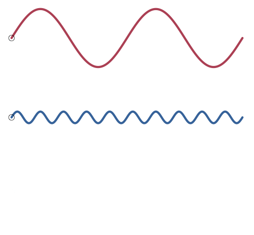{fig-align="center"}
:::

## Complex Sounds

```{r}
#| fig-width: 5
#| fig-asp: 1
#| layout-ncol: 2
expand_grid(
  y = 0,
  x = seq(0, 2*pi, length = 200),
  t = 0,
  freq = c(4, 8, 16, 32)
) |> 
  mutate(
    .by = freq,
    y = make_sinex(x, freq, t),
    freq_f = factor(freq)
  ) ->
  many_wav

many_wav |> 
  ggplot(
    aes(x, y + as.numeric(freq_f))
  ) + 
  geom_line(
    aes(
      color = factor(freq)
    ),
    linewidth = 2,
    lineend = "round"    
  ) +
  guides(color = "none") +
  theme_void()


many_wav |> 
  summarise(
    .by = x,
    y = sum(y)
  ) |> 
  ggplot(
    aes(x, y)
  ) + 
  geom_line(
    linewidth = 2,
    lineend = "round"
  ) + 
  theme_void()
```

## Complex sounds

::: {.content-hidden when-format="typst"}
```{=html}
<script src="https://unpkg.com/@strudel/embed@latest"></script>
<strudel-repl>
<!--  
$: freq("~ [220, 440, 880]")
 .s("sine")
 ._scope()

$: freq("220 ~")
   .s("sine")
   ._scope()
  $: freq("440 ~")
   .s("sine")
   ._scope()
s: freq("880 ~")
   .s("sine")
   ._scope()
-->
</strudel-repl>
```
:::

## Complex Sounds

### Interference

```{r}
#| fig-width: 6
#| fig-asp: 0.618
expand_grid(
  y = 0,
  x = seq(0, 2*pi, length = 200),
  t = c(0, 0.5 * pi),
  freq = 4,
) |> 
  mutate(
    .by = freq,
    y = make_sinex(x + t, freq, t)
  ) ->
  wavs2

wavs2 |> 
  summarise(
    .by = x,
    y = sum(y),
    t = 50
  ) ->
  complex_wav2


wavs2 |> 
  ggplot(
    aes(x, y)
  ) + 
  geom_line(
    aes(
      color = factor(t)
    ),
    linewidth = 2,
    lineend = "round"
  ) +
  guides(color = "none") +
  facet_grid(t~.) +
  theme_void() +
  theme_sub_strip(
    text = element_blank()
  )  
```

## Complex Sounds

### Interference

```{r}
#| eval: false
complex_wav2 |> 
  pull(x) |> 
  unique() |> 
  map(
    ~complex_wav2 |> 
      filter(x <= .x) |> 
      mutate(time = .x)
  ) |> 
  list_rbind() ->
  complex_wav2_t

wavs2 |> 
  mutate(time = x) |> 
  ggplot() +
  geom_line(
    data = wavs2,
    aes(
      x = x, 
      y = y,
      color = factor(t)
    ),
    linewidth = 2,
    lineend = "round"
  ) +
  geom_line(
    data = complex_wav2_t,
    aes(x = x, y = y),
    linewidth = 2,
    lineend = "round"
  ) +
  geom_point(
    aes(
      x = x,
      y = y,
      time = time
    ),
    size = 5,
    shape = 1
  ) +
  guides(color = "none") +
  facet_grid(
    t ~ . 
  ) +
  theme_void() +
  theme_sub_strip(
    text = element_blank()
  ) +  
  transition_states(
    time
  ) ->
  anim1_5


anim_save(
  filename = "images/interference.gif",
  animation = anim1_5,
  width = 500,
  height = 500*0.927
)
```

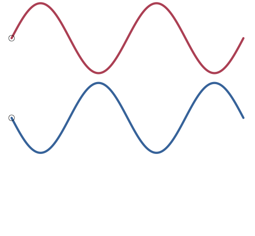{fig-align="center"}

## The Source-Filter Model

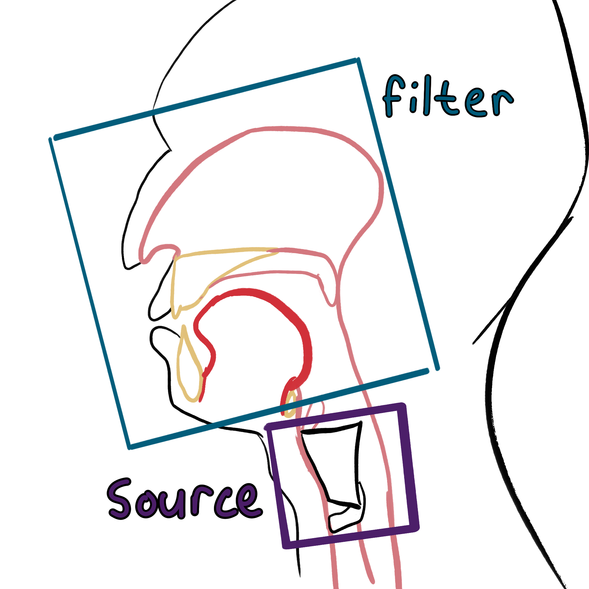{fig-align="center"}

## Fundamental Frequency - From the Source

The wavelength is proportional to the string length.

```{r}
make_harmonic <- function(df){
  df |> 
    mutate(
      y = sin((freq/2) * x) * cos(t * freq) * (1/freq)
    )
}

expand_grid(
  y = 0,
  x = seq(0, 2*pi, length = 100),
  t = seq(0, 2*pi, length = 100),
  freq = 1,
  string = "long"
) ->
  string1

string1 |> 
  group_by(t) |> 
  group_split() |> 
  map(
    make_harmonic
  ) |> 
  list_rbind() ->
  string1v
```

```{r}
#| eval: false
string1v |> 
  v$vplot() |> 
  v$mark_line(
    x = x,
    y = y
  ) |> 
  v$annotate(
    x = c(0,2*pi),
    y = c(0,0),
    geom = "point"
  ) |> 
  v$theme_void() |> 
  v$transition_time(
    time = t
  ) |> 
  v$animate(
    nframes = 100,
    fps = 12
  ) |> 
  v$anim_save("images/string1.gif", animation = _)
```

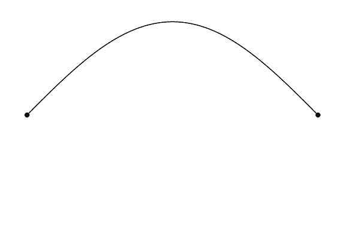{fig-align="center"}

## Fundamental Frequency - From the Source

Wave Length = 2Length

## Harmonics - From the Source

```{r}
expand_grid(
  x = seq(0, 2*pi, length = 100),
  t = seq(0,2*pi, length = 100),
  freq = 1:6
) ->
  string

expand_grid(
  x = seq(0, 2*pi, length = 100),
  t = seq(0,4*pi, length = 100),
  freq = 1:6
) ->
  string_time


expand_grid(
  x = seq(0, 6*pi, length = 200),
  t = seq(0, 4*pi, length = 100),
  freq = 1:6
) ->
  long_string


make_harmonic_sum <- function(df){
  df |> 
    mutate(
      y = sin((freq/2) * x) * cos(t * freq) * (1/freq)
    ) |> 
    summarise(
      .by = c(x, t),
      y = sum(y)
    )
}

make_harmonic_incident <- function(df){
  df |> 
    mutate(
      y = sin((freq/2) * space) * cos(t * freq) * (1/freq)
    ) |> 
    summarise(
      .by = c(space, t),
      y = sum(y)
    ) |> 
    summarise(
      .by = t,
      y = y[floor(n()/2)]
    )
}
```

```{r}
#| fig-width: 6
#| fig-asp: 0.66
#| eval: false
string |> 
  mutate(harm = freq - 1) |> 
  ggplot(
    aes(x = x, t = t, freq = freq)
  ) +
  geom_line(
    stat = "manual",
    fun = make_harmonic
  ) +
  annotate(
    x = c(0,2*pi),
    y = c(0,0),
    geom = "point"
  ) +
  facet_wrap(~harm, ncol = 3) +
  transition_time(t) +
  theme_no_x() +
  theme_no_y() ->
  anim2

anim_save(
  filename = "images/harmonics.gif",
  animation = anim2,
  width = 500,
  height = 500 * 0.66,
  fps = 12
)
```

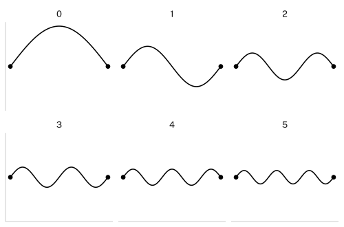{fig-align="center"}

## Harmonics - From the Source

$$
WL_n = \frac{2L}{n}
$$

- When $n$ = 1, $WL$ is the fundamental frequency.

- For integers \> 1, $WL$ is a harmonic.

- Every harmonic wavelength is the fundamental divided by a whole number integer.

- Every harmonic *frequency* is a whole number *multiple* of the fundamental frequency.

## Harmonics {.smaller}

### Wavelength to Frequency

::: {.content-hidden when-format="typst"}
```{ojs}
viewof freq = Inputs.range([50, 200], {value: 50, step: 1, label: "freq"})
```

```{ojs}
md`Fundamental Wavelength = 34300/${freq} = ${Math.round(34300/freq)} cm`
```

```{ojs}
md`
| Harmonic | Wavelength | Frequency |
| ---------: | -----------: | ----------: |
| 0 | ${Math.round(34300/freq)} cm | ${freq} Hz |
| 1 | ${Math.round(34300/(freq * 2))} cm | ${freq * 2} Hz |
| 2 | ${Math.round(34300/(freq * 3))} cm | ${freq * 3} Hz |
| 3 | ${Math.round(34300/(freq * 4))} cm | ${freq * 4} Hz | 
| 4 | ${Math.round(34300/(freq * 5))} cm | ${freq * 5} Hz | 
`
```
:::

::: {.content-visible when-format="typst"}
```{r}
#| layout-ncol: 2
make_harmonic_df <- function(freq){
  tibble(
    Harmonic = 0:4,
    Wavelength = str_glue(
      "{round((34300/freq) * (Harmonic + 1))} cm"
    ),
    Frequency = str_glue(
      "{round(freq * (Harmonic + 1))} Hz"
    )
  ) 
}

make_harmonic_df(50) |> 
  tt() |> 
  style_tt(
    align = "r"
  )

make_harmonic_df(100) |> 
  tt() |> 
  style_tt(
    align = "r"
  )
```
:::

## Harmonics {.smaller}

::: {.content-hidden when-format="typst"}
```{ojs}
viewof freq2 = Inputs.range([50, 200], {value: 50, step: 1, label: "freq"})
```

```{ojs}
harmonics = Array.from([0,1]).map(
  x => Array.from([1,2,3,4,5]).map(
    h => Object.create({
      x: x,
      y: freq2 * h,
      h: h
    })
  )
).flat()

Plot.plot({
  y: {
    label: "Frequency",
    domain: [0,1000]
  },
  color: {
    domain: [0,1000]
  },
  x: {
    label: "",
    ticks: []
  },
  marks: [
    Plot.lineY(
      harmonics,
      {
        x: "x",
        y: "y",
        stroke: "y",
        strokeWidth: 4
      },
    ),
    Plot.text(
      harmonics.filter(x => x.x < 0.5),
      {
        x: 0.5,
        y: (d) => d.y+25,
        text: (d) => d.h-1,
        fill: "y",
        fontSize: 20
      }
    ),
    Plot.axisY({
      fontSize: 12
    })
  ]
})
```
:::

::: {.content-visible when-format="typst"}
```{r}
#| fig-width: 6
#| fig-asp: 0.618
expand_grid(
  harmonic = 0:4,
  x = c(0.1,0.9),
  freq = c(50, 100, 200)
) |> 
  mutate(
    x2 = x + (as.numeric(factor(freq))-1)
  )  |> 
  ggplot(
    aes(
      x2, freq * (harmonic + 1)
    )
  ) +
  geom_textline(
    aes(
      group = harmonic,
      color = (harmonic + 1),
      label = harmonic
    ),
    linewidth = 2,
    lineend = "round"
  ) +
  guides(color = "none") +
  labs(
    y = "Frequency (Hz)"
  ) +
  theme_no_x()+
  NULL
```
:::

## Harmonics

```{r}
library(praatpicture)

praatpicture(
  sound = here::here("data/audio/harmonics.wav"),
  frames = "spectrogram",
  spec_freqRange = c(0, 2000),
  spec_windowLength = 0.025,
  spec_dynamicRange = 40
)
```

::: {.content-hidden when-format="typst"}

:::

## Harmonics

```{r}
draw_spectralslice(
  sound = here::here("data/audio/harmonics.wav"),
  time = c(0.8, 1),
  windowLength = 0.025,
  freqRange = c(0, 4000)
)
```

## Harmonics

```{r}
#| eval: false
string_time |> 
  ggplot(
    aes(x = x, t = t, freq = freq)
  ) +
  geom_line(
    stat = "manual",
    fun = make_harmonic_sum
  ) +
  annotate(
    x = c(0,2*pi),
    y = c(0,0),
    geom = "point"
  ) +
  transition_time(t) +
  theme_no_x() +
  theme_no_y() ->
  anim3

anim_save(
  filename = "images/combo-wab.gif",
  animation = anim3,
  width = 500,
  height = 500 * 0.618,
  fps = 12
)
```

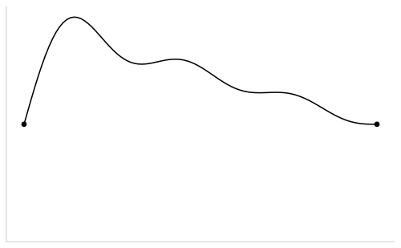{fig-align="center"}

## Harmonics

```{r}
#| fig-width: 6
#| fig-asp: 0.618
long_string |> 
  ggplot(
    aes(space = x, t = t, freq = freq)
  ) +
  geom_line(
    stat = "manual",
    fun = make_harmonic_incident,
    aes(
      y = after_stat(y),
      x = after_stat(t)
    )
  ) +
  #transition_time(t)+
  theme_no_x()+
  theme_no_y()
```

## Standing Waves

### Nodes and Antinodes

```{r}
#| eval: false
expand_grid(
  x = seq(0, 2*pi, length = 100),
  t = seq(0,2*pi, length = 100),
  freq = 4
) |> 
  ggplot(
    aes(x = x, freq = freq)
  ) +
  geom_hline(
    yintercept = 0,
    linewidth = 0.2
  ) +
  geom_line(
    aes(t = t),
    stat = "manual",
    fun = make_harmonic,
    linewidth = 2
  ) +
  geom_point(
    data = tibble(
      x = seq(0, 2*pi, length = 5),
      y = 0,
      freq = 1
    ),
    aes(
      x = x,
      y = y
    ),
    size = 3
  ) +
  geom_textvline(
    data = expand_grid(
      x = seq(0,2, length =5) * pi,
      t = seq(0,2*pi, length = 100)
    ),
    aes(
      xintercept = x
    ),
    label = "node",
    color = ptol_blue,
    hjust = 0.2
  ) +
  geom_textvline(
    data = expand_grid(
      x = seq(0.25,1.75, length = 4) * pi,
      t = seq(0,2*pi, length = 100)
    ),
    aes(
      xintercept = x
    ),
    label = "antinode",
    color = ptol_red,
    hjust = 0.8
  ) +  
  labs(
    y = "pressure",
    x = "space"
  ) +
  transition_time(t) +
  theme_sub_axis(
    text = element_blank()
  ) ->
  anim4

anim_save(
  filename = "images/nodes.gif",
  animation = anim4,
  width = 500,
  height = 500 * 0.618,
  fps = 12
)
```

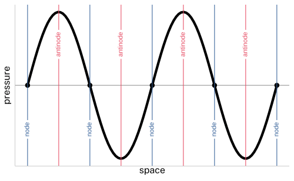{fig-align="center"}

## From the source to the filter

- The physical activity of the vocal folds generates the fundamental frequency and the harmonics.

- Then, the air pressure waves propagate through your vocal tract, which introduces *resonances*.

## Resonance - From the Filter

### Pressure

```{r}
make_sine <- function(x, freq = 1, t = 0){
  # if there's no `freq` column
  # set `freq` to 1.
  -1 * cos(freq*x) * cos(t*freq)
}


make_disp <- function(x, freq=1, t=0){
  sin(freq*x) * cos(t*freq)
}


make_disp_df <- function(df, freq=1, t=0, rel = 0.09){
  df |> 
    mutate(
      x = x + (make_disp(
        x, freq, t
      ) * (rel/freq)),
      disp = make_disp(
        x, freq, t
      ),
      pressure = make_sine(
        x, freq = freq, t=t
      ),
      t = t
    )
}
```

```{r}
tibble(
  x = runif(12000, min = -0.5, max = 1.5),
  y = runif(12000)
) |> 
  mutate(
    id = row_number()
  ) ->
  air
```

```{r}
f = 2
map(
  seq(0, 2.5*pi, length = 50),
  ~make_disp_df(
    df = air, 
    freq = f * pi,
    t = .x,
    rel = 0.3
  )
) |> 
  list_rbind() ->
  big_df

pressure_df <- expand_grid(
  x = seq(0, 1, length = 100),
  t = seq(0, 2.5*pi, length = 50)
) |> 
  mutate(
    y = -make_sine(x, freq = f * pi, t = t)
  )

disp_df <- expand_grid(
  x = seq(0, 1, length = 100),
  t = seq(0, 2.5*pi, length = 50)
) |> 
  mutate(
    y = make_disp(x, freq = f * pi, t = t)
  )
```

```{r}
#| eval: false
big_df |> 
  ggplot(
    aes(x, y)
  ) + 
  geom_point(
    size = 0.2,
    aes(color = -pressure)
  ) + 
  geom_line(
    data = pressure_df,
    aes(
      y = (-y-1) * 0.2,
      color = y
    ),
    linewidth = 2,
    lineend = "round"
  ) +
  scale_y_continuous(
    expand = expansion(0)
  ) +
  scale_x_continuous(
    expand = expansion(0)
  ) + 
  annotate(
    x = c(1, 0.001, 0.001, 1),
    y = c(0, 0, 0.99, 0.99),
    geom = "path",
    linewidth = 1.5
  ) +
  guides(color = "none") +
  theme_void() +
  theme_no_y() + 
  theme_no_x() +
  transition_time(
    t
  ) +
  coord_cartesian(
    xlim = c(0,1)
  ) ->
  anim7

anim_save(
  filename = "images/pressure.gif",
  animation = anim7,
  width = 500,
  height = 500 * 0.618,
  nframes = 200,
  fps = 12
)
```

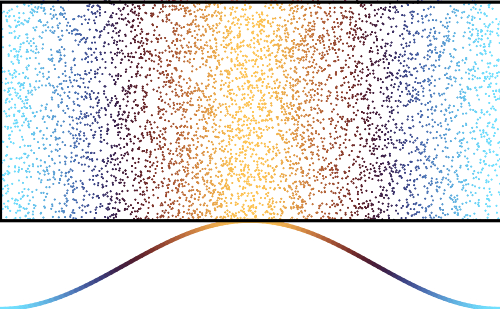{fig-align="center"}

## Pressure & Displacement

### Displacement

```{r}
#| eval: false
big_df |> 
  ggplot(
    aes(x, y)
  ) + 
  geom_point(
    size = 0.2,
    aes(color = -disp)
  ) + 
  geom_line(
    data = disp_df,
    aes(
      y = (y-1) * 0.2,
      color = -y
    ),
    linewidth = 2,
    lineend = "round"
  ) +
  annotate(
    x = c(1, 0.001, 0.001, 1),
    y = c(0, 0, 0.99, 0.99),
    geom = "path",
    linewidth = 1.5
  ) +  
  scale_y_continuous(
    expand = expansion(0)
  ) +
  scale_x_continuous(
    expand = expansion(0)
  ) +  
  guides(color = "none") +
  scico::scale_color_scico(
    palette = "vanimo"
  )+
  theme_void() +
  theme_no_y() + 
  theme_no_x() +
  transition_time(
    t
  ) +
  coord_cartesian(
    xlim = c(0,1)
  ) ->
  anim8

anim_save(
  filename = "images/displacement.gif",
  animation = anim8,
  width = 500,
  height = 500 * 0.618,
  nframes = 200,
  fps = 12
)
```

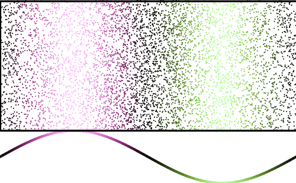{fig-align="center"}

## Resonance - From the Filter



## Resonance - From the filter

Wavelengths that put a displacement antinode at the lips are resonant frequencies.

```{r}
#| eval: false
make_disp2 <- function(df){
  df |> 
    mutate(
      disp = sin(freq*x) * cos(t*freq)
    )
}

expand_grid(
  x = seq(0, 2*pi,length = 200),
  t = seq(0, 8*pi, length = 200),
  freq = c(1,3,5)/4
) |> 
  mutate(freq_s = str_glue("{freq}L")) |> 
  ggplot(
    aes(x = x, freq = freq, t = t)
  ) +
  geom_line(
    #data = flat |> mutate(level = "displacement"),
    aes(
      y = after_stat(disp)
    ),
    stat = "manual",
    fun = make_disp2,
    linewidth = 1
  )+
  facet_grid(freq_s~., scale = "free_y")+
  theme_no_x() +
  theme_no_y() +
  transition_time(t) +
  NULL  ->
  anim8_5

anim_save(
  filename = "images/disp-antinode.gif",
  animation = anim8_5,
  width = 500,
  height = 500,
  nframes = 200,
  fps = 12
)
```

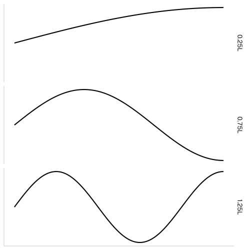{fig-align="center"}

## Resonance - From the Filter

```{r}
f = 2.5
map(
  seq(0, 2.5*pi, length = 50),
  ~make_disp_df(
    df = air, 
    freq = f * pi,
    t = .x,
    rel = 0.3
  )
) |> 
  list_rbind() ->
  big_df

pressure_df <- expand_grid(
  x = seq(0, 1, length = 100),
  t = seq(0, 2.5*pi, length = 50)
) |> 
  mutate(
    y = -make_sine(x, freq = f * pi, t = t)
  )

disp_df <- expand_grid(
  x = seq(0, 1, length = 100),
  t = seq(0, 2.5*pi, length = 50)
) |> 
  mutate(
    y = make_disp(x, freq = f * pi, t = t)
  )
```

```{r}
#| eval: false
big_df |> 
  ggplot(
    aes(x, y)
  ) + 
  geom_point(
    size = 0.2,
    aes(color = -disp)
  ) + 
  geom_line(
    data = disp_df,
    aes(
      y = (y-1) * 0.2,
      color = -y
    ),
    linewidth = 2,
    lineend = "round"
  ) +
  annotate(
    x = c(1, 0.001, 0.001, 1),
    y = c(0, 0, 0.99, 0.99),
    geom = "path",
    linewidth = 1.5
  ) +  
  scale_y_continuous(
    expand = expansion(0)
  ) +
  scale_x_continuous(
    expand = expansion(0)
  ) +  
  guides(color = "none") +
  scico::scale_color_scico(
    palette = "vanimo"
  )+
  theme_void() +
  theme_no_y() + 
  theme_no_x() +
  transition_time(
    t
  ) +
  coord_cartesian(
    xlim = c(0,1)
  ) -> 
  anim9

anim_save(
  filename = "images/formant.gif",
  animation = anim9,
  width = 500,
  height = 500 * 0.618,
  nframes = 200,
  fps = 12
)
```

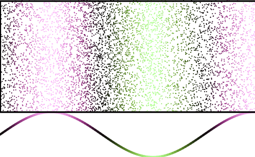{fig-align="center"}

## Resonance - From the Filter

$$
F_n = \frac{(2n-1)c}{4L}
$$

$$
L = \frac{(2n-1)c}{4F_n}
$$

- $n$ = resonant frequency

- $c$ = speed of sound
