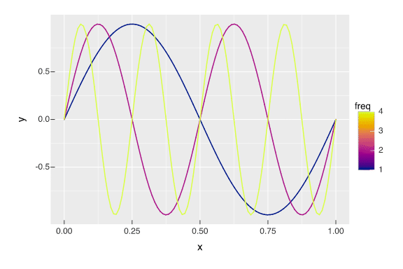

```{r}
library(tidyverse)
box::use(
  v = vellumplot
)
```

```{r}
make_sine <- function(x, freq = 1){
  # if there's no `freq` column
  # set `freq` to 1.
  y = sin(
        (freq * x * 2 * pi)
      )
}
```

```{r}
make_moving_sine <- function(x, freq, t){
  sin(
    (freq * (x - t) * 2 * pi)
  )
}
```

```{r}
#| eval: false
expand_grid(
  x = seq(0,1, length = 100),
  freq = c(1, 2, 4),
  t = seq(0, 3, length = 100)
) |> 
  mutate(
    .by = freq,
    y = make_moving_sine(x, freq, t)
  ) |> 
  v$vplot() |> 
  v$mark_line(
    x = x,
    y = y,
    color = freq
  ) |> 
  v$transition_time(
    t
  ) |> 
  v$scale_color_continuous(
    palette = "Plasma"
  ) |> 
  v$animate(
    nframes = 200
  ) |> 
  v$anim_save(
    filename = "test.gif"
  )
```



```{r}
make_moving_disp <- function(x, freq=1, t=0){
  cos(
    (freq * (x - t)* 2 * pi)
  )
}

make_disp_df <- function(df,freq=1,t=0){
  df |> 
    mutate(
      x = x + (make_moving_disp(
        x, freq, t
      ) * 0.09),
      disp = make_moving_disp(
        x, freq, t
      ),
      t = t
    )
}
```

```{r}
tibble(
  x = runif(10000, max = 2),
  y = runif(10000)
) |> 
  mutate(
    id = row_number()
  )->
  air


air |> 
  filter(
    between(x, 0.99, 1.1)
  ) |> 
  pull(id) |> 
  sample(20) ->
  chosen

air |> 
  mutate(
    mark = id %in% chosen
  ) -> 
  air

map(
  seq(0, 2.5*pi, length = 100),
  ~make_disp_df(
    df = air, 
    freq = 1,
    t = .x
  )
) |> 
  list_rbind() ->
  big_df
```

```{r}
#| eval: false
big_df |> 
  v$vplot() |> 
  v$mark_point(
    x = x,
    y = y,
    size = 0.5,
    color = mark
  ) |> 
  v$scale_color_manual(
    values = c("black", "red")
  ) |> 
  v$guides(
    color = v$guide_none()
  ) |> 
  v$scale_x_continuous(
    expand = 0
  ) |> 
  v$scale_y_continuous(
    expand = 0
  ) |>   
  v$transition_time(
    t
  ) |> 
  v$ease_aes("cubic-in-out") |> 
  v$theme_void() |> 
  v$animate(nframes = 200, fps = 12) |> 
  v$anim_save(
    filename = "air.gif"
  )
```

{fig-align="center"}

```{r}

```
